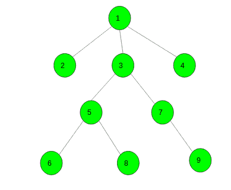

# 在树中给定子树的 DFS 遍历中找到第 k 个节点

> 原文:[https://www . geeksforgeeks . org/find-the-kth-node-in-DFS-遍历树中给定的子树/](https://www.geeksforgeeks.org/find-the-kth-node-in-the-dfs-traversal-of-a-given-subtree-in-a-tree/)

给定一个节点为 **N** 的树，以及两个整数 **K** 和 **V** 。任务是在顶点 **V** 的 DFS 遍历中找到 **Kth** 节点。
考虑下面的树:



> 节点号 1 的 DFS 是[1，2，3，5，6，8，7，9，4]。
> 3 号节点的 DFS 为[3，5，6，8，7，9]
> 7 号节点的 DFS 为[7，9]
> 9 号节点的 DFS 为[9]。

如果顶点 V 的 DFS 中的数字小于 k，则打印“-1”。

**示例:**

```
Input : Tree: *Shown in above image*, V = 3, K = 4
Output : 8

Input : Tree: *Shown in above image*, V = 7, K = 3
Output : -1
```

**逼近**:我们构造一个向量 *p* :存储从顶点 1 开始的完全树的 DFS 遍历。设 tin <sub>v</sub> 为顶点 V 在向量 p 中的位置(向量 p 的大小在我们从顶点 V 返回 DFS 的瞬间)，tout <sub>v</sub> 为离开顶点 V 的子树后第一个被推送到向量的顶点的位置(向量 p 的大小在我们从顶点 V 返回 DFS 的瞬间)。那么很明显顶点 V 的子树位于区间【tin <sub>v</sub> ，tout <sub>v</sub> 】。
所以，要在节点 V 的子树的 DFS 中找到第 k 个节点，我们就要返回区间【tin <sub>v</sub> ，tout <sub>v</sub> 中的第 k 个节点。

下面是上述方法的实现:

## C++

```
// C++ program to find the Kth node in the
// DFS traversal of the subtree of given
// vertex V in a Tree

#include <bits/stdc++.h>
using namespace std;
#define N 100005

// To store nodes
int n;
vector<int> tree[N];

// To store the current index of vertex in DFS
int currentIdx;

// To store the starting index and ending
// index of vertex in the DFS traversal array
vector<int> startIdx, endIdx;

// To store the DFS of vertex 1
vector<int> p;

// Function to add edge between two nodes
void Add_edge(int u, int v)
{
    tree[u].push_back(v);
    tree[v].push_back(u);
}

// Initialize the vectors
void intisalise()
{
    startIdx.resize(n);
    endIdx.resize(n);
    p.resize(n);
}

// Function to perform DFS of a vertex
// 1\. stores the DFS of the vertex 1 in vector p,
// 2\. store the start index of DFS of every vertex
// 3\. store the end index of DFS of every vertex
void Dfs(int ch, int par)
{
    p[currentIdx] = ch;

    // store staring index of node ch
    startIdx[ch] = currentIdx++;

    for (auto c : tree[ch]) {
        if (c != par)
            Dfs(c, ch);
    }

    // store ending index
    endIdx[ch] = currentIdx - 1;
}

// Function to find the Kth node in DFS of vertex V
int findNode(int v, int k)
{
    k += startIdx[v] - 1;

    // check if kth number exits or not
    if (k <= endIdx[v])
        return p[k];

    return -1;
}

// Driver code
int main()
{
    // number of nodes
    n = 9;

    // add edges
    Add_edge(1, 2);
    Add_edge(1, 3);
    Add_edge(1, 4);
    Add_edge(3, 5);
    Add_edge(3, 7);
    Add_edge(5, 6);
    Add_edge(5, 8);
    Add_edge(7, 9);

    intisalise();

    // store DFS of 1st node
    Dfs(1, 0);

    int v = 3, k = 4;

    cout << findNode(v, k);

    return 0;
}
```

## Java 语言(一种计算机语言，尤用于创建网站)

```
// Java program to find the Kth node in the
// DFS traversal of the subtree of given
// vertex V in a Tree
import java.util.*;

class GFG{

static int N = 100005;

// To store nodes
static int n;

static ArrayList<
       ArrayList<Integer>> tree = new ArrayList<>();

// To store the current index of vertex in DFS
static int currentIdx;

// To store the starting index and ending
// index of vertex in the DFS traversal array
static int[] startIdx;
static int[] endIdx;

// To store the DFS of vertex 1
static int[] p;

// Function to add edge between two nodes
static void Add_edge(int u, int v)
{
    tree.get(u).add(v);
    tree.get(v).add(u);
}

// Initialize the vectors
static void intisalise()
{
    startIdx = new int[n + 1];
    endIdx = new int[n + 1];
    p = new int[n + 1];
}

// Function to perform DFS of a vertex
// 1\. stores the DFS of the vertex 1 in vector p,
// 2\. store the start index of DFS of every vertex
// 3\. store the end index of DFS of every vertex
static void Dfs(int ch, int par)
{
    p[currentIdx] = ch;

    // store staring index of node ch
    startIdx[ch] = currentIdx++;

    for(int c : tree.get(ch))
    {
        if (c != par)
            Dfs(c, ch);
    }

    // store ending index
    endIdx[ch] = currentIdx - 1;
}

// Function to find the Kth node
// in DFS of vertex V
static int findNode(int v, int k)
{
    k += startIdx[v] - 1;

    // Check if kth number exits or not
    if (k <= endIdx[v])
        return p[k];

    return -1;
}

// Driver code
public static void main(String[] args)
{

    // Number of nodes
    n = 9;

    for(int i = 0; i <= n; i++)
        tree.add(new ArrayList<Integer>());

    // Add edges
    Add_edge(1, 2);
    Add_edge(1, 3);
    Add_edge(1, 4);
    Add_edge(3, 5);
    Add_edge(3, 7);
    Add_edge(5, 6);
    Add_edge(5, 8);
    Add_edge(7, 9);

    intisalise();

    // Store DFS of 1st node
    Dfs(1, 0);

    int v = 3, k = 4;

    System.out.println(findNode(v, k));
}
}

// This code is contributed by jrishabh99
```

## 蟒蛇 3

```
# Python3 program to find the Kth node in the
# DFS traversal of the subtree of given
# vertex V in a Tree
N = 100005

n = 10
tree = [[]for i in range(N)]

# To store the current index of vertex in DFS
currentIdx = 0

# To store the starting index and ending
# index of vertex in the DFS traversal array
startIdx = [0 for i in range(n)]
endIdx = [0 for i in range(n)]

# To store the DFS of vertex 1
p = [0 for i in range(n)]

# Function to add edge between two nodes
def Add_edge(u, v):
    tree[u].append(v)
    tree[v].append(u)

# Initialize the vectors
def intisalise():
    pass

# Function to perform DFS of a vertex
# 1\. stores the DFS of the vertex 1 in vector p,
# 2\. store the start index of DFS of every vertex
# 3\. store the end index of DFS of every vertex
def Dfs(ch, par):
    global currentIdx

    p[currentIdx] = ch

    # store staring index of node ch
    startIdx[ch] = currentIdx
    currentIdx += 1

    for c in tree[ch]:
        if (c != par):
            Dfs(c, ch)

    # store ending index
    endIdx[ch] = currentIdx - 1

# Function to find the Kth node in
# DFS of vertex V
def findNode(v, k):

    k += startIdx[v] - 1

    # check if kth number exits or not
    if (k <= endIdx[v]):
        return p[k]

    return -1

# Driver code

# number of nodes
n = 9

# add edges
Add_edge(1, 2)
Add_edge(1, 3)
Add_edge(1, 4)
Add_edge(3, 5)
Add_edge(3, 7)
Add_edge(5, 6)
Add_edge(5, 8)
Add_edge(7, 9)

intisalise()

# store DFS of 1st node
Dfs(1, 0)

v, k = 3, 4

print(findNode(v, k))

# This code is contributed by mohit kumar
```

## C#

```
// C# program to find the Kth node in the
// DFS traversal of the subtree of given
// vertex V in a Tree
using System;
using System.Collections;
using System.Collections.Generic;

class GFG{

// To store nodes
static int n;

static ArrayList tree = new ArrayList();

// To store the current index of vertex in DFS
static int currentIdx;

// To store the starting index and ending
// index of vertex in the DFS traversal array
static int[] startIdx;
static int[] endIdx;

// To store the DFS of vertex 1
static int[] p;

// Function to add edge between two nodes
static void Add_edge(int u, int v)
{
    ((ArrayList)tree[u]).Add(v);
    ((ArrayList)tree[v]).Add(u);
}

// Initialize the vectors
static void intisalise()
{
    startIdx = new int[n + 1];
    endIdx = new int[n + 1];
    p = new int[n + 1];
}

// Function to perform DFS of a vertex
// 1\. stores the DFS of the vertex 1 in vector p,
// 2\. store the start index of DFS of every vertex
// 3\. store the end index of DFS of every vertex
static void Dfs(int ch, int par)
{
    p[currentIdx] = ch;

    // store staring index of node ch
    startIdx[ch] = currentIdx++;

    foreach(int c in (ArrayList)tree[ch])
    {
        if (c != par)
            Dfs(c, ch);
    }

    // store ending index
    endIdx[ch] = currentIdx - 1;
}

// Function to find the Kth node 
// in DFS of vertex V
static int findNode(int v, int k)
{
    k += startIdx[v] - 1;

    // Check if kth number exits or not
    if (k <= endIdx[v])
        return p[k];

    return -1;
}

// Driver code
public static void Main(string[] args)
{

    // Number of nodes
    n = 9;

    for(int i = 0; i <= n; i++)
        tree.Add(new ArrayList());

    // Add edges
    Add_edge(1, 2);
    Add_edge(1, 3);
    Add_edge(1, 4);
    Add_edge(3, 5);
    Add_edge(3, 7);
    Add_edge(5, 6);
    Add_edge(5, 8);
    Add_edge(7, 9);

    intisalise();

    // Store DFS of 1st node
    Dfs(1, 0);

    int v = 3, k = 4;

    Console.Write(findNode(v, k));
}
}

// This code is contributed by rutvik_56
```

## java 描述语言

```
<script>
// Javascript program to find the Kth node in the
// DFS traversal of the subtree of given
// vertex V in a Tree

let N = 100005;

// To store nodes
let n=10;

let tree = [];
// To store the current index of vertex in DFS
let currentIdx=0;

// To store the starting index and ending
// index of vertex in the DFS traversal array
let startIdx;
let endIdx;

// To store the DFS of vertex 1
let p;

// Function to add edge between two nodes
function Add_edge(u,v)
{
    tree[u].push(v);
    tree[v].push(u);
}

// Initialize the vectors
function intisalise()
{
    startIdx = new Array(n + 1);
    endIdx = new Array(n + 1);
    p = new Array(n + 1);
    for(let i=0;i<(n+1);i++)
    {
        startIdx[i]=0;
        endIdx[i]=0;
        p[i]=0;
    }
}

// Function to perform DFS of a vertex
// 1\. stores the DFS of the vertex 1 in vector p,
// 2\. store the start index of DFS of every vertex
// 3\. store the end index of DFS of every vertex
function Dfs(ch,par)
{
    p[currentIdx] = ch;

    // store staring index of node ch
    startIdx[ch] = currentIdx++;

    for(let c=0;c<tree[ch].length;c++)
    {
        if (tree[ch] != par)
            Dfs(tree[ch], ch);
    }

    // store ending index
    endIdx[ch] = currentIdx - 1;
}

// Function to find the Kth node
// in DFS of vertex V
function findNode(v,k)
{
    k += startIdx[v] - 1;

    // Check if kth number exits or not
    if (k <= endIdx[v])
        return p[k];

    return -1;
}

// Driver code
// Number of nodes
    n = 9;

    for(let i = 0; i <= n; i++)
        tree.push([]);

    // Add edges
    Add_edge(1, 2);
    Add_edge(1, 3);
    Add_edge(1, 4);
    Add_edge(3, 5);
    Add_edge(3, 7);
    Add_edge(5, 6);
    Add_edge(5, 8);
    Add_edge(7, 9);

    intisalise();
    // Store DFS of 1st node
    Dfs(1, 0);

    let v = 3, k = 4;

    document.write(findNode(v, k));

// This code is contributed by unknown2108
</script>
```

**Output:** 

```
8
```