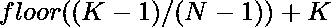

# 找出不能被 N 整除的第 k 个数

> 原文:[https://www . geeksforgeeks . org/find-the-kth-number-哪个不能被 n 整除/](https://www.geeksforgeeks.org/find-the-kth-number-which-is-not-divisible-by-n/)

给定两个整数 **N** 和 **K** ，任务是找到不能被 N 整除的第 K 个<sup>号</sup>号
T7】注:N 的值大于 1，因为每个数都可以被 1 整除。

**示例:**

> **输入:** N = 3，K = 6
> **输出:** 8
> **解释:**
> 不能被 N 整除的数= 3 –{ 1，2，4，5，7，8，10}
> 第 6 个不能被 3 整除的数是 8。
> 
> **输入:** N = 7，K = 97
> **输出:** 113
> **解释:**
> 不能被 N = 7 整除的数字–{ 1，2，4，5，6，…。}
> 第 97 个不能被 7 整除的数是 113。

**天真的方法:**一个简单的解决方案是迭代一个循环来寻找第 K 个<sup>不可被 n 整除的数</sup>，下面是寻找第 K 个<sup>数</sup>的步骤:

*   将不可分数和当前数的计数初始化为 0。
*   循环的同时使用[进行迭代，直到不可分数字的计数不等于 K](https://www.geeksforgeeks.org/c-c-while-loop-with-examples/)
*   如果当前数不能被 n 整除，则将不可整除数的计数增加 1

下面是上述方法的实现:

## C++

```
// C++ implementation to find
// the K'th non divisible
// number by N

#include <bits/stdc++.h>

using namespace std;

// Function to find
// the K'th non divisible
// number by N
int kthNonDivisible(int N, int K)
{
    int find = 0;
    int j = 0;

    // Loop to find the K non
    // divisible number by N
    while (find != K) {
        j++;
        if (j % N != 0)
            find++;
    }
    return j;
}

// Driver Code
int main()
{
    int N = 3;
    int K = 6;
    cout << kthNonDivisible(N, K);
    return 0;
}
```

## Java 语言(一种计算机语言，尤用于创建网站)

```
// Java implementation to find
// the K'th non divisible
// number by N
class GFG{

// Function to find
// the K'th non divisible
// number by N
static int kthNonDivisible(int N, int K)
{
    int find = 0;
    int j = 0;

    // Loop to find the K non
    // divisible number by N
    while (find != K)
    {
        j++;
        if (j % N != 0)
            find++;
    }
    return j;
}

// Driver code
public static void main(String[] args)
{
    int N = 3;
    int K = 6;

    System.out.print(kthNonDivisible(N, K));
}
}

// This code is contributed by shivanisinghss2110
```

## 蟒蛇 3

```
# Python3 implementation to find
# the K'th non divisible
# number of N
import math

# Function to find the Kth
# not divisible by N
def kthNonDivisible(n, K):

    find = 0
    j = 0

    # Loop to find the K non
    # divisible number by N
    while find != K:   
        j = j + 1
        if j % N != 0:
            find = find + 1

    return j

# Driver Code
N = 3
K = 6

# Function Call
print(kthNonDivisible(N, K))

# This code is contributed by ishayadav181
```

## C#

```
// C# implementation to find the
// K'th non-divisible number by N
using System;

class GFG {

// Function to find the K'th
// non divisible number by N
static int kthNonDivisible(int N, int K)
{
    int find = 0;
    int j = 0;

    // Loop to find the K non
    // divisible number by N
    while (find != K)
    {
        j++;

        if (j % N != 0)
            find++;
    }
    return j;
}

// Driver code
public static void Main(String[] args)
{
    int N = 3;
    int K = 6;

    Console.Write(kthNonDivisible(N, K));
}
}

// This code is contributed by shivanisinghss2110
```

## java 描述语言

```
<script>
    // Javascript implementation to find the
    // K'th non-divisible number by N

    // Function to find the K'th
    // non divisible number by N
    function kthNonDivisible(N, K)
    {
        let find = 0;
        let j = 0;

        // Loop to find the K non
        // divisible number by N
        while (find != K)
        {
            j++;

            if (j % N != 0)
                find++;
        }
        return j;
    }

    let N = 3;
    let K = 6;

    document.write(kthNonDivisible(N, K));

    // This code is contributed by decode2207.
</script>
```

**Output**

```
8
```

**另一种方法——利用二分搜索法**这个想法是利用二分搜索法来解决这个问题。这个问题的搜索空间将从 1 到最大整数值，中间值计算为搜索空间的中间值与 n 的倍数之差

*   如果中间值大于 K，则将 H 的值更新为中间值-1。
*   否则，如果中间值大于 K，则将 L 的值更新为中间值–1。

下面是上述方法的实现:

## C++

```
// C++ implementation for
// above approach
#include <bits/stdc++.h>
using namespace std;

// Function to find the Kth
// not divisible by N
void kthNonDivisible(int N, int K)
{

    // Lowest possible value
    int L = 1;

    // Highest possible value
    int H = INT_MAX;

    // To store the Kth non
    // divisible number of N
    int ans = 0;

    // Using binary search
    while (L <= H)
    {

        // Calculating mid value
        int mid = (L + H) / 2;

        // Sol would have the value
        // by subtracting all
        // multiples of n till mid
        int sol = mid - mid / N;

        // Check if sol is greater than k
        if (sol > K)
        {

            // H should be reduced to find
            // minimum possible value
            H = mid - 1;
        }

        // Check if sol is less than k
        // then L will be mid+1
        else if (sol < K)
        {
            L = mid + 1;
        }

        // Check if sol is equal to k
        else
        {

            // ans will be mid
            ans = mid;

            // H would be reduced to find any
            // more possible value
            H = mid - 1;
        }
    }

    // Print the answer
    cout << ans;
}

// Driver Code
int main()
{
    int N = 3;
    int K = 7;

    // Function Call
    kthNonDivisible(N, K);
    return 0;
}
```

## Java 语言(一种计算机语言，尤用于创建网站)

```
// Java implementation for
// above approach
class GFG{

// Function to find the Kth
// not divisible by N
public static void kthNonDivisible(int N,
                                   int K)
{

    // Lowest possible value
    int L = 1;

    // Highest possible value
    int H = Integer.MAX_VALUE;

    // To store the Kth non
    // divisible number of N
    int ans = 0;

    // Using binary search
    while (L <= H)
    {

        // Calculating mid value
        int mid = (L + H) / 2;

        // Sol would have the value
        // by subtracting all
        // multiples of n till mid
        int sol = mid - mid / N;

        // Check if sol is greater than k
        if (sol > K)
        {

            // H should be reduced to find
            // minimum possible value
            H = mid - 1;
        }

        // Check if sol is less than k
        // then L will be mid+1
        else if (sol < K)
        {
            L = mid + 1;
        }

        // Check if sol is equal to k
        else
        {

            // ans will be mid
            ans = mid;

            // H would be reduced to find any
            // more possible value
            H = mid - 1;
        }
    }

    // Print the answer
    System.out.print(ans);
}

// Driver code
public static void main(String[] args)
{
    int N = 3;
    int K = 7;

    // Function Call
    kthNonDivisible(N, K);
}
}

// This code is contributed by divyeshrabadiya07
```

## 蟒蛇 3

```
# Python3 implementation for
# above approach
import sys

# Function to find the Kth
# not divisible by N
def kthNonDivisible(N, K):

    # Lowest possible value
    L = 1

    # Highest possible value
    H = sys.maxsize

    # To store the Kth non
    # divisible number of N
    ans = 0

    # Using binary search
    while (L <= H):

        # Calculating mid value
        mid = (L + H) // 2

        # Sol would have the value
        # by subtracting all
        # multiples of n till mid
        sol = mid - mid // N

        # Check if sol is greater than k
        if (sol > K):

            # H should be reduced to find
            # minimum possible value
            H = mid - 1

        # Check if sol is less than k
        # then L will be mid+1
        elif (sol < K):
          L = mid + 1

        # Check if sol is equal to k
        else:

            # ans will be mid
            ans = mid

            # H would be reduced to find any
            # more possible value
            H = mid - 1

    # Print the answer
    print(ans)

# Driver Code
N = 3
K = 7

# Function call
kthNonDivisible(N, K)

# This code is contributed by ANKITKUMAR34
```

## C#

```
// C# implementation for
// above approach
using System;

class GFG{

// Function to find the Kth
// not divisible by N
static void kthNonDivisible(int N, int K)
{

    // Lowest possible value
    int L = 1;

    // Highest possible value
    int H = Int32.MaxValue;

    // To store the Kth non
    // divisible number of N
    int ans = 0;

    // Using binary search
    while (L <= H)
    {

        // Calculating mid value
        int mid = (L + H) / 2;

        // Sol would have the value
        // by subtracting all
        // multiples of n till mid
        int sol = mid - mid / N;

        // Check if sol is greater than k
        if (sol > K)
        {

            // H should be reduced to find
            // minimum possible value
            H = mid - 1;
        }

        // Check if sol is less than k
        // then L will be mid+1
        else if (sol < K)
        {
            L = mid + 1;
        }

        // Check if sol is equal to k
        else
        {

            // ans will be mid
            ans = mid;

            // H would be reduced to find
            // any more possible value
            H = mid - 1;
        }
    }

    // Print the answer
    Console.Write(ans);
}

// Driver code
static void Main()
{
    int N = 3;
    int K = 7;

    // Function Call
    kthNonDivisible(N, K);
}
}

// This code is contributed by divyesh072019
```

## java 描述语言

```
<script>
    // Javascript implementation for above approach

    // Function to find the Kth
    // not divisible by N
    function kthNonDivisible(N, K)
    {

        // Lowest possible value
        let L = 1;

        // Highest possible value
        let H = 2147483647;

        // To store the Kth non
        // divisible number of N
        let ans = 0;

        // Using binary search
        while (L <= H)
        {

            // Calculating mid value
            let mid = parseInt((L + H) / 2, 10);

            // Sol would have the value
            // by subtracting all
            // multiples of n till mid
            let sol = mid - parseInt(mid / N, 10);

            // Check if sol is greater than k
            if (sol > K)
            {

                // H should be reduced to find
                // minimum possible value
                H = mid - 1;
            }

            // Check if sol is less than k
            // then L will be mid+1
            else if (sol < K)
            {
                L = mid + 1;
            }

            // Check if sol is equal to k
            else
            {

                // ans will be mid
                ans = mid;

                // H would be reduced to find
                // any more possible value
                H = mid - 1;
            }
        }

        // Print the answer
        document.write(ans);
    }

    let N = 3;
    let K = 7;

    // Function Call
    kthNonDivisible(N, K);

// This code is contributed by mukesh07.
</script>
```

**Output**

```
10
```

**时间复杂度:** O(logN)

**有效方法:**问题中的关键观察是，从 1 到 N-1 的每个数都不能被 N 整除，然后类似地，N + 1 到 2 * N–1 也不能被 N 整除。记住这一点，不能被 N 整除的第 K 个<sup>数</sup>将是:



下面是上述方法的实现:

## C++

```
// C++ implementation to find
// the K'th non-divisible
// number of N

#include <bits/stdc++.h>

using namespace std;
// Function to find the Kth
// not divisible by N
int kthNonDivisible(int N, int K)
{
    return K + floor((K - 1) / (N - 1));
}

// Driver Code
int main()
{
    int N = 3;
    int K = 6;

    // Function Call
    cout << kthNonDivisible(N, K);
    return 0;
}
```

## Java 语言(一种计算机语言，尤用于创建网站)

```
// Java implementation to find the
// K'th non-divisible number of N
class GFG{

// Function to find the Kth
// not divisible by N
static int kthNonDivisible(int N, int K)
{
    return (int) (K + Math.floor((K - 1) / (N - 1)));
}

// Driver Code
public static void main(String[] args)
{
    int N = 3;
    int K = 6;

    // Function Call
    System.out.print(kthNonDivisible(N, K));
}
}

// This code is contributed by amal kumar choubey
```

## 蟒蛇 3

```
# Python3 implementation to find
# the K'th non-divisible
# number of N
import math

# Function to find the Kth
# not divisible by N
def kthNonDivisible(N, K):

    return K + math.floor((K - 1) / (N - 1))

# Driver Code
N = 3
K = 6

# Function Call
print(kthNonDivisible(N, K))

# This code is contributed by ishayadav181
```

## C#

```
// C# implementation to find the
// K'th non-divisible number of N
using System;

class GFG{

// Function to find the Kth
// not divisible by N
static int kthNonDivisible(int N, int K)
{
    return (int) (K + Math.Floor((double)(K - 1) /
                                         (N - 1)));
}

// Driver Code
public static void Main(String[] args)
{
    int N = 3;
    int K = 6;

    // Function Call
    Console.Write(kthNonDivisible(N, K));
}
}

// This code is contributed by amal kumar choubey
```

## java 描述语言

```
<script>

// Javascript implementation to find
// the K'th non-divisible
// number of N

// Function to find the Kth
// not divisible by N
function kthNonDivisible(N, K)
{
    return K + parseInt(
        Math.floor((K - 1) / (N - 1)), 10);
}

// Driver code
let N = 3;
let K = 6;

// Function Call
document.write(kthNonDivisible(N, K));

// This code is contributed by suresh07

</script>
```

**Output**

```
8
```