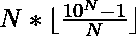

# 求 N 的最大 N 位数倍数

> 原文:[https://www . geesforgeks . org/find-最大 n 位数 n 的倍数/](https://www.geeksforgeeks.org/find-the-largest-n-digit-multiple-of-n/)

给定一个数字 **N** ，任务是找到 N 的最大 **N 位数倍数。
**例:**** 

> **输入:** N = 2
> **输出:** 98
> **说明:**
> 98 是 2 的最大倍数，是 2 位数。
> **输入:** N = 3
> **输出:** 999
> **说明:**
> 999 是 3 的最大倍数，是 3 位数。

**进场:**思路是做一个观察。

*   如果我们仔细观察，会形成一个系列，如 9，98，999，9996，99995，…
*   在上述系列中，第 N 项可以计算为:

> 

*   因此，以数字 N 为输入，实现上述公式。

以下是上述方法的实现:

## C++

```
// C++ program to find largest multiple
// of N containing N digits
#include <iostream>
#include <math.h>
using namespace std;

// Function to find the largest
// N digit multiple of N

void smallestNumber(int N)
{
    cout << N * floor((pow(10, N) - 1) / N);
}

// Driver code
int main()
{
    int N = 2;
    smallestNumber(N);

    return 0;
}
```

## Java 语言(一种计算机语言，尤用于创建网站)

```
// Java program to find largest multiple
// of N containing N digits
import java.util.*;
class GFG{

// Function to find the largest
// N digit multiple of N
static void smallestNumber(int N)
{
    System.out.print(N * Math.floor((
                         Math.pow(10, N) - 1) / N));
}

// Driver code
public static void main(String args[])
{
    int N = 2;
    smallestNumber(N);
}
}

// This code is contributed by Nidhi_biet
```

## 蟒蛇 3

```
# Python3 program to find largest multiple
# of N containing N digits
from math import floor

# Function to find the largest
# N digit multiple of N
def smallestNumber(N):
    print(N * floor((pow(10, N) - 1) / N))

# Driver code
if __name__ == '__main__':
    N = 2
    smallestNumber(N)

# This code is contributed by Mohit Kumar
```

## C#

```
// C# program to find largest multiple
// of N containing N digits
using System;
class GFG{

// Function to find the largest
// N digit multiple of N
static void smallestNumber(int N)
{
    Console.Write(N * Math.Floor((
                      Math.Pow(10, N) - 1) / N));
}

// Driver code
public static void Main()
{
    int N = 2;
    smallestNumber(N);
}
}

// This code is contributed by Code_Mech
```

## java 描述语言

```
<script>

// javascript program to find largest multiple
// of N containing N digits

// Function to find the largest
// N digit multiple of N

function smallestNumber( N)
{
    document.write( N * Math.floor((Math.pow(10, N) - 1) / N));
}

// Driver code
let N = 2;
    smallestNumber(N);

// This code is contributed by todaysgaurav

</script>
```

**Output:** 

```
98
```

***时间复杂度:** O(1)*

***辅助空间:** O(1)*