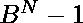

# 求基数 B 中最大的 N 位数完美平方数

> 原文:[https://www . geesforgeks . org/find-最大 n 位数完美平方基数-b/](https://www.geeksforgeeks.org/find-the-largest-n-digit-perfect-square-number-in-base-b/)

给定两个整数 **N** 和 **B** ，任务是找出基数 B 的最大 N 位数，这是一个[完美平方。](https://www.geeksforgeeks.org/check-if-given-number-is-perfect-square-in-cpp/)
**例:**

> **输入:** N = 2，B = 10
> **输出:** 81
> **说明:**
> 81 是基数 10 中最大的两位数完美平方。
> **输入:** N = 1，B = 8
> **输出:** 4
> **说明:**
> 4 是最大的 1 位数八进制数，也是一个完美的正方形。

**方法:**B 基数中最大的数 N 由给出。所以如果我们[找到整数形式的这个数的平方根](https://www.geeksforgeeks.org/square-root-of-an-integer/)，然后我们必须再次求它的平方，那么它将是 N 位数的最大完美平方，由公式给出。
以下是上述方法的实现:

## C++

```
// C++ implementation to find Largest
// N digit perfect square number in Base B

#include <bits/stdc++.h>
using namespace std;

// Function to find the
// largest N digit number
void nDigitPerfectSquares(int n, int b)
{
    // Largest n-digit perfect square
    int largest
        = pow(ceil(sqrt(pow(b, n))) - 1, 2);

    // Print the result
    cout << largest;
}

// Driver Code
int main()
{
    int N = 1, B = 8;

    nDigitPerfectSquares(N, B);

    return 0;
}
```

## Java 语言(一种计算机语言，尤用于创建网站)

```
// Java implementation to find largest N
// digit perfect square number in base B
import java.io.*;
import java.util.*;

class GFG {

// Function to find the
// largest N digit number
static double nDigitPerfectSquares(int n, int b)
{

    // Largest n-digit perfect square
    double largest = Math.pow(Math.ceil
                             (Math.sqrt
                             (Math.pow(b, n))) - 1, 2);

    // Print the result
    return largest;
}

// Driver code
public static void main(String[] args)
{
    int N = 1, B = 8;
    System.out.println(nDigitPerfectSquares(N, B));
}
}

// This code is contributed by coder001
```

## 蟒蛇 3

```
# Python3 implementation to find the largest
# N digit perfect square number in base B
import math

# Function to find the
# largest N digit number
def nDigitPerfectSquares(n, b):

    # Largest n-digit perfect square
    largest = pow(math.ceil
                 (math.sqrt(pow(b, n))) - 1, 2)

    # Print the result
    print(largest)

# Driver Code
N = 1
B = 8

nDigitPerfectSquares(N, B)

# This code is contributed by divyamohan123
```

## C#

```
// C# implementation to find largest N
// digit perfect square number in base B
using System;

class GFG {

// Function to find the
// largest N digit number
static double nDigitPerfectSquares(int n, int b)
{

    // Largest n-digit perfect square
    double largest = Math.Pow(Math.Ceiling
                             (Math.Sqrt
                             (Math.Pow(b, n))) - 1, 2);

    // Print the result
    return largest;
}

// Driver code
public static void Main(String[] args)
{
    int N = 1, B = 8;

    Console.WriteLine(nDigitPerfectSquares(N, B));
}
}

// This code is contributed by PrinciRaj1992
```

## java 描述语言

```
<script>

// Javascript implementation to find Largest
// N digit perfect square number in Base B

// Function to find the
// largest N digit number
function nDigitPerfectSquares(n, b)
{
    // Largest n-digit perfect square
    var largest
        = Math.pow(Math.ceil(Math.sqrt(Math.pow(b, n))) - 1, 2);

    // Print the result
    document.write(largest);
}

// Driver Code
var N = 1, B = 8;
nDigitPerfectSquares(N, B);

</script>
```

**Output:** 

```
4
```