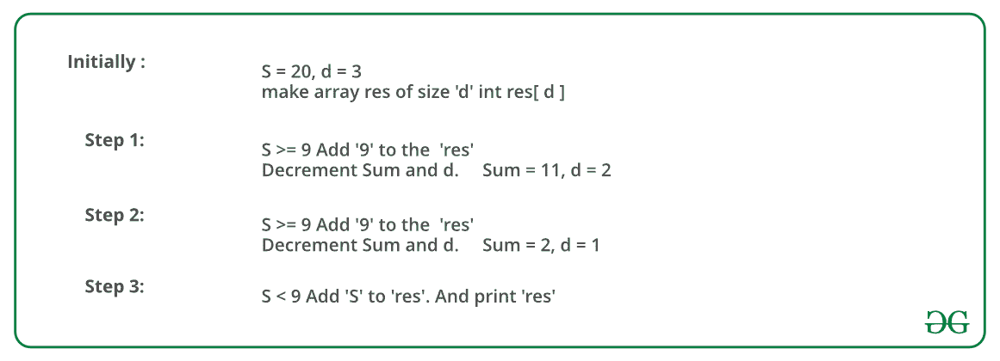

# 找到给定位数和位数总和的最大数

> 原文:[https://www . geesforgeks . org/find-给定位数和位数之和的最大数/](https://www.geeksforgeeks.org/find-the-largest-number-with-given-number-of-digits-and-sum-of-digits/)

如何找到给定位数和 **s** 和位数 **d** 的最大数字？
**例:**

```
Input  : s = 9, d = 2
Output : 90

Input  : s = 20, d = 3
Output : 992
```

一个**简单解**是考虑所有 m 位数，以位数和为 s 跟踪最大数，这个解的时间复杂度的一个接近的上界是 O(10 <sup>m</sup> )。
有一个**贪婪的方法**来解决问题。其思想是从最左边到最右边(或从最高有效位到最低有效位)逐个填充所有数字。
我们比较余数和 9 如果余数和大于 9，我们把 9 放在当前位置，否则我们把余数和。因为我们从左到右填充数字，我们把最高的数字放在左边，因此得到最大的数字。
下图是上述方法的示例:



以下是上述方法的实现:

## C++

```
// C++ program to find the largest number that can be
// formed from given sum of digits and number of digits.
#include <iostream>
using namespace std;

// Prints the smalles possible number with digit sum 's'
// and 'm' number of digits.
void findLargest(int m, int s)
{
    // If sum of digits is 0, then a number is possible
    // only if number of digits is 1.
    if (s == 0)
    {
        (m == 1)? cout << "Largest number is " << 0
                       : cout << "Not possible";
        return ;
    }

    // Sum greater than the maximum possible sum.
    if (s > 9*m)
    {
        cout << "Not possible";
        return ;
    }

    // Create an array to store digits of result
    int res[m];

    // Fill from most significant digit to least
    // significant digit.
    for (int i=0; i<m; i++)
    {
        // Fill 9 first to make the number largest
        if (s >= 9)
        {
            res[i] = 9;
            s -= 9;
        }

        // If remaining sum becomes less than 9, then
        // fill the remaining sum
        else
        {
            res[i] = s;
            s = 0;
        }
    }

    cout << "Largest number is ";
    for (int i=0; i<m; i++)
        cout << res[i];
}

// Driver code
int main()
{
    int s = 9, m = 2;
    findLargest(m, s);
    return 0;
}
```

## Java 语言(一种计算机语言，尤用于创建网站)

```
// Java program to find the largest number that can be
// formed from given sum of digits and number of digits

class GFG
{
    // Function to print the largest possible number with digit sum 's'
    // and 'm' number of digits
    static void findLargest(int m, int s)
    {
        // If sum of digits is 0, then a number is possible
        // only if number of digits is 1
        if (s == 0)
        {
            System.out.print(m == 1 ? "Largest number is 0" : "Not possible");

            return ;
        }

        // Sum greater than the maximum possible sum
        if (s > 9*m)
        {
            System.out.println("Not possible");
            return ;
        }

        // Create an array to store digits of result
        int[] res = new int[m];

        // Fill from most significant digit to least
        // significant digit
        for (int i=0; i<m; i++)
        {
            // Fill 9 first to make the number largest
            if (s >= 9)
            {
                res[i] = 9;
                s -= 9;
            }

            // If remaining sum becomes less than 9, then
            // fill the remaining sum
            else
            {
                res[i] = s;
                s = 0;
            }
        }

        System.out.print("Largest number is ");
        for (int i=0; i<m; i++)
            System.out.print(res[i]);
    }

    // driver program
    public static void main (String[] args)
    {
        int s = 9, m = 2;
        findLargest(m, s);
    }
}

// Contributed by Pramod Kumar
```

## 蟒蛇 3

```
# Python 3 program to find
# the largest number that
# can be formed from given
# sum of digits and number
# of digits.

# Prints the smalles
# possible number with digit
# sum 's' and 'm' number of
# digits.
def findLargest( m, s) :

    # If sum of digits is 0,
    # then a number is possible
    # only if number of digits
    # is 1.
    if (s == 0) :

        if(m == 1) :
            print("Largest number is " , "0",end = "")
        else :
            print("Not possible",end = "")

        return

    # Sum greater than the
    # maximum possible sum.
    if (s > 9 * m) :
        print("Not possible",end = "")
        return

    # Create an array to
    # store digits of
    # result
    res = [0] * m

    # Fill from most significant
    # digit to least significant
    # digit.
    for i in range(0, m) :

        # Fill 9 first to make
        # the number largest
        if (s >= 9) :
            res[i] = 9
            s = s - 9

        # If remaining sum
        # becomes less than
        # 9, then fill the
        # remaining sum
        else :
            res[i] = s
            s = 0

    print( "Largest number is ",end = "")

    for i in range(0, m) :
        print(res[i],end = "")

# Driver code
s = 9
m = 2
findLargest(m, s)

# This code is contributed by Nikita Tiwari.
```

## C#

```
// C# program to find the
// largest number that can
// be formed from given sum
// of digits and number of digits
using System;

class GFG
{

    // Function to print the 
    // largest possible number
    // with digit sum 's' and
    // 'm' number of digits
    static void findLargest(int m, int s)
    {
        // If sum of digits is 0,
        // then a number is possible
        // only if number of digits is 1
        if (s == 0)
        {
            Console.Write(m == 1 ?
                   "Largest number is 0" :
                          "Not possible");

            return ;
        }

        // Sum greater than the
        // maximum possible sum
        if (s > 9 * m)
        {
            Console.WriteLine("Not possible");
            return ;
        }

        // Create an array to
        // store digits of result
        int []res = new int[m];

        // Fill from most significant
        // digit to least significant digit
        for (int i = 0; i < m; i++)
        {
            // Fill 9 first to make
            // the number largest
            if (s >= 9)
            {
                res[i] = 9;
                s -= 9;
            }

            // If remaining sum becomes
            // less than 9, then
            // fill the remaining sum
            else
            {
                res[i] = s;
                s = 0;
            }
        }

        Console.Write("Largest number is ");
        for (int i = 0; i < m; i++)
            Console.Write(res[i]);
    }

    // Driver Code
    static public void Main ()
    {
        int s = 9, m = 2;
        findLargest(m, s);
    }
}

// This code is Contributed by ajit
```

## 服务器端编程语言（Professional Hypertext Preprocessor 的缩写）

```
<?php
// PHP program to find the largest
// number that can be formed from
// given sum of digits and number
// of digits.

// Prints the smalles possible
// number with digit sum 's'
// and 'm' number of digits.
function findLargest($m, $s)
{
    // If sum of digits is 0, then
    // a number is possible only if
    // number of digits is 1.
    if ($s == 0)
    {
        if(($m == 1) == true)
            echo "Largest number is " , 0;
        else
            echo "Not possible";
        return ;
    }

    // Sum greater than the
    // maximum possible sum.
    if ($s > 9 * $m)
    {
        echo "Not possible";
        return ;
    }

    // Create an array to store
    // digits of result Fill from
    // most significant digit to
    // least significant digit.
    for ($i = 0; $i < $m; $i++)
    {
        // Fill 9 first to make
        // the number largest
        if ($s >= 9)
        {
            $res[$i] = 9;
            $s -= 9;
        }

        // If remaining sum becomes
        // less than 9, then fill
        // the remaining sum
        else
        {
            $res[$i] = $s;
            $s = 0;
        }
    }

    echo "Largest number is ";
    for ($i = 0; $i < $m; $i++)
        echo $res[$i];
}

// Driver code
$s = 9; $m = 2;
findLargest($m, $s);

// This code is contributed by m_kit
?>
```

## java 描述语言

```
<script>
// Javascript program to find the largest number that can be
// formed from given sum of digits and number of digits.

// Prints the smalles possible number with digit sum 's'
// and 'm' number of digits.
function findLargest(m, s)
{
    // If sum of digits is 0, then a number is possible
    // only if number of digits is 1.
    if (s == 0)
    {
        (m == 1)? document.write("Largest number is " + 0)
                    : document.write("Not possible");
        return ;
    }

    // Sum greater than the maximum possible sum.
    if (s > 9*m)
    {
        document.write("Not possible");
        return ;
    }

    // Create an array to store digits of result
    let res = new Array(m);

    // Fill from most significant digit to least
    // significant digit.
    for (let i=0; i<m; i++)
    {
        // Fill 9 first to make the number largest
        if (s >= 9)
        {
            res[i] = 9;
            s -= 9;
        }

        // If remaining sum becomes less than 9, then
        // fill the remaining sum
        else
        {
            res[i] = s;
            s = 0;
        }
    }

    document.write("Largest number is ");
    for (let i=0; i<m; i++)
        document.write(res[i]);
}

// Driver code
    let s = 9, m = 2;
    findLargest(m, s);

// This code is contributed by Mayank Tyagi

</script>
```

**输出:**

```
Largest number is 90
```

该解决方案的时间复杂度为 0(m)。
本文由**瓦伊巴夫·阿加瓦尔**供稿。如果你喜欢极客博客并想投稿，你也可以写一篇文章并把你的文章邮寄到 review-team@geeksforgeeks.org。看到你的文章出现在极客博客主页上，帮助其他极客。
如发现任何不正确的地方，请写评论，或者您想分享更多关于上述话题的信息