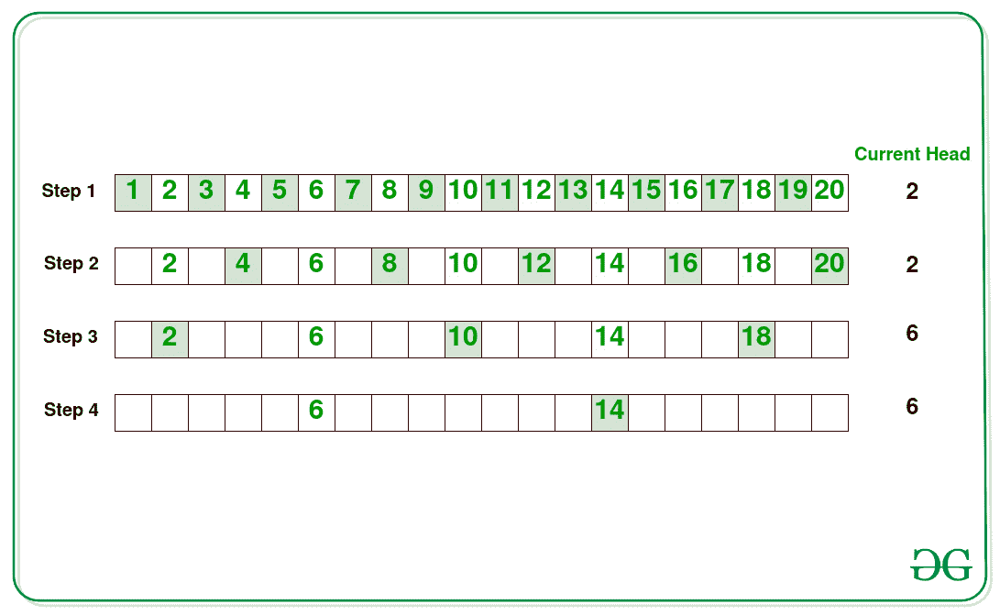

# 交替从两端重复移除每隔一个元素后找到最后一个元素

> 原文:[https://www . geeksforgeeks . org/find-最后一个元素-重复-每隔一秒-从任一端移除元素-交替/](https://www.geeksforgeeks.org/find-the-last-element-after-repeatedly-removing-every-second-element-from-either-end-alternately/)

给定一个由 **N** 个整数组成的[数组](https://www.geeksforgeeks.org/introduction-to-arrays/)**arr【】**，任务是从第一个和最后一个交替开始，在移除每隔一个元素后找到最后一个剩余的数组元素。

**示例:**

> **输入:** arr[] = {1，2，3，4，5，6，7，8，9，10}
> **输出:** 8
> **说明:**列表中的元素有:1 2 3 4 5 6 7 8 9 10
> 从**第一个**数组元素开始，从 arr[] = { **<u>1、</u>** 2 中去掉每隔一个元素。 **<u>3、</u>** 4、 **<u>5、</u>** 6、 **<u>7、</u>** 8、 **<u>9、</u>** 10}将 arr[]修改为{2、4、6、8、10}。
> 从最后一个**数组元素开始，从 arr[] = { **<u>2、</u>** 4、 **<u>6</u>** 、8、 **<u>10</u> }** 将 arr[]修改为{4，8}。
> 从**第一个**数组元素开始，从 arr[] = { **<u>4、</u>** 8}中移除每隔一个元素，将 arr[]修改为{8}。
> 因此，数组中最后剩余的元素是 **8。****
> 
> **输入:** arr[] = {2，3，5，6}
> **输出:** 3

**天真方法:**解决这个问题最简单的方法是从第一个和最后一个索引开始交替移除数组中的每一秒元素，直到数组的大小减少到 **1** 。打印执行给定操作后剩余的最后一个数组元素。

***时间复杂度:**O(N<sup>2</sup>)*
***辅助空间:** O(1)*

**有效方法:**上述方法也可以通过下图中 **N = 20** 的观察进行优化:

[](https://media.geeksforgeeks.org/wp-content/cdn-uploads/20210217130215/LastElement1.jpg)

从上图中可以观察到以下情况:

*   每次 **N/2** 号被淘汰。
*   如果转弯方向是从**左到右** (→)，则序列的第一个元素变为**(currentfirtelement+2<sup>step–1</sup>)**。
*   如果转弯方向是从**右向左**(↓)然后列表中的[剩余号码是**奇数**](https://www.geeksforgeeks.org/check-whether-given-number-even-odd/) ，则序列的第一个元素变为**(current firmitement+2<sup>step–1</sup>)**。
*   从以上步骤得到**currentfirtelement**的最终值后，将该值打印为序列中的剩余元素。

**步骤:**

*   初始化一个变量，比如**左转**，检查元素是从左边删除还是从右边删除。
*   初始化变量**将元素**保留为 **N** 、**步骤**保留为 **1** ，将**头**保留为 **1** ，以存储序列中的剩余元素、执行的步骤数以及序列的第一个元素。
*   迭代直到**剩余条件**大于 **1** :
    *   如果**左转**的值为**真**，则更新**头**为**(头+ 2 <sup>步–1</sup>)**。否则，如果**剩余**为奇数，则更新**头**为**(头+ 2 <sup>步–1</sup>)**。
    *   将**剩余元素**的值更新为**剩余元素/2** 。
    *   将**步**更新为 **2 *步**。
    *   切换**向左转**从右侧移除元素。
*   完成上述步骤后，将索引**(head–1)**处的值打印为剩余元素。

下面是上述方法的实现:

## C++

```
// C++ program for the above approach
#include <bits/stdc++.h>
using namespace std;

// Function to find the last element
// remaining in the array after
// performing the given operations
void printLastElement(int arr[], int N)
{
    // Checks if traversal is from
    // left to right or vice versa
    bool leftTurn = true;

    // Store the elements currently
    // present in the array
    int remainElements = N;

    // Store the distance between 2
    // consecutive array elements
    int step = 1;

    // Store the first element
    // of the remaining array
    int head = 1;

    // Iterate while elements
    // are greater than 1
    while (remainElements > 1) {

        // If left to right turn
        if (leftTurn) {

            // Update head
            head = head + step;
        }

        // Otherwise, check if the
        // remaining elements are odd
        else {

            // If true, update head
            if (remainElements % 2 == 1)
                head = head + step;
        }

        // Eleminate half of the array elements
        remainElements = remainElements / 2;

        // Double the steps after each turn
        step = step * 2;

        // Alter the turn
        leftTurn = !leftTurn;
    }

    // Print the remaining element
    cout << arr[head - 1];
}

// Driver Code
int main()
{
    int arr[] = { 2, 3, 5, 6 };
    int N = sizeof(arr) / sizeof(arr[0]);

    printLastElement(arr, N);

    return 0;
}
```

## Java 语言(一种计算机语言，尤用于创建网站)

```
// Java program for the above approach
import java.lang.*;

class GFG{

// Function to find the last element
// remaining in the array after
// performing the given operations
public static void printLastElement(int arr[], int N)
{

    // Checks if traversal is from
    // left to right or vice versa
    boolean leftTurn = true;

    // Store the elements currently
    // present in the array
    int remainElements = N;

    // Store the distance between 2
    // consecutive array elements
    int step = 1;

    // Store the first element
    // of the remaining array
    int head = 1;

    // Iterate while elements
    // are greater than 1
    while (remainElements > 1)
    {

        // If left to right turn
        if (leftTurn)
        {

            // Update head
            head = head + step;
        }

        // Otherwise, check if the
        // remaining elements are odd
        else
        {

            // If true, update head
            if (remainElements % 2 == 1)
                head = head + step;
        }

        // Eleminate half of the array elements
        remainElements = remainElements / 2;

        // Double the steps after each turn
        step = step * 2;

        // Alter the turn
        leftTurn = !leftTurn;
    }

    // Print the remaining element
    System.out.print( arr[head - 1]);
}

// Driver code
public static void main(String args[])
{
    int[] arr = { 2, 3, 5, 6 };
    int N = arr.length;

    printLastElement(arr, N);
}
}

// This code is contributed by SoumikMondal
```

## 蟒蛇 3

```
# Python3 program for the above approach

# Function to find the last element
# remaining in the array after
# performing the given operations
def printLastElement(arr, N):

    # Checks if traversal is from
    # left to right or vice versa
    leftTurn = True

    # Store the elements currently
    # present in the array
    remainElements = N

    # Store the distance between 2
    # consecutive array elements
    step = 1

    # Store the first element
    # of the remaining array
    head = 1

    # Iterate while elements
    # are greater than 1
    while (remainElements > 1):

        # If left to right turn
        if (leftTurn):

            # Update head
            head = head + step

        # Otherwise, check if the
        # remaining elements are odd
        else:

            # If true, update head
            if (remainElements % 2 == 1):
                head = head + step

        # Eleminate half of the array elements
        remainElements = remainElements // 2

        # Double the steps after each turn
        step = step * 2

        # Alter the turn
        leftTurn = not leftTurn

    # Print the remaining element
    print(arr[head - 1])

# Driver Code
if __name__ == "__main__":

    arr = [ 2, 3, 5, 6 ]
    N = len(arr)

    printLastElement(arr, N)

# This code is contributed by ukasp
```

## java 描述语言

```
<script>

// Javascript program for the above approach

// Function to find the last element
// remaining in the array after
// performing the given operations
function printLastElement(arr, N)
{

    // Checks if traversal is from
    // left to right or vice versa
    var leftTurn = true;

    // Store the elements currently
    // present in the array
    var remainElements = N;

    // Store the distance between 2
    // consecutive array elements
    var step = 1;

    // Store the first element
    // of the remaining array
    var head = 1;

    // Iterate while elements
    // are greater than 1
    while (remainElements > 1)
    {

        // If left to right turn
        if (leftTurn)
        {

            // Update head
            head = head + step;
        }

        // Otherwise, check if the
        // remaining elements are odd
        else
        {

            // If true, update head
            if (remainElements % 2 == 1)
                head = head + step;
        }

        // Eleminate half of the array elements
        remainElements = remainElements / 2;

        // Double the steps after each turn
        step = step * 2;

        // Alter the turn
        leftTurn = !leftTurn;
    }

    // Print the remaining element
    document.write(arr[head - 1]);
}

// Driver code
var arr = [ 2, 3, 5, 6 ];
var N = arr.length;

printLastElement(arr, N);

// This code is contributed by Ankita saini

</script>
```

## C#

```
// C# program for the above approach
using System;

public class GFG{

    // Function to find the last element
// remaining in the array after
// performing the given operations
public static void printLastElement(int[] arr, int N)
{

    // Checks if traversal is from
    // left to right or vice versa
    bool leftTurn = true;

    // Store the elements currently
    // present in the array
    int remainElements = N;

    // Store the distance between 2
    // consecutive array elements
    int step = 1;

    // Store the first element
    // of the remaining array
    int head = 1;

    // Iterate while elements
    // are greater than 1
    while (remainElements > 1)
    {

        // If left to right turn
        if (leftTurn)
        {

            // Update head
            head = head + step;
        }

        // Otherwise, check if the
        // remaining elements are odd
        else
        {

            // If true, update head
            if (remainElements % 2 == 1)
                head = head + step;
        }

        // Eleminate half of the array elements
        remainElements = remainElements / 2;

        // Double the steps after each turn
        step = step * 2;

        // Alter the turn
        leftTurn = !leftTurn;
    }

    // Print the remaining element
    Console.Write( arr[head - 1]);
}

// Driver code

    static public void Main (){
        int[] arr = { 2, 3, 5, 6 };
    int N = arr.Length;

    printLastElement(arr, N);
    }

}

// This code is contributed by avanitrachhadiya2155
```

**Output:** 

```
3
```

***时间复杂度:** O(log N)*
***辅助空间:** O(1)*