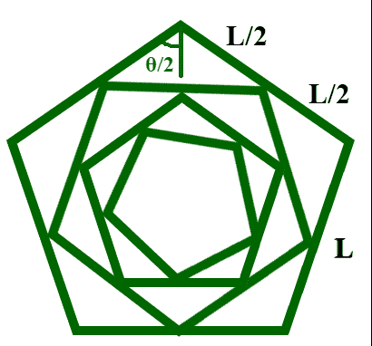
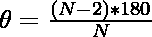
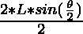
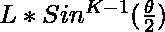

# 求给定运算形成的第 k 个 N 边多边形的长度

> 原文:[https://www . geeksforgeeks . org/find-给定运算形成的长度为 kth-n 边的多边形/](https://www.geeksforgeeks.org/find-the-length-of-kth-n-sided-polygon-formed-by-given-operations/)

给定一个整数 **L** ，代表一个 **N** 边正多边形的边长和一个整数 **K** ，任务是通过连接**边的中点找到**(K–1)<sup>第</sup>** 边正多边形内部形成的 **K <sup>第</sup>**T10】N**边正多边形的边长****

**示例:**

> **输入:** N = 3，L = 6，K = 2
> T3】输出: 3
> 
> **输入:** N = 5，L = 21，K = 7
> T3】输出: 5.88796

**方法:**给定的问题可以基于以下观察来解决:

[](https://media.geeksforgeeks.org/wp-content/uploads/20210407011938/penta.png)

*   假设，θ代表 N 边多边形的内角，对于内部形成的所有多边形来说，该内角都是相同的，即
*   通过连接边的中点在内部形成的第一个多边形的边的长度可以使用公式来计算。
*   在**(K–1)<sup>多边形</sup>**内部形成的 **K <sup>第</sup>** 多边形的边的长度以及连接**(K–1)<sup>第</sup>多边形**的边的中点为

按照以下步骤解决问题:

*   求 N 边正多边形的[内角，并存储在一个变量中，比如以弧度表示的**角**。](https://www.geeksforgeeks.org/program-to-find-the-interior-and-exterior-angle-of-a-regular-polygon/)
*   用上面讨论的公式计算**K<sup>th</sup>T3【N 边正多边形】的边长后打印边长。**

下面是上述方法的实现:

## C++

```
// C++ program for the above approach

#include <bits/stdc++.h>
using namespace std;
#define PI 3.14159265

// Function to calculate the interior
// angle of a N-sided regular polygon
double findInteriorAngle(int n)
{
    return (n - 2) * PI / n;
}

// Function to find the K-th polygon
// formed inside the (K - 1)th polygon
double calculateSideLength(double L,
                           int N, int K)
{
    // Stores the interior angle
    double angle = findInteriorAngle(N);

    // Stores the side length of
    // K-th regular polygon
    double length = L * pow(sin(angle / 2),
                            (K - 1));

    // Return the length
    return length;
}

// Driver Code
int main()
{
    double N = 5, L = 21, K = 7;
    cout << calculateSideLength(L, N, K);

    return 0;
}
```

## Java 语言(一种计算机语言，尤用于创建网站)

```
// Java program for the above approach
import java.util.*;

class GFG{

static final double PI = 3.14159265;

// Function to calculate the interior
// angle of a N-sided regular polygon
static double findInteriorAngle(int n)
{
    return ((n - 2) * PI) / n;
}

// Function to find the K-th polygon
// formed inside the (K - 1)th polygon
static double calculateSideLength(double L,
                                  int N, int K)
{

    // Stores the interior angle
    double angle = findInteriorAngle(N);

    // Stores the side length of
    // K-th regular polygon
    double length = L * Math.pow(Math.sin(angle / 2),
                                             (K - 1));

    // Return the length
    return length;
}

// Driver Code
public static void main(String[] args)
{
    double L = 21;
    int N = 5, K = 7;

    System.out.print(calculateSideLength(L, N, K));
}
}

// This code is contributed by 29AjayKumar
```

## 蟒蛇 3

```
# Python3 program for the above approach
import math
PI = 3.14159265

# Function to calculate the interior
# angle of a N-sided regular polygon
def findInteriorAngle(n):

    return (n - 2) * PI / n

# Function to find the K-th polygon
# formed inside the (K - 1)th polygon
def calculateSideLength(L,
                        N, K):

    # Stores the interior angle
    angle = findInteriorAngle(N)

    # Stores the side length of
    # K-th regular polygon
    length = L * pow(math.sin(angle / 2),
                     (K - 1))

    # Return the length
    return length

# Driver Code
if __name__ == "__main__":

    N = 5
    L = 21
    K = 7
    print(calculateSideLength(L, N, K))

    # This code is contributed by ukasp.
```

## C#

```
// C# program for the above approach
using System;

class GFG{

static readonly double PI = 3.14159265;

// Function to calculate the interior
// angle of a N-sided regular polygon
static double findInteriorAngle(int n)
{
    return ((n - 2) * PI) / n;
}

// Function to find the K-th polygon
// formed inside the (K - 1)th polygon
static double calculateSideLength(double L,
                                  int N, int K)
{

    // Stores the interior angle
    double angle = findInteriorAngle(N);

    // Stores the side length of
    // K-th regular polygon
    double length = L * Math.Pow(Math.Sin(angle / 2),
                                             (K - 1));

    // Return the length
    return length;
}

// Driver Code
public static void Main(String[] args)
{
    double L = 21;
    int N = 5, K = 7;

    Console.Write(calculateSideLength(L, N, K));
}
}

// This code is contributed by 29AjayKumar
```

## java 描述语言

```
<script>

        // Javascript program for the above approach
        const PI = 3.14159265

        // Function to calculate the interior
        // angle of a N-sided regular polygon
        function findInteriorAngle(n)
        {
            return (n - 2) * PI / n;
        }

        // Function to find the K-th polygon
        // formed inside the (K - 1)th polygon
        function calculateSideLength(L,
            N, K) {
            // Stores the interior angle
            let angle = findInteriorAngle(N);

            // Stores the side length of
            // K-th regular polygon
            let length = L * Math.pow(Math.sin(angle / 2),
                (K - 1));

            // Return the length
            return length;
        }

        // Driver Code

        let N = 5
        let L = 21
        let K = 7;
        document.write(calculateSideLength(L, N, K))

    </script>
```

**Output:** 

```
5.88796
```

***时间复杂度:** O(log K)*
***辅助空间:** O(1)*