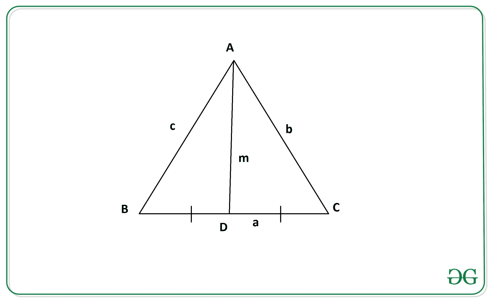

# 如果给定边长，求三角形中值的长度

> 原文:[https://www . geeksforgeeks . org/find-给定边长的三角形中值长度/](https://www.geeksforgeeks.org/find-the-length-of-the-median-of-a-triangle-if-length-of-sides-are-given/)

假设三角形所有三条边的长度分别为 **a** 、 **b** 和 **c** 。任务是计算三角形中线的长度。

> 三角形的中间值**是将一个顶点连接到对侧中点的线段，从而将该侧一分为二。**

**例:**

> **输入:** a = 8，b = 10，c = 13
> **输出:** 10.89
> **输入:** a = 4，b = 3，c = 5
> **输出:** 3.61

**方法:**思路是用[阿波罗尼斯定理](https://en.wikipedia.org/wiki/Apollonius%27s_theorem#:~:text=In%20geometry%2C%20Apollonius's%20theorem%20is, median%20bisecting%20the%20third%20side%22.)来解决这个问题。

> **阿波罗尼奥斯定理**指出“三角形任意两条边的平方之和等于第三条边一半的平方的两倍，以及平分第三条边的中线的平方的两倍”。
> 
> [](https://media.geeksforgeeks.org/wp-content/uploads/20200609160743/geeks.jpg)
> 
> 从上图中，根据阿波罗尼奥斯定理，我们有:
> 
> 
> 
> 其中 a、b 和 c 是三角形边长
> ，m 是三角形边 2*a
> 的中值长度

因此，上式中三角形的中值长度由下式给出:

> 

以下是上述方法的实现:

## C++

```
// C++ program to find the length of the
// median using sides of the triangle
#include<bits/stdc++.h>
using namespace std;

// Function to return the length of
// the median using sides of triangle
float median(int a, int b, int c)
{
    float n = sqrt(2 * b * b +
                   2 * c * c - a * a) / 2;
    return n;
}

// Driver code
int main()
{
    int a, b, c;
    a = 4;
    b = 3;
    c = 5;

    // Function call
    float ans = median(a, b, c);

    // Print final answer with 2
    // digits after decimal
    cout << fixed << setprecision(2) << ans;
    return 0;
}

// This code is contributed by himanshu77
```

## Java 语言(一种计算机语言，尤用于创建网站)

```
// Java program to find the length of the
// median using sides of the triangle
import java.util.*;

class GFG{

// Function to return the length of
// the median using sides of triangle
public static float median(int a, int b, int c)
{
    float n = (float)(Math.sqrt(2 * b * b +
                                2 * c * c -
                                a * a) / 2);
    return n;
}

// Driver code
public static void main(String[] args)
{
    int a, b, c;
    a = 4;
    b = 3;
    c = 5;

    // Function call
    float ans = median(a, b, c);

    // Print final answer with 2
    // digits after decimal
    System.out.println(String.format("%.2f", ans));
}
}

// This code is contributed by divyeshrabadiya07
```

## 蟒蛇 3

```
# Python3 implementation to Find the
# length of the median using sides
# of the triangle

import math

# Function to return the length of
# the median using sides of triangle.
def median(a, b, c):

    n = (1 / 2)*math.sqrt(2*(b**2)
   + 2*(c**2)
 - a**2) 

    return n

# Driver Code
a = 4
b = 3
c = 5

# Function Call
ans = median(a, b, c)

# Print the final answer
print(round(ans, 2))
```

## C#

```
// C# program to find the length of the
// median using sides of the triangle
using System;

class GFG{

// Function to return the length of
// the median using sides of triangle
public static float median(int a, int b, int c)
{
    float n = (float)(Math.Sqrt(2 * b * b +
                                2 * c * c -
                                a * a) / 2);
    return n;
}

// Driver code
public static void Main(String[] args)
{
    int a, b, c;
    a = 4;
    b = 3;
    c = 5;

    // Function call
    float ans = median(a, b, c);

    // Print readonly answer with 2
    // digits after decimal
    Console.WriteLine(String.Format("{0:F2}", ans));
}
}

// This code is contributed by gauravrajput1
```

## java 描述语言

```
<script>

// JavaScript program to find the length of the
// median using sides of the triangle

// Function to return the length of
// the median using sides of triangle
function median(a, b, c)
{
    let n = (Math.sqrt(2 * b * b +
                                2 * c * c -
                                a * a) / 2);
    return n;
}

// Driver Code

     let a, b, c;
    a = 4;
    b = 3;
    c = 5;

    // Function call
    let ans = median(a, b, c);

    // Print final answer with 2
    // digits after decimal
    document.write(ans, 2);

</script>
```

**Output:** 

```
3.61
```

***时间复杂度:** O(1)*
***空间复杂度:** O(1)*