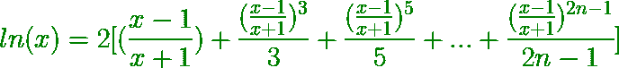
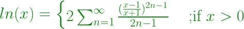
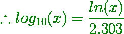

# 借助展开找到 ln(X)和 log10X

> 原文:[https://www . geesforgeks . org/find-the-lnx-and-log 10x-借助扩展/](https://www.geeksforgeeks.org/find-the-lnx-and-log10x-with-the-help-of-expansion/)

给定一个正数 x，任务是在展开的帮助下找到这个数的自然对数(ln)并记录到这个数的基数 10 (log <sub>10</sub> )。

**示例:**

```
Input: x = 5
Output: ln 5.000 = 1.609
        log10 5.000 = 0.699

Input: x = 10
Output: ln 10.000 = 2.303
        log10 10.000 = 1.000
```

**进场:**

*   x (ln x)的自然对数展开式为:



*   所以这个系列可以总结为:



*   因此，可以用一个函数来计算序列的第 n 项 **1 ≤ x ≤ n**
*   现在要计算 **log <sub>10</sub> x** ，可以使用下面的公式:



下面是上述方法的实现:

## C++

```
// CPP code to Find the ln x and
// log<sub>10</sub> x with the help of expansion

#include <cmath>
#include <iomanip>
#include <iostream>

using namespace std;

// Function to calculate ln x using expansion
double calculateLnx(double n)
{

    double num, mul, cal, sum = 0;
    num = (n - 1) / (n + 1);

    // terminating value of the loop
    // can be increased to improve the precision
    for (int i = 1; i <= 1000; i++) {
        mul = (2 * i) - 1;
        cal = pow(num, mul);
        cal = cal / mul;
        sum = sum + cal;
    }
    sum = 2 * sum;
    return sum;
}

// Function to calculate log10 x
double calculateLogx(double lnx)
{
    return (lnx / 2.303);
}

// Driver Code
int main()
{

    double lnx, logx, n = 5;
    lnx = calculateLnx(n);
    logx = calculateLogx(lnx);

    // setprecision(3) is used to display
    // the output up to 3 decimal places

    cout << fixed << setprecision(3)
         << "ln " << n << " = "
         << lnx << endl;
    cout << fixed << setprecision(3)
         << "log10 " << n << " = "
         << logx << endl;
}
```

## Java 语言(一种计算机语言，尤用于创建网站)

```
// Java code to Find the ln x and
// log<sub>10</sub> x with the help of expansion
import java.io.*;

class GFG
{

// Function to calculate ln x using expansion
static double calculateLnx(double n)
{
    double num, mul, cal, sum = 0;
    num = (n - 1) / (n + 1);

    // terminating value of the loop
    // can be increased to improve the precision
    for (int i = 1; i <= 1000; i++)
    {
        mul = (2 * i) - 1;
        cal = Math.pow(num, mul);
        cal = cal / mul;
        sum = sum + cal;
    }
    sum = 2 * sum;
    return sum;
}

// Function to calculate log10 x
static double calculateLogx(double lnx)
{
    return (lnx / 2.303);
}

// Driver Code
public static void main (String[] args)
{
    double lnx, logx, n = 5;
    lnx = calculateLnx(n);
    logx = calculateLogx(lnx);

    // setprecision(3) is used to display
    // the output up to 3 decimal places

    System.out.println ("ln " + n + " = " + lnx );
    System.out.println ("log10 " + n + " = "+ logx );
}
}

// This code is contributed by ajit
```

## 蟒蛇 3

```
# Python 3 code to Find the ln x and
# log<sub>10</sub> x with the help of expansion
# Function to calculate ln x using expansion
from math import pow
def calculateLnx(n):
    sum = 0
    num = (n - 1) / (n + 1)

    # terminating value of the loop
    # can be increased to improve the precision
    for i in range(1, 1001, 1):
        mul = (2 * i) - 1
        cal = pow(num, mul)
        cal = cal / mul
        sum = sum + cal

    sum = 2 * sum
    return sum

# Function to calculate log10 x
def calculateLogx(lnx):
    return (lnx / 2.303)

# Driver Code
if __name__ == '__main__':
    n = 5
    lnx = calculateLnx(n)
    logx = calculateLogx(lnx)

    # setprecision(3) is used to display
    # the output up to 3 decimal places

    print("ln", "{0:.3f}".format(n),
           "=", "{0:.3f}".format(lnx))
    print("log10", "{0:.3f}".format(n),
              "=", "{0:.3f}".format(logx))

# This code is contributed by
# Surendra_Gangwar
```

## C#

```
// C# code to Find the ln x and
// log<sub>10</sub> x with the help of expansion
using System;

class GFG
{

// Function to calculate ln x using expansion
static double calculateLnx(double n)
{
    double num, mul, cal, sum = 0;
    num = (n - 1) / (n + 1);

    // terminating value of the loop
    // can be increased to improve the precision
    for (int i = 1; i <= 1000; i++)
    {
        mul = (2 * i) - 1;
        cal = Math.Pow(num, mul);
        cal = cal / mul;
        sum = sum + cal;
    }
    sum = 2 * sum;
    return sum;
}

// Function to calculate log10 x
static double calculateLogx(double lnx)
{
    return (lnx / 2.303);
}

// Driver Code
public static void Main (String[] args)
{
    double lnx, logx, n = 5;
    lnx = calculateLnx(n);
    logx = calculateLogx(lnx);

    // setprecision(3) is used to display
    // the output up to 3 decimal places

    Console.WriteLine("ln " + n + " = " + lnx );
    Console.WriteLine("log10 " + n + " = "+ logx );
}
}

// This code is contributed by Princi Singh
```

## java 描述语言

```
<script>

// Javascript code to Find the ln x and
// log<sub>10</sub> x with the help of expansion

// Function to calculate ln x using expansion
function calculateLnx(n)
{
    let num, mul, cal, sum = 0;
    num = (n - 1) / (n + 1);

    // Terminating value of the loop
    // can be increased to improve the precision
    for(let i = 1; i <= 1000; i++)
    {
        mul = (2 * i) - 1;
        cal = Math.pow(num, mul);
        cal = cal / mul;
        sum = sum + cal;
    }
    sum = 2 * sum;
    return sum;
}

// Function to calculate log10 x
function calculateLogx(lnx)
{
    return (lnx / 2.303);
}

// Driver Code
let lnx, logx, n = 5;
lnx = calculateLnx(n);
logx = calculateLogx(lnx);

// setprecision(3) is used to display
// the output up to 3 decimal places
document.write("ln " + n + " = " + lnx + "<br>");
document.write("log10 " + n + " = "+ logx + "<br>");

// This code is contributed by souravmahato348

</script>
```

**Output:** 

```
ln 5.000 = 1.609
log10 5.000 = 0.699
```