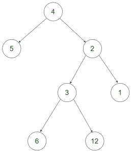

# 求二叉树兄弟的最大 GCD

> 原文:[https://www . geeksforgeeks . org/find-最大值-二叉树的同辈 gcd/](https://www.geeksforgeeks.org/find-the-maximum-gcd-of-the-siblings-of-a-binary-tree/)

给定一个 2d- [数组](https://www.geeksforgeeks.org/array-data-structure/)**arr【】【】**表示一个[二叉树](https://www.geeksforgeeks.org/binary-tree-data-structure/)的节点，任务是找到这个树的兄弟节点的最大值 [GCD](https://www.geeksforgeeks.org/c-program-find-gcd-hcf-two-numbers/) ，而不需要实际构造它。

**示例:**

> **输入:** arr[][] = {{4，5}、{4，2}、{2，3}、{2，1}、{3，6}、{3，12}}
> **输出:** 6
> **解释:**
> 
> 
> 
> 对于上面的树，对于节点 3 的子节点，为节点 6 和 12 形成了西伯利亚的最大 GCD。
> 
> **输入:** arr[][] = {{5，4}，{5，8}，{4，6}，{4，9}，{8，10}，{10，20}，{10，30 } }
> T3】输出: 10

**方法:**思路是形成一个[向量](https://www.geeksforgeeks.org/vector-in-cpp-stl/)，以向量的形式存储树。以向量形式存储树后，会出现以下情况:

*   如果向量大小为 **0 或 1** ，则打印 0 为[找不到 GCD](https://www.geeksforgeeks.org/c-program-find-gcd-hcf-two-numbers/) 。
*   对于所有其他情况，因为我们以一对的形式存储树，所以我们考虑两对的第一个值并比较它们。但是首先，您需要对这对边进行排序。
    **例如，**让我们假设向量 A 和 b 中有两对。我们检查是否:

```
A.first == B.first
```

*   如果它们都匹配，那么它们都属于同一个父对象。因此，我们计算成对的第二个值的 GCD，并最终打印所有这样的 GCD 的最大值。

下面是上述方法的实现:

## C++

```
// C++ program to find the maximum
// GCD of the siblings of a binary tree

#include <bits/stdc++.h>
using namespace std;

// Function to find maximum GCD
int max_gcd(vector<pair<int, int> >& v)
{
    // No child or Single child
    if (v.size() == 1 || v.size() == 0)
        return 0;

    sort(v.begin(), v.end());

    // To get the first pair
    pair<int, int> a = v[0];
    pair<int, int> b;
    int ans = INT_MIN;
    for (int i = 1; i < v.size(); i++) {
        b = v[i];

        // If both the pairs belongs to
        // the same parent
        if (b.first == a.first)

            // Update ans with the max
            // of current gcd and
            // gcd of both children
            ans
                = max(ans,
                      __gcd(a.second,
                            b.second));

        // Update previous
        // for next iteration
        a = b;
    }
    return ans;
}

// Driver function
int main()
{
    vector<pair<int, int> > v;
    v.push_back(make_pair(5, 4));
    v.push_back(make_pair(5, 8));
    v.push_back(make_pair(4, 6));
    v.push_back(make_pair(4, 9));
    v.push_back(make_pair(8, 10));
    v.push_back(make_pair(10, 20));
    v.push_back(make_pair(10, 30));

    cout << max_gcd(v);
    return 0;
}
```

## Java 语言(一种计算机语言，尤用于创建网站)

```
// Java program to find the maximum
// GCD of the siblings of a binary tree
import java.util.*;
import java.lang.*;

class GFG{

// Function to find maximum GCD
static int max_gcd(ArrayList<int[]> v)
{

    // No child or Single child
    if (v.size() == 1 || v.size() == 0)
        return 0;

      Collections.sort(v, new Comparator<int[]>() {
        public int compare(int[] a, int[] b) {
            return a[0]-b[0];
        }
    });

    // To get the first pair
    int[] a = v.get(0);
    int[] b = new int[2];
    int ans = Integer.MIN_VALUE;

    for(int i = 1; i < v.size(); i++)
    {
        b = v.get(i);

        // If both the pairs belongs to
        // the same parent
        if (b[0] == a[0])

            // Update ans with the max
            // of current gcd and
            // gcd of both children
            ans = Math.max(ans,
                           gcd(a[1],
                               b[1]));

        // Update previous
        // for next iteration
        a = b;
    }
    return ans;
} 

static int gcd(int a, int b)
{
    if (b == 0)
        return a;

    return gcd(b, a % b);
}

// Driver code
public static void main(String[] args)
{
    ArrayList<int[]> v = new ArrayList<>();

    v.add(new int[]{5, 4});
    v.add(new int[]{5, 8});
    v.add(new int[]{4, 6});
    v.add(new int[]{4, 9});
    v.add(new int[]{8, 10});
    v.add(new int[]{10, 20});
    v.add(new int[]{10, 30});

    System.out.println(max_gcd(v));
}
}

// This code is contributed by offbeat
```

## 蟒蛇 3

```
# Python3 program to find the maximum
# GCD of the siblings of a binary tree
from math import gcd

# Function to find maximum GCD
def max_gcd(v):

    # No child or Single child
    if (len(v) == 1 or len(v) == 0):
        return 0

    v.sort()

    # To get the first pair
    a = v[0]
    ans = -10**9
    for i in range(1, len(v)):
        b = v[i]

        # If both the pairs belongs to
        # the same parent
        if (b[0] == a[0]):

            # Update ans with the max
            # of current gcd and
            # gcd of both children
            ans = max(ans, gcd(a[1], b[1]))

        # Update previous
        # for next iteration
        a = b
    return ans

# Driver function
if __name__ == '__main__':
    v=[]
    v.append([5, 4])
    v.append([5, 8])
    v.append([4, 6])
    v.append([4, 9])
    v.append([8, 10])
    v.append([10, 20])
    v.append([10, 30])

    print(max_gcd(v))

# This code is contributed by mohit kumar 29   
```

## C#

```
// C# program to find the maximum
// GCD of the siblings of a binary tree
using System.Collections;
using System;

class GFG{

// Function to find maximum GCD
static int max_gcd(ArrayList v)
{

    // No child or Single child
    if (v.Count == 1 || v.Count == 0)
        return 0;

    v.Sort();

    // To get the first pair
    int[] a = (int [])v[0];
    int[] b = new int[2];
    int ans = -10000000;

    for(int i = 1; i < v.Count; i++)
    {
      b = (int[])v[i];

      // If both the pairs belongs to
      // the same parent
      if (b[0] == a[0])

        // Update ans with the max
        // of current gcd and
        // gcd of both children
        ans = Math.Max(ans, gcd(a[1], b[1]));

      // Update previous
      // for next iteration
      a = b;
    }
    return ans;
} 

static int gcd(int a, int b)
{
    if (b == 0)
        return a;

    return gcd(b, a % b);
}

// Driver code
public static void Main(string[] args)
{
    ArrayList v = new ArrayList();

    v.Add(new int[]{5, 4});
    v.Add(new int[]{5, 8});
    v.Add(new int[]{4, 6});
    v.Add(new int[]{4, 9});
    v.Add(new int[]{8, 10});
    v.Add(new int[]{10, 20});
    v.Add(new int[]{10, 30});

    Console.Write(max_gcd(v));
}
}

// This code is contributed by rutvik_56
```

## java 描述语言

```
<script>

// JavaScript program to find the maximum
// GCD of the siblings of a binary tree

// Function to find maximum GCD
function max_gcd(v)
{
    // No child or Single child
    if (v.length == 1 || v.length == 0)
        return 0;

    v.sort((a, b) => a - b);

    // To get the first pair
    let a = v[0];
    let b;
    let ans = Number.MIN_SAFE_INTEGER;
    for (let i = 1; i < v.length; i++) {
        b = v[i];

        // If both the pairs belongs to
        // the same parent
        if (b[0] == a[0])

            // Update ans with the max
            // of current gcd and
            // gcd of both children
            ans
                = Math.max(ans, gcd(a[1], b[1]));

        // Update previous
        // for next iteration
        a = b;
    }
    return ans;
}

function gcd(a, b)
{
    if (b == 0)
        return a;

    return gcd(b, a % b);
}

// Driver function

    let v = new Array();
    v.push([5, 4]);
    v.push([5, 8]);
    v.push([4, 6]);
    v.push([4, 9]);
    v.push([8, 10]);
    v.push([10, 20]);
    v.push([10, 30]);

    document.write(max_gcd(v));

    // This code is contributed by gfgking

</script>
```

**Output:** 

```
10
```