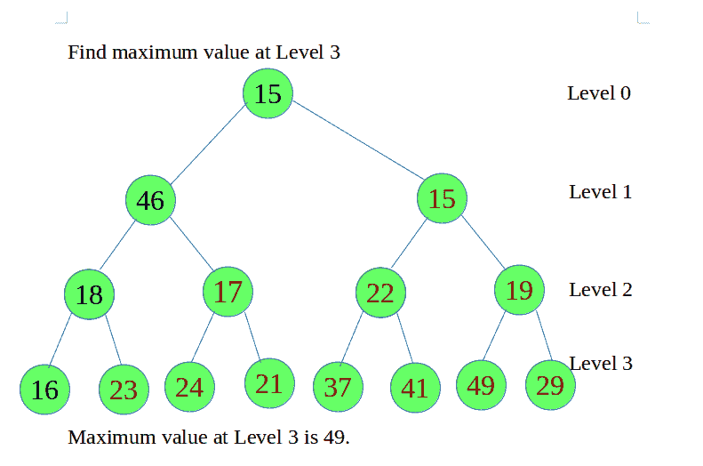

# 在二叉树中找到给定级别的最大节点

> 原文:[https://www . geeksforgeeks . org/find-二叉树中给定级别的最大节点数/](https://www.geeksforgeeks.org/find-the-maximum-node-at-a-given-level-in-a-binary-tree/)

给定一个**二叉树**和一个**等级**。任务是**找到给定级别最大值的节点**。



其思想是[沿着深度](https://www.geeksforgeeks.org/depth-first-search-or-dfs-for-a-graph/)递归遍历树，一旦达到要求的级别就返回节点，然后为每个后续调用返回最大的左右子树。因此最后一次调用将返回给定级别的所有节点中具有最大值的节点。
下面是分步算法:

1.  执行 DFS 遍历，每次将*级*的值减 1，并保持递归遍历左右子树。
2.  当*级别*的值变为 0 时，表示我们在给定的级别上，然后返回根- >数据。
3.  找出左右子树返回的两个值之间的最大值，并返回最大值。

下面是上述方法的实现:

## C++

```
// C++ program to find the node with
// maximum value at a given level

#include <iostream>

using namespace std;

// Tree node
struct Node {
    int data;
    struct Node *left, *right;
};

// Utility function to create a new Node
struct Node* newNode(int val)
{
    struct Node* temp = new Node;
    temp->left = NULL;
    temp->right = NULL;
    temp->data = val;
    return temp;
}

// function to find the maximum value
// at given level
int maxAtLevel(struct Node* root, int level)
{
    // If the tree is empty
    if (root == NULL)
        return 0;

    // if level becomes 0, it means we are on
    // any node at the given level
    if (level == 0)
        return root->data;

    int x = maxAtLevel(root->left, level - 1);
    int y = maxAtLevel(root->right, level - 1);

    // return maximum of two
    return max(x, y);
}

// Driver code
int main()
{
    // Creating the tree
    struct Node* root = NULL;
    root = newNode(45);
    root->left = newNode(46);
    root->left->left = newNode(18);
    root->left->left->left = newNode(16);
    root->left->left->right = newNode(23);
    root->left->right = newNode(17);
    root->left->right->left = newNode(24);
    root->left->right->right = newNode(21);
    root->right = newNode(15);
    root->right->left = newNode(22);
    root->right->left->left = newNode(37);
    root->right->left->right = newNode(41);
    root->right->right = newNode(19);
    root->right->right->left = newNode(49);
    root->right->right->right = newNode(29);

    int level = 3;

    cout << maxAtLevel(root, level);

    return 0;
}
```

## Java 语言(一种计算机语言，尤用于创建网站)

```
// Java program to find the
// node with maximum value
// at a given level
import java.util.*;
class GFG
{

// Tree node
static class Node
{
    int data;
    Node left, right;
}

// Utility function to
// create a new Node
static Node newNode(int val)
{
    Node temp = new Node();
    temp.left = null;
    temp.right = null;
    temp.data = val;
    return temp;
}

// function to find
// the maximum value
// at given level
static int maxAtLevel(Node root, int level)
{
    // If the tree is empty
    if (root == null)
        return 0;

    // if level becomes 0,
    // it means we are on
    // any node at the given level
    if (level == 0)
        return root.data;

    int x = maxAtLevel(root.left, level - 1);
    int y = maxAtLevel(root.right, level - 1);

    // return maximum of two
    return Math.max(x, y);
}

// Driver code
public static void main(String args[])
{
    // Creating the tree
    Node root = null;
    root = newNode(45);
    root.left = newNode(46);
    root.left.left = newNode(18);
    root.left.left.left = newNode(16);
    root.left.left.right = newNode(23);
    root.left.right = newNode(17);
    root.left.right.left = newNode(24);
    root.left.right.right = newNode(21);
    root.right = newNode(15);
    root.right.left = newNode(22);
    root.right.left.left = newNode(37);
    root.right.left.right = newNode(41);
    root.right.right = newNode(19);
    root.right.right.left = newNode(49);
    root.right.right.right = newNode(29);

    int level = 3;

    System.out.println(maxAtLevel(root, level));
}
}

// This code is contributed
// by Arnab Kundu
```

## 蟒蛇 3

```
# Python3 program to find the node 
# with maximum value at a given level

# Helper function that allocates a new
# node with the given data and None
# left and right poers.                                    
class newNode:

    # Constructor to create a new node
    def __init__(self, data):
        self.data = data
        self.left = None
        self.right = None

# function to find the maximum 
# value at given level
def maxAtLevel(root, level):

    # If the tree is empty
    if (root == None) :
        return 0

    # if level becomes 0, it means we
    # are on any node at the given level
    if (level == 0) :
        return root.data

    x = maxAtLevel(root.left, level - 1)
    y = maxAtLevel(root.right, level - 1)

    # return maximum of two
    return max(x, y)

# Driver Code
if __name__ == '__main__':

    """
    Let us create Binary Tree shown
    in above example """
    root = newNode(45)
    root.left = newNode(46)
    root.left.left = newNode(18)
    root.left.left.left = newNode(16)
    root.left.left.right = newNode(23)
    root.left.right = newNode(17)
    root.left.right.left = newNode(24)
    root.left.right.right = newNode(21)
    root.right = newNode(15)
    root.right.left = newNode(22)
    root.right.left.left = newNode(37)
    root.right.left.right = newNode(41)
    root.right.right = newNode(19)
    root.right.right.left = newNode(49)
    root.right.right.right = newNode(29)
    level = 3
    print(maxAtLevel(root, level))

# This code is contributed by
# Shubham Singh(SHUBHAMSINGH10)
```

## C#

```
// C# program to find the
// node with maximum value
// at a given level
using System;

class GFG
{

    // Tree node
    class Node
    {
        public int data;
        public Node left, right;
    }

    // Utility function to
    // create a new Node
    static Node newNode(int val)
    {
        Node temp = new Node();
        temp.left = null;
        temp.right = null;
        temp.data = val;
        return temp;
    }

    // function to find
    // the maximum value
    // at given level
    static int maxAtLevel(Node root, int level)
    {
        // If the tree is empty
        if (root == null)
            return 0;

        // if level becomes 0,
        // it means we are on
        // any node at the given level
        if (level == 0)
            return root.data;

        int x = maxAtLevel(root.left, level - 1);
        int y = maxAtLevel(root.right, level - 1);

        // return maximum of two
        return Math.Max(x, y);
    }

    // Driver code
    public static void Main(String []args)
    {
        // Creating the tree
        Node root = null;
        root = newNode(45);
        root.left = newNode(46);
        root.left.left = newNode(18);
        root.left.left.left = newNode(16);
        root.left.left.right = newNode(23);
        root.left.right = newNode(17);
        root.left.right.left = newNode(24);
        root.left.right.right = newNode(21);
        root.right = newNode(15);
        root.right.left = newNode(22);
        root.right.left.left = newNode(37);
        root.right.left.right = newNode(41);
        root.right.right = newNode(19);
        root.right.right.left = newNode(49);
        root.right.right.right = newNode(29);

        int level = 3;

        Console.WriteLine(maxAtLevel(root, level));
    }
}

// This code is contributed by 29AjayKumar
```

## java 描述语言

```
<script>

// Javascript program to find the node
// with maximum value at a given level
// Tree node
class Node
{
    constructor()
    {
        this.data = 0;
        this.left = null;
        this.right = null;
    }
}

// Utility function to
// create a new Node
function newNode(val)
{
    var temp = new Node();
    temp.left = null;
    temp.right = null;
    temp.data = val;
    return temp;
}

// Function to find
// the maximum value
// at given level
function maxAtLevel(root, level)
{

    // If the tree is empty
    if (root == null)
        return 0;

    // If level becomes 0,
    // it means we are on
    // any node at the given level
    if (level == 0)
        return root.data;

    var x = maxAtLevel(root.left, level - 1);
    var y = maxAtLevel(root.right, level - 1);

    // Return maximum of two
    return Math.max(x, y);
}

// Driver code
// Creating the tree
var root = null;
root = newNode(45);
root.left = newNode(46);
root.left.left = newNode(18);
root.left.left.left = newNode(16);
root.left.left.right = newNode(23);
root.left.right = newNode(17);
root.left.right.left = newNode(24);
root.left.right.right = newNode(21);
root.right = newNode(15);
root.right.left = newNode(22);
root.right.left.left = newNode(37);
root.right.left.right = newNode(41);
root.right.right = newNode(19);
root.right.right.left = newNode(49);
root.right.right.right = newNode(29);

var level = 3;
document.write(maxAtLevel(root, level));

// This code is contributed by noob2000

</script>
```

**Output**

```
49
```

**时间复杂度:** O(N)，其中 N 为二叉树中的节点总数。
**辅助空间:** O(N)

**迭代方法**
也可以通过使用 Queue 来完成，Queue 使用级别顺序遍历，当给定的级别等于我们的 count 变量时，它基本上检查最大节点。(变量 k)。

下面是上述方法的实现:

## C++

```
// C++ program for above approach
#include<bits/stdc++.h>
using namespace std;

// Tree Node
class TreeNode
{
      public:
          TreeNode *left, *right;
          int data;
};

TreeNode* newNode(int item)
{
 TreeNode* temp = new TreeNode;
 temp->data = item;
 temp->left = temp->right = NULL;
 return temp;
}

// Function to calculate maximum node
int bfs_maximumNode(TreeNode* root, int level)
{

    // Check if root is NULL
    if(root == NULL)
        return 0;

    // Queue of type TreeNode*
    queue<TreeNode*> mq;

    // Push root in queue
    mq.push(root);

    int ans = 0, maxm = INT_MIN, k = 0 ;

    // While queue is not empty
    while( !mq.empty() )
    {
        int size = mq.size();

        // While size if not 0
        while(size--)
        {

            // Accessing front element
            // in queue
            TreeNode* temp = mq.front();
            mq.pop();

            if(level == k && maxm < temp->data)
                maxm = temp->data;

            if(temp->left)
                mq.push(temp->left);

            if(temp->right)
                mq.push(temp->right);
        }
        k++;
        ans = max(maxm, ans);
    }

    // Return answer
    return ans;
}

// Driver Code
int main()
{
    TreeNode* root = NULL;
    root = newNode(45);
    root->left = newNode(46);
    root->left->left = newNode(18);
    root->left->left->left = newNode(16);
    root->left->left->right = newNode(23);
    root->left->right = newNode(17);
    root->left->right->left = newNode(24);
    root->left->right->right = newNode(21);
    root->right = newNode(15);
    root->right->left = newNode(22);

    root->right->left->left = newNode(37);
    root->right->left->right = newNode(41);
    root->right->right = newNode(19);
    root->right->right->left = newNode(49);
    root->right->right->right = newNode(29);

    int level = 3;

    // Function Call
    cout << bfs_maximumNode(root, level);
    return 0;
}

//This code is written  done by Anurag Mishra.
```

## Java 语言(一种计算机语言，尤用于创建网站)

```
// Java program for above approach
import java.util.*;

class GFG{

// Tree Node
static class TreeNode
{
    TreeNode left, right;
    int data;
};

static TreeNode newNode(int item)
{
    TreeNode temp = new TreeNode();
    temp.data = item;
    temp.left = temp.right = null;
    return temp;
}

// Function to calculate maximum node
static int bfs_maximumNode(TreeNode root,
                           int level)
{

    // Check if root is null
    if (root == null)
        return 0;

    // Queue of type TreeNode
    Queue<TreeNode> mq = new LinkedList<>();

    // Push root in queue
    mq.add(root);

    int ans = 0, maxm = -10000000, k = 0;

    // While queue is not empty
    while (mq.size() != 0)
    {
        int size = mq.size();

        // While size if not 0
        while (size != 0)
        {
            size--;

            // Accessing front element
            // in queue
            TreeNode temp = mq.poll();

            if (level == k && maxm < temp.data)
                maxm = temp.data;

            if (temp.left != null)
                mq.add(temp.left);

            if (temp.right != null)
                mq.add(temp.right);
        }
        k++;
        ans = Math.max(maxm, ans);
    }

    // Return answer
    return ans;
}

// Driver Code
public static void main(String []args)
{
    TreeNode root = null;
    root = newNode(45);
    root.left = newNode(46);
    root.left.left = newNode(18);
    root.left.left.left = newNode(16);
    root.left.left.right = newNode(23);
    root.left.right = newNode(17);
    root.left.right.left = newNode(24);
    root.left.right.right = newNode(21);
    root.right = newNode(15);
    root.right.left = newNode(22);

    root.right.left.left = newNode(37);
    root.right.left.right = newNode(41);
    root.right.right = newNode(19);
    root.right.right.left = newNode(49);
    root.right.right.right = newNode(29);

    int level = 3;

    // Function Call
    System.out.print(bfs_maximumNode(root, level));
}
}

// This code is contributed by pratham76
```

## 蟒蛇 3

```
# Python3 program for above approach
import sys

# Tree Node
class TreeNode:

    def __init__(self, data):

        self.data = data
        self.left = None
        self.right = None

def newNode(item):

    temp = TreeNode(item)

    return temp

# Function to calculate maximum node
def bfs_maximumNode(root, level):

    # Check if root is NULL
    if(root == None):
        return 0

    # Queue of type TreeNode*
    mq = []

    # Append root in queue
    mq.append(root)

    ans = 0
    maxm = -sys.maxsize - 1
    k = 0

    # While queue is not empty
    while(len(mq) != 0):
        size = len(mq)

        # While size if not 0
        while(size):
            size -= 1

            # Accessing front element
            # in queue
            temp = mq[0]
            mq.pop(0)

            if (level == k and maxm < temp.data):
                maxm = temp.data

            if (temp.left):
                mq.append(temp.left)

            if (temp.right):
                mq.append(temp.right)

        k += 1
        ans = max(maxm, ans)

    # Return answer
    return ans

# Driver Code
if __name__=="__main__":

    root = None
    root = newNode(45)
    root.left = newNode(46)
    root.left.left = newNode(18)
    root.left.left.left = newNode(16)
    root.left.left.right = newNode(23)
    root.left.right = newNode(17)
    root.left.right.left = newNode(24)
    root.left.right.right = newNode(21)
    root.right = newNode(15)
    root.right.left = newNode(22)

    root.right.left.left = newNode(37)
    root.right.left.right = newNode(41)
    root.right.right = newNode(19)
    root.right.right.left = newNode(49)
    root.right.right.right = newNode(29)

    level = 3

    # Function Call
    print(bfs_maximumNode(root, level))

# This code is contributed by rutvik_56
```

## C#

```
// C# program for above approach
using System;
using System.Collections.Generic;
class GFG {

    // Tree Node
    class TreeNode {

        public int data;
        public TreeNode left, right;

        public TreeNode(int item)
        {
            data = item;
            left = right = null;
        }
    }

    static TreeNode newNode(int item)
    {
        TreeNode temp = new TreeNode(item);
        return temp;
    }

    // Function to calculate maximum node
    static int bfs_maximumNode(TreeNode root,
                               int level)
    {

        // Check if root is null
        if (root == null)
            return 0;

        // Queue of type TreeNode
        List<TreeNode> mq = new List<TreeNode>();

        // Push root in queue
        mq.Add(root);

        int ans = 0, maxm = -10000000, k = 0;

        // While queue is not empty
        while (mq.Count != 0)
        {
            int size = mq.Count;

            // While size if not 0
            while (size != 0)
            {
                size--;

                // Accessing front element
                // in queue
                TreeNode temp = mq[0];
                mq.RemoveAt(0);

                if (level == k && maxm < temp.data)
                    maxm = temp.data;

                if (temp.left != null)
                    mq.Add(temp.left);

                if (temp.right != null)
                    mq.Add(temp.right);
            }
            k++;
            ans = Math.Max(maxm, ans);
        }

        // Return answer
        return ans;
    }

  static void Main() {
    TreeNode root = null;
    root = newNode(45);
    root.left = newNode(46);
    root.left.left = newNode(18);
    root.left.left.left = newNode(16);
    root.left.left.right = newNode(23);
    root.left.right = newNode(17);
    root.left.right.left = newNode(24);
    root.left.right.right = newNode(21);
    root.right = newNode(15);
    root.right.left = newNode(22);

    root.right.left.left = newNode(37);
    root.right.left.right = newNode(41);
    root.right.right = newNode(19);
    root.right.right.left = newNode(49);
    root.right.right.right = newNode(29);

    int level = 3;

    // Function Call
    Console.Write(bfs_maximumNode(root, level));
  }
}

// This code is contributed by suresh07.
```

## java 描述语言

```
<script>
// JavaScript program for above approach

// Tree Node
class TreeNode
{

    constructor()
    {
        this.left = this.right = null;
        this.data = 0;
    }
}

function newNode(item)
{
    let temp = new TreeNode();
    temp.data = item;
    temp.left = temp.right = null;
    return temp;
}

// Function to calculate maximum node
function bfs_maximumNode(root,level)
{
    // Check if root is null
    if (root == null)
        return 0;

    // Queue of type TreeNode
    let mq = [];

    // Push root in queue
    mq.push(root);

    let ans = 0, maxm = -10000000, k = 0;

    // While queue is not empty
    while (mq.length != 0)
    {
        let size = mq.length;

        // While size if not 0
        while (size != 0)
        {
            size--;

            // Accessing front element
            // in queue
            let temp = mq.shift();

            if (level == k && maxm < temp.data)
                maxm = temp.data;

            if (temp.left != null)
                mq.push(temp.left);

            if (temp.right != null)
                mq.push(temp.right);
        }
        k++;
        ans = Math.max(maxm, ans);
    }

    // Return answer
    return ans;
}

// Driver Code
let root = null;
root = newNode(45);
root.left = newNode(46);
root.left.left = newNode(18);
root.left.left.left = newNode(16);
root.left.left.right = newNode(23);
root.left.right = newNode(17);
root.left.right.left = newNode(24);
root.left.right.right = newNode(21);
root.right = newNode(15);
root.right.left = newNode(22);

root.right.left.left = newNode(37);
root.right.left.right = newNode(41);
root.right.right = newNode(19);
root.right.right.left = newNode(49);
root.right.right.right = newNode(29);

let level = 3;

// Function Call
document.write(bfs_maximumNode(root, level));

// This code is contributed by avanitrachhadiya2155
</script>
```

**Output**

```
49
```

**时间复杂度:** O(N)，其中 N 为二叉树中的节点总数。
**辅助空间:** O(N)