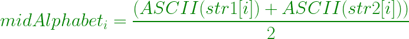

# 找到给定字符串对的每个索引的中间字母

> 原文:[https://www . geesforgeks . org/查找给定字符串对的每个索引的中间字母/](https://www.geeksforgeeks.org/find-the-mid-alphabet-for-each-index-of-the-given-pair-of-strings/)

给定由小写英文字母组成的两个相同长度的字符串 **str1** 和 **str2** ，任务是为给定字符串对的每个索引找到中间字母。
**例:**

> **输入:**str 1 =“ABCD”，str 2 =“cdef”
> T3】输出: bcde
> **解释:**
> **b** 是 **a** 和**c**T15】c 是 **b** 和 **d** 的中间
> d 是**的中间**

**方法:**
中字母表可以通过取该索引处每个字符串中字符的 ASCII 值的平均值来计算。



以下是上述方法的实现:

## C++

```
// C++ program to find the Mid-Alphabet
// for each index of the given Pair of Strings

#include <bits/stdc++.h>
using namespace std;

// Function to find the mid alphabets
void findMidAlphabet(string s1, string s2, int n)
{

    // For every character pair
    for (int i = 0; i < n; i++) {

        // Get the average of the characters
        int mid = (s1[i] + s2[i]) / 2;
        cout << (char)mid;
    }
}

// Driver code
int main()
{

    string s1 = "akzbqzgw";
    string s2 = "efhctcsz";
    int n = s1.length();

    findMidAlphabet(s1, s2, n);

    return 0;
}
```

## Java 语言(一种计算机语言，尤用于创建网站)

```
// Java program to find the Mid-Alphabet
// for each index of the given Pair of Strings
class GFG
{

// Function to find the mid alphabets
static void findMidAlphabet(String s1,
                            String s2, int n)
{

    // For every character pair
    for (int i = 0; i < n; i++)
    {

        // Get the average of the characters
        int mid = (s1.charAt(i) +
                   s2.charAt(i)) / 2;
        System.out.print((char)mid);
    }
}

// Driver code
public static void main(String []args)
{
    String s1 = "akzbqzgw";
    String s2 = "efhctcsz";
    int n = s1.length();

    findMidAlphabet(s1, s2, n);
}
}

// This code is contributed by Rajput-Ji
```

## 蟒蛇 3

```
# Python3 program to find the Mid-Alphabet
# for each index of the given Pair of Strings

# Function to find the mid alphabets
def findMidAlphabet(s1, s2, n):

    # For every character pair
    for i in range(n):

        # Get the average of the characters
        mid = (ord(s1[i]) + ord(s2[i])) // 2
        print(chr(mid), end = "")

# Driver code
s1 = "akzbqzgw"
s2 = "efhctcsz"
n = len(s1)

findMidAlphabet(s1, s2, n)

# This code is contributed
# by Mohit Kumar
```

## C#

```
// C# program to find the Mid-Alphabet
// for each index of the given Pair of Strings
using System;

public class GFG
{

// Function to find the mid alphabets
static void findMidAlphabet(String s1,
                            String s2, int n)
{

    // For every character pair
    for (int i = 0; i < n; i++)
    {

        // Get the average of the characters
        int mid = (s1[i] +
                   s2[i]) / 2;
        Console.Write((char)mid);
    }
}

// Driver code
public static void Main(String []args)
{
    String s1 = "akzbqzgw";
    String s2 = "efhctcsz";
    int n = s1.Length;

    findMidAlphabet(s1, s2, n);
}
}

// This code contributed by Rajput-Ji
```

## java 描述语言

```
<script>

      // JavaScript program to find the Mid-Alphabet
      // for each index of the given Pair of Strings

      // Function to find the mid alphabets
      function findMidAlphabet(s1, s2, n)
      {
        // For every character pair
        for (var i = 0; i < n; i++)
        {

          // Get the average of the characters
          var mid = (s1[i].charCodeAt(0) +
          s2[i].charCodeAt(0)) / 2;
          document.write(String.fromCharCode(mid));
        }
      }

      // Driver code
      var s1 = "akzbqzgw";
      var s2 = "efhctcsz";
      var n = s1.length;

      findMidAlphabet(s1, s2, n);

</script>
```

**Output:** 

```
chqbrnmx
```

**时间复杂度:** ，其中 N 是字符串的长度。