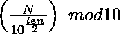
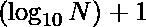

# 找到给定数字的中间数字

> 原文:[https://www . geesforgeks . org/find-给定数字的中间数字/](https://www.geeksforgeeks.org/find-the-middle-digit-of-a-given-number/)

给定一个数字 **N** ，任务是找到给定数字 **N** 的中间数字。如果数字有两个中间数字，则打印第一个中间数字。

**示例:**

> **输入:**N = 12345
> T3】输出: 3
> 
> **输入:**N = 98562
> T3】输出: 5

**方法:**任意数字 N 的中间数字可由下式给出



给定数字的长度( **len** )可以计算为


**例如:**

> 如果 N = 12345
> len =(int)log<sub>10</sub>(12345)+1 = 5
> 因此，
> N 的前半部分= N/10<sup>5/2</sup>= N/10<sup>2</sup>= 123
> 因此 N 的中间数字= N 的前半部分的最后一个数字=(N 的前半部分)% 10 = 123 % 10 = 3

下面的代码是上述方法的实现:

## C++

```
// Program to find middle digit of number

#include <bits/stdc++.h>
using namespace std;

// Function to find the middle digit
int middleDigit(int n)
{
    // Find total number of digits
    int digits = (int)log10(n) + 1;

    // Find middle digit
    n = (int)(n / pow(10, digits / 2))
        % 10;

    // Return middle digit
    return n;
}

// Driver program
int main()
{
    // Given Number N
    int N = 98562;

    // Function call
    cout << middleDigit(N)
         << "\n";
    return 0;
}
```

## Java 语言(一种计算机语言，尤用于创建网站)

```
// Java program to find middle digit of number
class GFG{

// Function to find the middle digit
static int middleDigit(int n)
{

    // Find total number of digits
    int digits = (int)Math.log10(n) + 1;

    // Find middle digit
    n = (int)(n / Math.pow(10, digits / 2)) % 10;

    // Return middle digit
    return n;
}

// Driver Code
public static void main(String[] args)
{

    // Given number N
    int N = 98562;

    // Function call
    System.out.println(middleDigit(N));
}
}

// This code is contributed by rutvik_56   
```

## 蟒蛇 3

```
# Python3 Program to find middle digit of number
import math

# Function to find the middle digit
def middleDigit(n):

    # Find total number of digits
    digits = math.log10(n) + 1;

    # Find middle digit
    n = int((n // math.pow(10, digits // 2))) % 10;

    # Return middle digit
    return n;

# Driver program

# Given Number N
N = 98562;

# Function call
print(middleDigit(N))

# This code is contributed by Code_Mech
```

## C#

```
// C# program to find middle digit of number
using System;

class GFG{

// Function to find the middle digit
static int middleDigit(int n)
{

    // Find total number of digits
    int digits = (int)Math.Log10(n) + 1;

    // Find middle digit
    n = (int)(n / Math.Pow(10, digits / 2)) % 10;

    // Return middle digit
    return n;
}

// Driver code
static void Main()
{

    // Given number N
    int N = 98562;

    // Function call
    Console.WriteLine(middleDigit(N));
}
}

// This code is contributed by divyeshrabadiya07   
```

## java 描述语言

```
<script>
// Program to find middle digit of number

// Function to find the middle digit
function middleDigit(n)
{
    // Find total number of digits
    let digits = parseInt(Math.log10(n) + 1);

    // Find middle digit
    n = parseInt(parseInt(n / Math.pow(10, parseInt(digits / 2))) % 10);

    // Return middle digit
    return n;
}

// Driver program
// Given Number N
let N = 98562;

// Function call
document.write(middleDigit(N));

// This code is contributed by subham348.
</script>
```

**Output:** 

```
5
```

**时间复杂度:** O(1)

**辅助空间:** O(1)