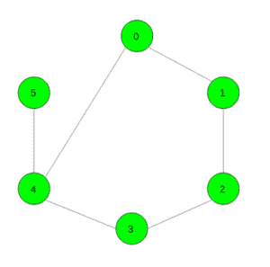

# 找到到达阵列末端的最小移动次数

> 原文:[https://www . geesforgeks . org/find-到达阵列末端的最小移动次数/](https://www.geeksforgeeks.org/find-the-minimum-number-of-moves-to-reach-end-of-the-array/)

给定一个大小为 **N** 的数组 **arr[]** ，其中每个元素都来自范围**【0，9】**。任务是从第一个索引开始到达数组的最后一个索引。从 **i <sup>th</sup>** 索引，我们可以移到**(I–1)<sup>th</sup>**、 **(i + 1) <sup>th</sup>** 或任何**j<sup>th</sup>T21】索引，其中 **j ≠ i** 和 **arr[j] = arr[i]** 。**

**示例:**

> **输入:** arr[] = {1，2，3，4，1，5}
> **输出:** 2
> 首先从第 0 <sup>个</sup>索引移动到第 4 <sup>个</sup>索引
> ，然后从第 4 <sup>个</sup>索引移动到第 5 <sup>个</sup>。
> 
> **输入:** arr[] = {1，2，3，4，5，1 }
> T3】输出: 1

**方法:**根据给定的数组构建图，其中图中的节点数将等于数组的大小。图形的每个节点 **i** 将连接到 **(i 1) <sup>第</sup>** 节点、 **(i + 1) <sup>第</sup>** 节点和一个节点 **j** ，使得 **i ≠ j** 和 **arr[i] = arr[j]** 。现在，答案将是构造图中从索引 **0** 到索引**N–1**的路径中的最小边。
数组 arr[] = {1，2，3，4，1，5}的图形如下图所示:



下面是上述方法的实现:

## C++

```
// C++ implementation of the approach
#include <bits/stdc++.h>
using namespace std;
#define N 100005

vector<int> gr[N];

// Function to add edge
void add_edge(int u, int v)
{
    gr[u].push_back(v);
    gr[v].push_back(u);
}

// Function to return the minimum path
// from 0th node to the (n - 1)th node
int dijkstra(int n)
{
    // To check whether an edge is visited or not
    // and to keep distance of vertex from 0th index
    int vis[n] = { 0 }, dist[n];

    for (int i = 0; i < n; i++)
        dist[i] = INT_MAX;

    // Make 0th index visited and distance is zero
    vis[0] = 1;
    dist[0] = 0;

    // Take a queue and push first element
    queue<int> q;
    q.push(0);

    // Continue this until all vertices are visited
    while (!q.empty()) {
        int x = q.front();

        // Remove the first element
        q.pop();

        for (int i = 0; i < gr[x].size(); i++) {

            // Check if a vertex is already visited or not
            if (vis[gr[x][i]] == 1)
                continue;

            // Make vertex visited
            vis[gr[x][i]] = 1;

            // Store the number of moves to reach element
            dist[gr[x][i]] = dist[x] + 1;

            // Push the current vertex into the queue
            q.push(gr[x][i]);
        }
    }

    // Return the minimum number of
    // moves to reach (n - 1)th index
    return dist[n - 1];
}

// Function to return the minimum number of moves
// required to reach the end of the array
int Min_Moves(int a[], int n)
{

    // To store the positions of each element
    vector<int> fre[10];
    for (int i = 0; i < n; i++) {
        if (i != n - 1)
            add_edge(i, i + 1);

        fre[a[i]].push_back(i);
    }

    // Add edge between same elements
    for (int i = 0; i < 10; i++) {
        for (int j = 0; j < fre[i].size(); j++) {
            for (int k = j + 1; k < fre[i].size(); k++) {
                if (fre[i][j] + 1 != fre[i][k]
                    and fre[i][j] - 1 != fre[i][k]) {
                    add_edge(fre[i][j], fre[i][k]);
                }
            }
        }
    }

    // Return the required minimum number of moves
    return dijkstra(n);
}

// Driver code
int main()
{
    int a[] = { 1, 2, 3, 4, 1, 5 };
    int n = sizeof(a) / sizeof(a[0]);

    cout << Min_Moves(a, n);

    return 0;
}
```

## Java 语言(一种计算机语言，尤用于创建网站)

```
// Java implementation of the approach
import java.io.*;
import java.util.*;

class GFG{

static ArrayList<
       ArrayList<Integer>> gr = new ArrayList<
                                    ArrayList<Integer>>();
static int N = 100005;

// Function to add edge
static void add_edge(int u, int v)
{
    for(int i = 0; i < N; i++)
    {
        gr.add(new ArrayList<Integer>());
    }
    gr.get(u).add(v);
    gr.get(v).add(u);
}

// Function to return the minimum path
// from 0th node to the (n - 1)th node
static int dijkstra(int n)
{

    // To check whether an edge is visited
    // or not and to keep distance of
    // vertex from 0th index
    int[] vis = new int[n];
    Arrays.fill(vis, 0);

    int[] dist = new int[n];
    for(int i = 0; i < n; i++)
    {
        dist[i] = Integer.MAX_VALUE;
    }

    // Make 0th index visited and
    // distance is zero
    vis[0] = 1;
    dist[0] = 0;

    // Take a queue and push first element
    Queue<Integer> q = new LinkedList<>();
    q.add(0);

    // Continue this until all vertices
    // are visited
    while (q.size() > 0)
    {

        // Remove the first element
        int x = q.poll();
        for(int i = 0; i < gr.get(x).size(); i++)
        {

            // Check if a vertex is already
            // visited or not
            if (vis[gr.get(x).get(i)] == 1)
            {
                continue;
            }

            // Make vertex visited
            vis[gr.get(x).get(i)] = 1;

            // Store the number of moves to
            // reach element
            dist[gr.get(x).get(i)] = dist[x] + 1;

            // Push the current vertex into
            // the queue
            q.add(gr.get(x).get(i));
        }
    }

    // Return the minimum number of
    // moves to reach (n - 1)th index
    return dist[n - 1];
}

// Function to return the minimum number of moves
// required to reach the end of the array
static int Min_Moves(int[] a, int n)
{

    // To store the positions of each element
    ArrayList<
    ArrayList<Integer>> fre = new ArrayList<
                                  ArrayList<Integer>>();
    for(int i = 0; i < 10; i++)
    {
        fre.add(new ArrayList<Integer>());
    }
    for(int i = 0; i < n; i++)
    {
        if (i != n - 1)
        {
            add_edge(i, i + 1);
        }
        fre.get(a[i]).add(i);
    }

    // Add edge between same elements
    for(int i = 0; i < 10; i++)
    {
        for(int j = 0;
                j < fre.get(i).size();
                j++)
        {
            for(int k = j + 1;
                    k < fre.get(i).size();
                    k++)
            {
                if (fre.get(i).get(j) + 1 !=
                    fre.get(i).get(k) &&
                    fre.get(i).get(j) - 1 !=
                    fre.get(i).get(k))
                {
                    add_edge(fre.get(i).get(j),
                             fre.get(i).get(k));
                }
            }
        }
    }

    // Return the required minimum
    // number of moves
    return dijkstra(n);
}

// Driver code
public static void main(String[] args)
{
    int[] a = { 1, 2, 3, 4, 1, 5 };
    int n = a.length;

    System.out.println(Min_Moves(a, n));
}
}

// This code is contributed by avanitrachhadiya2155
```

## 蟒蛇 3

```
# Python3 implementation of the approach
from collections import deque
N = 100005

gr = [[] for i in range(N)]

# Function to add edge
def add_edge(u, v):
    gr[u].append(v)
    gr[v].append(u)

# Function to return the minimum path
# from 0th node to the (n - 1)th node
def dijkstra(n):

    # To check whether an edge is visited
    # or not and to keep distance of vertex
    # from 0th index
    vis = [0 for i in range(n)]
    dist = [10**9 for i in range(n)]

    # Make 0th index visited and
    # distance is zero
    vis[0] = 1
    dist[0] = 0

    # Take a queue and
    # append first element
    q = deque()
    q.append(0)

    # Continue this until 
    # all vertices are visited
    while (len(q) > 0):
        x = q.popleft()

        # Remove the first element
        for i in gr[x]:

            # Check if a vertex is
            # already visited or not
            if (vis[i] == 1):
                continue

            # Make vertex visited
            vis[i] = 1

            # Store the number of moves
            # to reach element
            dist[i] = dist[x] + 1

            # Push the current vertex
            # into the queue
            q.append(i)

    # Return the minimum number of
    # moves to reach (n - 1)th index
    return dist[n - 1]

# Function to return the minimum number of moves
# required to reach the end of the array
def Min_Moves(a, n):

    # To store the positions of each element
    fre = [[] for i in range(10)]
    for i in range(n):
        if (i != n - 1):
            add_edge(i, i + 1)

        fre[a[i]].append(i)

    # Add edge between same elements
    for i in range(10):
        for j in range(len(fre[i])):
            for k in range(j + 1,len(fre[i])):
                if (fre[i][j] + 1 != fre[i][k] and
                    fre[i][j] - 1 != fre[i][k]):
                    add_edge(fre[i][j], fre[i][k])

    # Return the required
    # minimum number of moves
    return dijkstra(n)

# Driver code
a = [1, 2, 3, 4, 1, 5]
n = len(a)

print(Min_Moves(a, n))

# This code is contributed by Mohit Kumar
```

## C#

```
// C# implementation of the approach
using System;
using System.Collections.Generic;
class GFG
{
    static List<List<int>> gr = new List<List<int>>();
    static int N = 100005;

    // Function to add edge
    static void add_edge(int u, int v)
    {
        for(int i = 0; i < N; i++)
        {
            gr.Add(new List<int>());
        }
        gr[u].Add(v);
        gr[v].Add(u);
    }

    // Function to return the minimum path
    // from 0th node to the (n - 1)th node
    static int dijkstra(int n)
    {

        // To check whether an edge is visited
        // or not and to keep distance of
        // vertex from 0th index
        int[] vis = new int[n];
        Array.Fill(vis, 0);
        int[] dist = new int[n];
        for(int i = 0; i < n; i++)
        {
            dist[i] = Int32.MaxValue;
        }

        // Make 0th index visited and
        // distance is zero
        vis[0] = 1;
        dist[0] = 0;

        // Take a queue and push first element
        Queue<int> q = new Queue<int>();
        q.Enqueue(0);

        // Continue this until all vertices
        // are visited
        while(q.Count > 0)
        {

            // Remove the first element
            int x = q.Dequeue();
            for(int i = 0; i < gr[x].Count; i++ )
            {

                // Check if a vertex is already
                // visited or not
                if(vis[gr[x][i]] == 1)
                {
                    continue;
                }

                // Make vertex visited
                vis[gr[x][i]] = 1;

                // Store the number of moves to
                // reach element
                dist[gr[x][i]] = dist[x] + 1;

                // Push the current vertex into
                // the queue
                q.Enqueue(gr[x][i]);
            }
        }

        // Return the minimum number of
        // moves to reach (n - 1)th index
        return dist[n - 1];
    }

    // Function to return the minimum number of moves
    // required to reach the end of the array
    static int Min_Moves(int[] a, int n)
    {

        // To store the positions of each element
        List<List<int>> fre = new List<List<int>>();
        for(int i = 0; i < 10; i++)
        {
            fre.Add(new List<int>());         
        }
        for(int i = 0; i < n; i++)
        {
            if (i != n - 1)
            {
                add_edge(i, i + 1);
            }
            fre[a[i]].Add(i);
        }

        // Add edge between same elements
        for(int i = 0; i < 10; i++)
        {
            for(int j = 0; j < fre[i].Count; j++)
            {
                for(int k = j + 1; k < fre[i].Count; k++)
                {
                    if(fre[i][j] + 1 != fre[i][k] &&
                       fre[i][j] - 1 != fre[i][k])
                    {
                        add_edge(fre[i][j], fre[i][k]);
                    }
                }
            }
        }

        // Return the required minimum
        // number of moves
        return dijkstra(n);
    }

    // Driver code
    static public void Main ()
    {
        int[] a = { 1, 2, 3, 4, 1, 5 };
        int n = a.Length;
        Console.WriteLine(Min_Moves(a, n));
    }
}

// This code is contributed by rag2127
```

## java 描述语言

```
<script>
// Javascript implementation of the approach

let gr = [];
let N = 100005;

// Function to add edge
function add_edge(u,v)
{
    for(let i = 0; i < N; i++)
    {
        gr.push([]);
    }
    gr[u].push(v);
    gr[v].push(u);
}

// Function to return the minimum path
// from 0th node to the (n - 1)th node
function dijkstra(n)
{
    // To check whether an edge is visited
    // or not and to keep distance of
    // vertex from 0th index
    let vis = new Array(n);
    for(let i = 0; i < vis.length; i++)
    {
        vis[i] = 0;
    }

    let dist = new Array(n);
    for(let i = 0; i < n; i++)
    {
        dist[i] = Number.MAX_VALUE;
    }

    // Make 0th index visited and
    // distance is zero
    vis[0] = 1;
    dist[0] = 0;

    // Take a queue and push first element
    let q = [];
    q.push(0);

    // Continue this until all vertices
    // are visited
    while (q.length > 0)
    {

        // Remove the first element
        let x = q.shift();
        for(let i = 0; i < gr[x].length; i++)
        {

            // Check if a vertex is already
            // visited or not
            if (vis[gr[x][i]] == 1)
            {
                continue;
            }

            // Make vertex visited
            vis[gr[x][i]] = 1;

            // Store the number of moves to
            // reach element
            dist[gr[x][i]] = dist[x] + 1;

            // Push the current vertex into
            // the queue
            q.push(gr[x][i]);
        }
    }

    // Return the minimum number of
    // moves to reach (n - 1)th index
    return dist[n - 1];
}

// Function to return the minimum number of moves
// required to reach the end of the array
function Min_Moves(a,n)
{
    // To store the positions of each element
    let fre = [];
    for(let i = 0; i < 10; i++)
    {
        fre.push([]);
    }
    for(let i = 0; i < n; i++)
    {
        if (i != n - 1)
        {
            add_edge(i, i + 1);
        }
        fre[a[i]].push(i);
    }

    // Add edge between same elements
    for(let i = 0; i < 10; i++)
    {
        for(let j = 0;
                j < fre[i].length;
                j++)
        {
            for(let k = j + 1;
                    k < fre[i].length;
                    k++)
            {
                if (fre[i][j] + 1 !=
                    fre[i][k] &&
                    fre[i][j] - 1 !=
                    fre[i][k])
                {
                    add_edge(fre[i][j],
                             fre[i][k]);
                }
            }
        }
    }

    // Return the required minimum
    // number of moves
    return dijkstra(n);
}

// Driver code
let a = [1, 2, 3, 4, 1, 5 ];
let n = a.length;
document.write(Min_Moves(a, n));

// This code is contributed by unknown2108
</script>
```

**Output:** 

```
2
```