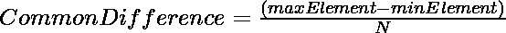

# 查找无序等差数列中缺失的数字

> 原文:[https://www . geesforgeks . org/find-无序算术级数中的缺失数字/](https://www.geeksforgeeks.org/find-the-missing-number-in-unordered-arithmetic-progression/)

给定一个未排序的[数组](https://www.geeksforgeeks.org/introduction-to-arrays/)**arr【】**中的 N 个整数[等差数列](https://www.geeksforgeeks.org/arithmetic-progression/)，任务是打印给定序列中缺失的元素。

**示例:**

> **输入:** arr[] = {12，3，6，15，18}
> **输出:** 9
> **解释:**
> 给出的元素顺序为:3，6，12，15，18。
> 因此缺失元素为 9。
> 
> **输入:** arr[] = {2，8，6，10}
> **输出:** 4
> **说明:**
> 给出的元素顺序为:2，6，8，10。
> 因此缺失元素为 4。

**天真的做法:**想法是用[二分搜索法](https://www.geeksforgeeks.org/binary-search/)。对给定的数组进行排序，然后该数组将按照 AP 系列的排序顺序排列，我们可以应用二分搜索法(如本文中的)如下所述:

1.  找到中间元素，检查中间元素和中间元素的下一个元素之间的差是否等于公共差，如果不是，则缺少的元素位于**中间**和**中间+ 1** 之间。
2.  如果中间元素等于给定算术级数中的(N/2) <sup>第</sup>项，则缺失的元素位于中间元素的右侧。
3.  否则该元素位于中间元素的左侧。

下面是上述方法的实现:

## C++

```
// C++ program for the above approach

#include <bits/stdc++.h>
using namespace std;

// Function to find the missing element
int findMissing(int arr[], int left,
                int right, int diff)
{

    // Fix left and right boundary
    // for binary search
    if (right <= left)
        return INT_MAX;

    // Find index of middle element
    int mid = left + (right - left) / 2;

    // Check if the element just after
    // the middle element is missing
    if (arr[mid + 1] - arr[mid] != diff)
        return (arr[mid] + diff);

    // Check if the element just
    // before mid is missing
    if (mid > 0
        && arr[mid] - arr[mid - 1] != diff)
        return (arr[mid - 1] + diff);

    // Check if the elements till mid
    // follow the AP, then recur
    // for right half
    if (arr[mid] == arr[0] + mid * diff)
        return findMissing(arr, mid + 1,
                           right, diff);

    // Else recur for left half
    return findMissing(arr, left,
                       mid - 1, diff);
}

// Function to find the missing
// element in AP series
int missingElement(int arr[], int n)
{

    // Sort the array arr[]
    sort(arr, arr + n);

    // Calculate Common Difference
    int diff = (arr[n - 1] - arr[0]) / n;

    // Binary search for the missing
    return findMissing(arr, 0, n - 1, diff);
}

// Driver Code
int main()
{
    // Given array arr[]
    int arr[] = { 2, 8, 6, 10 };
    int n = sizeof(arr) / sizeof(arr[0]);

    // Function Call
    cout << missingElement(arr, n);
    return 0;
}
```

## Java 语言(一种计算机语言，尤用于创建网站)

```
// Java program for the above approach
import java.util.Arrays;
class GFG{

// Function to find the missing element
static int findMissing(int arr[], int left,
                       int right, int diff)
{

    // Fix left and right boundary
    // for binary search
    if (right <= left)
        return 0;

    // Find index of middle element
    int mid = left + (right - left) / 2;

    // Check if the element just after
    // the middle element is missing
    if (arr[mid + 1] - arr[mid] != diff)
        return (arr[mid] + diff);

    // Check if the element just
    // before mid is missing
    if (mid > 0 &&
        arr[mid] - arr[mid - 1] != diff)
        return (arr[mid - 1] + diff);

    // Check if the elements till mid
    // follow the AP, then recur
    // for right half
    if (arr[mid] == arr[0] + mid * diff)
        return findMissing(arr, mid + 1,
                           right, diff);

    // Else recur for left half
    return findMissing(arr, left,
                       mid - 1, diff);
}

// Function to find the missing
// element in AP series
static int missingElement(int arr[], int n)
{

    // Sort the array arr[]
    Arrays.sort(arr);

    // Calculate Common Difference
    int diff = (arr[n - 1] - arr[0]) / n;

    // Binary search for the missing
    return findMissing(arr, 0, n - 1, diff);
}

// Driver Code
public static void main(String[] args)
{
    // Given array arr[]
    int arr[] = new int[]{ 2, 8, 6, 10 };
    int n = arr.length;

    // Function Call
    System.out.println(missingElement(arr, n));
}
}

// This code is contributed by rock_cool
```

## 蟒蛇 3

```
# Python3 program for the above approach
import sys

# Function to find the missing element
def findMissing(arr, left, right, diff):

    # Fix left and right boundary
    # for binary search
    if (right <= left):
        return sys.maxsize

    # Find index of middle element
    mid = left + (right - left) // 2

    # Check if the element just after
    # the middle element is missing
    if (arr[mid + 1] - arr[mid] != diff):
        return (arr[mid] + diff)

    # Check if the element just
    # before mid is missing
    if (mid > 0 and
        arr[mid] - arr[mid - 1] != diff):
        return (arr[mid - 1] + diff)

    # Check if the elements till mid
    # follow the AP, then recur
    # for right half
    if (arr[mid] == arr[0] + mid * diff):
        return findMissing(arr, mid + 1,
                           right, diff)

    # Else recur for left half
    return findMissing(arr, left,
                       mid - 1, diff)

# Function to find the missing
# element in AP series
def missingElement(arr, n):

    # Sort the array arr[]
    arr.sort()

    # Calculate Common Difference
    diff = (arr[n - 1] - arr[0]) // n

    # Binary search for the missing
    return findMissing(arr, 0, n - 1, diff)

# Driver Code

# Given array arr[]
arr = [ 2, 8, 6, 10 ]
n = len(arr)

# Function call
print(missingElement(arr, n))

# This code is contributed by sanjoy_62
```

## C#

```
// C# program for the above approach
using System;
class GFG{

// Function to find the missing element
static int findMissing(int []arr, int left,
                       int right, int diff)
{

    // Fix left and right boundary
    // for binary search
    if (right <= left)
        return 0;

    // Find index of middle element
    int mid = left + (right - left) / 2;

    // Check if the element just after
    // the middle element is missing
    if (arr[mid + 1] - arr[mid] != diff)
        return (arr[mid] + diff);

    // Check if the element just
    // before mid is missing
    if (mid > 0 &&
        arr[mid] - arr[mid - 1] != diff)
        return (arr[mid - 1] + diff);

    // Check if the elements till mid
    // follow the AP, then recur
    // for right half
    if (arr[mid] == arr[0] + mid * diff)
        return findMissing(arr, mid + 1,
                           right, diff);

    // Else recur for left half
    return findMissing(arr, left,
                       mid - 1, diff);
}

// Function to find the missing
// element in AP series
static int missingElement(int []arr, int n)
{

    // Sort the array []arr
    Array.Sort(arr);

    // Calculate Common Difference
    int diff = (arr[n - 1] - arr[0]) / n;

    // Binary search for the missing
    return findMissing(arr, 0, n - 1, diff);
}

// Driver Code
public static void Main(String[] args)
{
    // Given array []arr
    int []arr = new int[]{ 2, 8, 6, 10 };
    int n = arr.Length;

    // Function Call
    Console.WriteLine(missingElement(arr, n));
}
}

// This code is contributed by Rohit_ranjan
```

## java 描述语言

```
<script>

// Javascript program for the above approach

// Function to find the missing element
function findMissing(arr, left, right, diff)
{

    // Fix left and right boundary
    // for binary search
    if (right <= left)
        return 0;

    // Find index of middle element
    let mid = left + parseInt((right - left) / 2, 10);

    // Check if the element just after
    // the middle element is missing
    if (arr[mid + 1] - arr[mid] != diff)
        return (arr[mid] + diff);

    // Check if the element just
    // before mid is missing
    if (mid > 0 &&
        arr[mid] - arr[mid - 1] != diff)
        return (arr[mid - 1] + diff);

    // Check if the elements till mid
    // follow the AP, then recur
    // for right half
    if (arr[mid] == arr[0] + mid * diff)
        return findMissing(arr, mid + 1,
                           right, diff);

    // Else recur for left half
    return findMissing(arr, left,
                       mid - 1, diff);
}

// Function to find the missing
// element in AP series
function missingElement(arr, n)
{

    // Sort the array []arr
    arr.sort(function(a, b){return a - b});

    // Calculate Common Difference
    let diff = parseInt((arr[n - 1] -
                         arr[0]) / n, 10);

    // Binary search for the missing
    return findMissing(arr, 0, n - 1, diff);
}

// Driver code

// Given array []arr
let arr = [ 2, 8, 6, 10 ];
let n = arr.length;

// Function Call
document.write(missingElement(arr, n));

// This code is contributed by rameshtravel07

</script>
```

**Output:** 

```
4
```

***时间复杂度:**o(n * log<sub>2</sub>n)*
**高效方法:**为了优化上述方法我们将使用 XOR 的以下属性即 **a ^ a = 0** ，因此， **(a ^ b ^ c) ^ (a ^ c) = b** 。以下是步骤:

*   从给定的数组中找到**最大和最小元素**。
*   找出共同的区别为:

> 

*   计算数组中所有元素的 xor。
*   对实际序列的所有元素执行 xor 运算，以找到缺少元素的结果值。

下面是上述方法的实现:

## C++

```
// C++ program for the above approach
#include <bits/stdc++.h>
using namespace std;

// Function to get the missing element
int missingElement(int arr[], int n)
{
    // For maximum Element in the array
    int max_ele = arr[0];

    // For minimum Element in the array
    int min_ele = arr[0];

    // For xor of all elements
    int x = 0;

    // Common difference of AP series
    int d;

    // find maximum and minimum element
    for (int i = 0; i < n; i++) {
        if (arr[i] > max_ele)
            max_ele = arr[i];

        if (arr[i] < min_ele)
            min_ele = arr[i];
    }

    // Calculating common difference
    d = (max_ele - min_ele) / n;

    // Calculate the XOR of all elements
    for (int i = 0; i < n; i++) {
        x = x ^ arr[i];
    }

    // Perform XOR with actual AP series
    // resultant x will be the ans
    for (int i = 0; i <= n; i++) {
        x = x ^ (min_ele + (i * d));
    }

    // Return the missing element
    return x;
}

// Driver Code
int main()
{
    // Given array
    int arr[] = { 12, 3, 6, 15, 18 };
    int n = sizeof(arr) / sizeof(arr[0]);

    // Function Call
    int element = missingElement(arr, n);

    // Print the missing element
    cout << element;
}
```

## Java 语言(一种计算机语言，尤用于创建网站)

```
// Java program for the above approach
class GFG{

// Function to get the missing element
static int missingElement(int arr[], int n)
{

    // For maximum Element in the array
    int max_ele = arr[0];

    // For minimum Element in the array
    int min_ele = arr[0];

    // For xor of all elements
    int x = 0;

    // Common difference of AP series
    int d;

    // find maximum and minimum element
    for(int i = 0; i < n; i++)
    {
       if (arr[i] > max_ele)
           max_ele = arr[i];

       if (arr[i] < min_ele)
           min_ele = arr[i];
    }

    // Calculating common difference
    d = (max_ele - min_ele) / n;

    // Calculate the XOR of all elements
    for(int i = 0; i < n; i++)
    {
       x = x ^ arr[i];
    }

    // Perform XOR with actual AP series
    // resultant x will be the ans
    for(int i = 0; i <= n; i++)
    {
       x = x ^ (min_ele + (i * d));
    }

    // Return the missing element
    return x;
}

// Driver code
public static void main(String[] args)
{

    // Given array
    int arr[] = new int[]{ 12, 3, 6, 15, 18 };
    int n = arr.length;

    // Function Call
    int element = missingElement(arr, n);

    // Print the missing element
    System.out.print(element);
}
}

// This code is contributed by Pratima Pandey
```

## 蟒蛇 3

```
# Python3 program for the above approach

# Function to get the missing element
def missingElement(arr, n):

    # For maximum element in the array
    max_ele = arr[0]

    # For minimum Element in the array
    min_ele = arr[0]

    # For xor of all elements
    x = 0

    # Common difference of AP series
    d = 0

    # Find maximum and minimum element
    for i in range(n):
        if (arr[i] > max_ele):
            max_ele = arr[i]

        if (arr[i] < min_ele):
            min_ele = arr[i]

    # Calculating common difference
    d = (max_ele - min_ele) // n

    # Calculate the XOR of all elements
    for i in range(n):
        x = x ^ arr[i]

    # Perform XOR with actual AP series
    # resultant x will be the ans
    for i in range(n + 1):
        x = x ^ (min_ele + (i * d))

    # Return the missing element
    return x

# Driver Code
if __name__ == '__main__':

    # Given array
    arr = [ 12, 3, 6, 15, 18 ]
    n = len(arr)

    # Function Call
    element = missingElement(arr, n)

    # Print the missing element
    print(element)

# This code is contributed by mohit kumar 29
```

## C#

```
// C# program for the above approach
using System;
class GFG{

// Function to get the missing element
static int missingElement(int[] arr, int n)
{

    // For maximum Element in the array
    int max_ele = arr[0];

    // For minimum Element in the array
    int min_ele = arr[0];

    // For xor of all elements
    int x = 0;

    // Common difference of AP series
    int d;

    // find maximum and minimum element
    for(int i = 0; i < n; i++)
    {
       if (arr[i] > max_ele)
           max_ele = arr[i];

       if (arr[i] < min_ele)
           min_ele = arr[i];
    }

    // Calculating common difference
    d = (max_ele - min_ele) / n;

    // Calculate the XOR of all elements
    for(int i = 0; i < n; i++)
    {
       x = x ^ arr[i];
    }

    // Perform XOR with actual AP series
    // resultant x will be the ans
    for(int i = 0; i <= n; i++)
    {
       x = x ^ (min_ele + (i * d));
    }

    // Return the missing element
    return x;
}

// Driver code
public static void Main()
{

    // Given array
    int[] arr = new int[]{ 12, 3, 6, 15, 18 };
    int n = arr.Length;

    // Function Call
    int element = missingElement(arr, n);

    // Print the missing element
    Console.Write(element);
}
}

// This code is contributed by Ritik Bansal
```

## java 描述语言

```
<script>

    // Javascript program for the above approach

    // Function to get the missing element
    function missingElement(arr, n)
    {
        // For maximum Element in the array
        let max_ele = arr[0];

        // For minimum Element in the array
        let min_ele = arr[0];

        // For xor of all elements
        let x = 0;

        // Common difference of AP series
        let d;

        // find maximum and minimum element
        for (let i = 0; i < n; i++) {
            if (arr[i] > max_ele)
                max_ele = arr[i];

            if (arr[i] < min_ele)
                min_ele = arr[i];
        }

        // Calculating common difference
        d = parseInt((max_ele - min_ele) / n, 10);

        // Calculate the XOR of all elements
        for (let i = 0; i < n; i++) {
            x = x ^ arr[i];
        }

        // Perform XOR with actual AP series
        // resultant x will be the ans
        for (let i = 0; i <= n; i++) {
            x = x ^ (min_ele + (i * d));
        }

        // Return the missing element
        return x;
    }

    // Given array
    let arr = [ 12, 3, 6, 15, 18 ];
    let n = arr.length;

    // Function Call
    let element = missingElement(arr, n);

    // Print the missing element
    document.write(element);

</script>
```

**Output:** 

```
9
```

**时间复杂度:***O(N)*
T5】辅助空间: *O(1)*