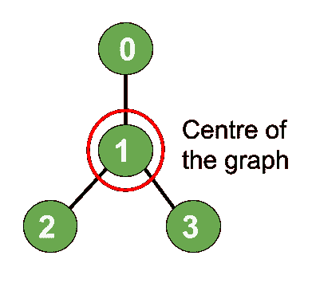
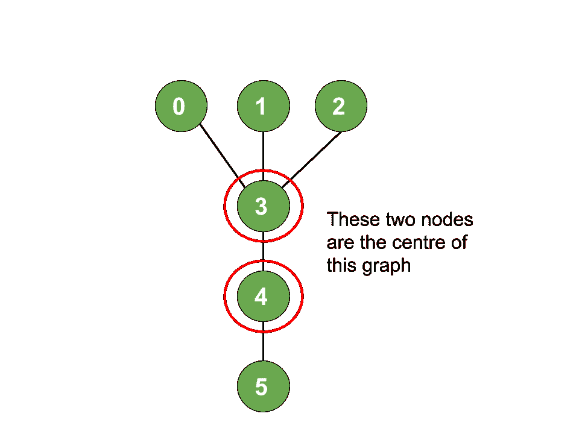

# 找到 N 元树中心的节点

> 原文:[https://www . geesforgeks . org/find-n 元树中心节点/](https://www.geeksforgeeks.org/find-the-node-at-the-centre-of-an-n-ary-tree/)

**先决条件:**

*   [N 元树的直径](https://www.geeksforgeeks.org/diameter-n-ary-tree/)
*   [图中两个节点之间的路径](https://www.geeksforgeeks.org/print-the-path-between-any-two-nodes-of-a-tree-dfs/)

给定一个 N 元树，其中 **N** 个节点从 **0 到 N-1** 编号，以及一个无向边列表，任务是找到给定树中心的节点。

> **偏心率:**给定树中任意顶点 V 的偏心率是给定顶点 V 与树中任意其他顶点之间的最大距离。
> **中心:**树的中心是偏心率最小的顶点。因此，这意味着为了找到中心，我们必须最小化这个偏心。

**示例:**

> **输入:** N = 4，边[] = { (1，0)，(1，2)，(1，3)}
> **输出:** 1
> **解释:**
> 
> 
> 
> **输入:** N = 6，边[] = { (0，3)，(1，3)，(2，3)，(4，3)，(5，4)}
> **输出:** 3，4
> T6】解释:
> 
> 

**进场:**可以观察到，最大偏心的路径是树的直径。因此，树直径的中心也将是树的中心。

**证明:**

> *   For example, let's consider the case where the longest path consists of an odd number of vertices. Let the longest path be **x** - **o** - **y** , where **x** and **y** are the two endpoints of the path, and **o** is the middle vertex.
> *   For a contradiction, if the center of the tree is not **o** but some other vertex [T2】 O' 【T3], then at least one of the following two statements must be true.
>     1.  Path [T0】 XO' 【T1] is strictly longer than path **XO**
>     2.  Path [T0】 YO' 【T1] is strictly longer than path **yo**
> *   This means that O' will not satisfy the condition of minimum eccentricity. Therefore, through contradiction, we prove that the center of the tree is actually the center of the diameter path.

*   现在如果直径由奇数个节点组成，那么只有一个中心(也称为**中心树**)。
*   如果直径由偶数个节点组成，则有 2 个中心节点(也称为**双中心树**)。

下面是上述方法的实现:

## C++

```
// C++ implementation of
// the above approach

#include <bits/stdc++.h>
using namespace std;

// To create tree
map<int, vector<int> > tree;

// Function to store the path
// from given vertex to the target
// vertex in a vector path
bool getDiameterPath(int vertex,
                     int targetVertex,
                     int parent,
                     vector<int>& path)
{

    // If the target node is found,
    // push it into path vector
    if (vertex == targetVertex) {

        path.push_back(vertex);
        return true;
    }

    for (auto i : tree[vertex]) {

        // To prevent visiting a
        // node already visited
        if (i == parent)
            continue;

        // Recursive call to the neighbours
        // of current node inorder
        // to get the path
        if (getDiameterPath(i, targetVertex,
                            vertex, path)) {
            path.push_back(vertex);
            return true;
        }
    }

    return false;
}

// Function to obtain and return the
// farthest node from a given vertex
void farthestNode(int vertex, int parent,
                  int height, int& maxHeight,
                  int& maxHeightNode)
{

    // If the current height is maximum
    // so far, then save the current node
    if (height > maxHeight) {
        maxHeight = height;
        maxHeightNode = vertex;
    }

    // Iterate over all the neighbours
    // of current node
    for (auto i : tree[vertex]) {
        // This is to prevent visiting
        // a already visited node
        if (i == parent)
            continue;

        // Next call will be at 1 height
        // higher than our current height
        farthestNode(i, vertex,
                     height + 1,
                     maxHeight,
                     maxHeightNode);
    }
}

// Function to add edges
void addedge(int a, int b)
{
    tree[a].push_back(b);
    tree[b].push_back(a);
}

void FindCenter(int n)
{
    // Now we will find the 1st farthest
    // node from 0(any arbitrary node)

    // Perform DFS from 0 and update
    // the maxHeightNode to obtain
    // the farthest node from 0

    // Reset to -1
    int maxHeight = -1;

    // Reset to -1
    int maxHeightNode = -1;

    farthestNode(0, -1, 0, maxHeight,
                 maxHeightNode);

    // Stores one end of the diameter
    int leaf1 = maxHeightNode;

    // Similarly the other end of
    // the diameter

    // Reset the maxHeight
    maxHeight = -1;
    farthestNode(maxHeightNode,
                 -1, 0, maxHeight,
                 maxHeightNode);

    // Stores the second end
    // of the diameter
    int leaf2 = maxHeightNode;

    // Store the diameter into
    // the vector path
    vector<int> path;

    // Diameter is equal to the
    // path between the two farthest
    // nodes leaf1 and leaf2
    getDiameterPath(leaf1, leaf2,
                    -1, path);

    int pathSize = path.size();

    if (pathSize % 2) {
        cout << path[pathSize / 2]
             << endl;
    }
    else {
        cout << path[pathSize / 2]
             << ", "
             << path[(pathSize - 1) / 2]
             << endl;
    }
}

// Driver Code
int main()
{

    int N = 4;
    addedge(1, 0);
    addedge(1, 2);
    addedge(1, 3);

    FindCenter(N);

    return 0;
}
```

## Java 语言(一种计算机语言，尤用于创建网站)

```
// Java implementation of
// the above approach
import java.util.*;

class GFG{

// To create tree
static Map<Integer, ArrayList<Integer>> tree;
static ArrayList<Integer> path;
static int maxHeight, maxHeightNode;

// Function to store the path
// from given vertex to the target
// vertex in a vector path
static boolean getDiameterPath(int vertex,
                               int targetVertex,
                               int parent,
                               ArrayList<Integer> path)
{

    // If the target node is found,
    // push it into path vector
    if (vertex == targetVertex)
    {
        path.add(vertex);
        return true;
    }

    for(Integer i : tree.get(vertex))
    {

        // To prevent visiting a
        // node already visited
        if (i == parent)
            continue;

        // Recursive call to the neighbours
        // of current node inorder
        // to get the path
        if (getDiameterPath(i, targetVertex,
                            vertex, path))
        {
            path.add(vertex);
            return true;
        }
    }
    return false;
}

// Function to obtain and return the
// farthest node from a given vertex
static void farthestNode(int vertex, int parent,
                         int height)
{

    // If the current height is maximum
    // so far, then save the current node
    if (height > maxHeight)
    {
        maxHeight = height;
        maxHeightNode = vertex;
    }

    // Iterate over all the neighbours
    // of current node
    if (tree.get(vertex) != null)
        for(Integer i : tree.get(vertex))
        {

            // This is to prevent visiting
            // a already visited node
            if (i == parent)
                continue;

            // Next call will be at 1 height
            // higher than our current height
            farthestNode(i, vertex,
                         height + 1);
        }
}

// Function to add edges
static void addedge(int a, int b)
{
    if (tree.get(a) == null)
        tree.put(a, new ArrayList<>());

    tree.get(a).add(b);

    if (tree.get(b) == null)
        tree.put(b, new ArrayList<>());

    tree.get(b).add(a);
}

static void FindCenter(int n)
{

    // Now we will find the 1st farthest
    // node from 0(any arbitrary node)

    // Perform DFS from 0 and update
    // the maxHeightNode to obtain
    // the farthest node from 0

    // Reset to -1
    maxHeight = -1;

    // Reset to -1
    maxHeightNode = -1;

    farthestNode(0, -1, 0);

    // Stores one end of the diameter
    int leaf1 = maxHeightNode;

    // Similarly the other end of
    // the diameter

    // Reset the maxHeight
    maxHeight = -1;
    farthestNode(maxHeightNode,
                 -1, 0);

    // Stores the second end
    // of the diameter
    int leaf2 = maxHeightNode;

    // Store the diameter into
    // the vector path
    path = new ArrayList<>();

    // Diameter is equal to the
    // path between the two farthest
    // nodes leaf1 and leaf2
    getDiameterPath(leaf1, leaf2,
                    -1, path);

    int pathSize = path.size();

    if (pathSize % 2 == 1)
    {
        System.out.println(path.get(pathSize / 2));
    }
    else {
        System.out.println(path.get(pathSize / 2) +
                    ", " + path.get((pathSize - 1) / 2));
    }
}

// Driver code
public static void main(String[] args)
{
    int N = 4;

    tree = new HashMap<>();
    addedge(1, 0);
    addedge(1, 2);
    addedge(1, 3);

    FindCenter(N);
}
}

// This code is contributed by offbeat
```

## 蟒蛇 3

```
# Python3 implementation of the above approach

# To create tree
tree = {}
path = []
maxHeight, maxHeightNode = -1, -1

# Function to store the path
# from given vertex to the target
# vertex in a vector path
def getDiameterPath(vertex, targetVertex, parent, path):

    # If the target node is found,
    # push it into path vector
    if (vertex == targetVertex):
        path.append(vertex)
        return True

    for i in range(len(tree[vertex])):
        # To prevent visiting a
        # node already visited
        if (tree[vertex][i] == parent):
            continue

        # Recursive call to the neighbours
        # of current node inorder
        # to get the path
        if (getDiameterPath(tree[vertex][i], targetVertex, vertex, path)):
            path.append(vertex)
            return True
    return False

# Function to obtain and return the
# farthest node from a given vertex
def farthestNode(vertex, parent, height):
    global maxHeight, maxHeightNode
    # If the current height is maximum
    # so far, then save the current node
    if (height > maxHeight):
        maxHeight = height
        maxHeightNode = vertex

    # Iterate over all the neighbours
    # of current node
    if (vertex in tree):
        for i in range(len(tree[vertex])):

            # This is to prevent visiting
            # a already visited node
            if (tree[vertex][i] == parent):
                continue

            # Next call will be at 1 height
            # higher than our current height
            farthestNode(tree[vertex][i], vertex, height + 1)

# Function to add edges
def addedge(a, b):
    if (a not in tree):
        tree[a] = []

    tree[a].append(b)

    if (b not in tree):
        tree[b] = []

    tree[b].append(a)

def FindCenter(n):
    # Now we will find the 1st farthest
    # node from 0(any arbitrary node)

    # Perform DFS from 0 and update
    # the maxHeightNode to obtain
    # the farthest node from 0

    # Reset to -1
    maxHeight = -1

    # Reset to -1
    maxHeightNode = -1

    farthestNode(0, -1, 0)

    # Stores one end of the diameter
    leaf1 = maxHeightNode

    # Similarly the other end of
    # the diameter

    # Reset the maxHeight
    maxHeight = -1
    farthestNode(maxHeightNode, -1, 0)

    # Stores the second end
    # of the diameter
    leaf2 = maxHeightNode

    # Store the diameter into
    # the vector path
    path = []

    # Diameter is equal to the
    # path between the two farthest
    # nodes leaf1 and leaf2
    getDiameterPath(leaf1, leaf2, -1, path)

    pathSize = len(path)

    if (pathSize % 2 == 1):
        print(path[int(pathSize / 2)]*-1)
    else:
        print(path[int(pathSize / 2)], ", ", path[int((pathSize - 1) / 2)], sep = "", end = "")

N = 4

tree = {}
addedge(1, 0)
addedge(1, 2)
addedge(1, 3)

FindCenter(N)

# This code is contributed by suresh07.
```

## C#

```
// C# implementation of
// the above approach
using System;
using System.Collections.Generic;
class GFG {

    // To create tree
    static Dictionary<int, List<int>> tree;
    static List<int> path;
    static int maxHeight, maxHeightNode;

    // Function to store the path
    // from given vertex to the target
    // vertex in a vector path
    static bool getDiameterPath(int vertex,
                                   int targetVertex,
                                   int parent,
                                   List<int> path)
    {

        // If the target node is found,
        // push it into path vector
        if (vertex == targetVertex)
        {
            path.Add(vertex);
            return true;
        }

        foreach(int i in tree[vertex])
        {

            // To prevent visiting a
            // node already visited
            if (i == parent)
                continue;

            // Recursive call to the neighbours
            // of current node inorder
            // to get the path
            if (getDiameterPath(i, targetVertex,
                                vertex, path))
            {
                path.Add(vertex);
                return true;
            }
        }
        return false;
    }

    // Function to obtain and return the
    // farthest node from a given vertex
    static void farthestNode(int vertex, int parent,
                             int height)
    {

        // If the current height is maximum
        // so far, then save the current node
        if (height > maxHeight)
        {
            maxHeight = height;
            maxHeightNode = vertex;
        }

        // Iterate over all the neighbours
        // of current node
        if (tree.ContainsKey(vertex) && tree[vertex].Count > 0)
        {
            foreach(int i in tree[vertex])
            {

                // This is to prevent visiting
                // a already visited node
                if (i == parent)
                    continue;

                // Next call will be at 1 height
                // higher than our current height
                farthestNode(i, vertex, height + 1);
            }
        }
    }

    // Function to add edges
    static void addedge(int a, int b)
    {
        if (!tree.ContainsKey(a))
            tree[a] = new List<int>();

        tree[a].Add(b);

        if (!tree.ContainsKey(b))
            tree[b] = new List<int>();

        tree[b].Add(a);
    }

    static void FindCenter(int n)
    {

        // Now we will find the 1st farthest
        // node from 0(any arbitrary node)

        // Perform DFS from 0 and update
        // the maxHeightNode to obtain
        // the farthest node from 0

        // Reset to -1
        maxHeight = -1;

        // Reset to -1
        maxHeightNode = -1;

        farthestNode(0, -1, 0);

        // Stores one end of the diameter
        int leaf1 = maxHeightNode;

        // Similarly the other end of
        // the diameter

        // Reset the maxHeight
        maxHeight = -1;
        farthestNode(maxHeightNode,
                     -1, 0);

        // Stores the second end
        // of the diameter
        int leaf2 = maxHeightNode;

        // Store the diameter into
        // the vector path
        path = new List<int>();

        // Diameter is equal to the
        // path between the two farthest
        // nodes leaf1 and leaf2
        getDiameterPath(leaf1, leaf2,
                        -1, path);

        int pathSize = path.Count;

        if (pathSize % 2 == 1)
        {
            Console.WriteLine(path[pathSize / 2]);
        }
        else {
            Console.WriteLine(path[pathSize / 2] +
                        ", " + path[(pathSize - 1) / 2]);
        }
    }

  static void Main() {
    int N = 4;

    tree = new Dictionary<int, List<int>>();
    addedge(1, 0);
    addedge(1, 2);
    addedge(1, 3);

    FindCenter(N);
  }
}

// This code is contributed by divyesh072019.
```

## java 描述语言

```
<script>
    // Javascript implementation of the above approach

    // To create tree
    let tree;
    let path;
    let maxHeight, maxHeightNode;

    // Function to store the path
    // from given vertex to the target
    // vertex in a vector path
    function getDiameterPath(vertex, targetVertex, parent, path)
    {

        // If the target node is found,
        // push it into path vector
        if (vertex == targetVertex)
        {
            path.push(vertex);
            return true;
        }

        for(let i = 0; i < tree.get(vertex).length; i++)
        {

            // To prevent visiting a
            // node already visited
            if (tree.get(vertex)[i] == parent)
                continue;

            // Recursive call to the neighbours
            // of current node inorder
            // to get the path
            if (getDiameterPath(tree.get(vertex)[i], targetVertex,
                                vertex, path))
            {
                path.push(vertex);
                return true;
            }
        }
        return false;
    }

    // Function to obtain and return the
    // farthest node from a given vertex
    function farthestNode(vertex, parent, height)
    {

        // If the current height is maximum
        // so far, then save the current node
        if (height > maxHeight)
        {
            maxHeight = height;
            maxHeightNode = vertex;
        }

        // Iterate over all the neighbours
        // of current node
        if (tree.get(vertex) != null)
            for(let i = 0; i < tree.get(vertex).length; i++)
            {

                // This is to prevent visiting
                // a already visited node
                if (tree.get(vertex)[i] == parent)
                    continue;

                // Next call will be at 1 height
                // higher than our current height
                farthestNode(tree.get(vertex)[i], vertex, height + 1);
            }
    }

    // Function to add edges
    function addedge(a, b)
    {
        if (tree.get(a) == null)
            tree.set(a, []);

        tree.get(a).push(b);

        if (tree.get(b) == null)
            tree.set(b, []);

        tree.get(b).push(a);
    }

    function FindCenter(n)
    {

        // Now we will find the 1st farthest
        // node from 0(any arbitrary node)

        // Perform DFS from 0 and update
        // the maxHeightNode to obtain
        // the farthest node from 0

        // Reset to -1
        maxHeight = -1;

        // Reset to -1
        maxHeightNode = -1;

        farthestNode(0, -1, 0);

        // Stores one end of the diameter
        let leaf1 = maxHeightNode;

        // Similarly the other end of
        // the diameter

        // Reset the maxHeight
        maxHeight = -1;
        farthestNode(maxHeightNode,
                     -1, 0);

        // Stores the second end
        // of the diameter
        let leaf2 = maxHeightNode;

        // Store the diameter into
        // the vector path
        path = [];

        // Diameter is equal to the
        // path between the two farthest
        // nodes leaf1 and leaf2
        getDiameterPath(leaf1, leaf2,
                        -1, path);

        let pathSize = path.length;

        if (pathSize % 2 == 1)
        {
            document.write(path[parseInt(pathSize / 2, 10)]);
        }
        else {
            document.write(path[parseInt(pathSize / 2, 10)] +
                        ", " + path[parseInt((pathSize - 1) / 2, 10)]);
        }
    }

    let N = 4;

    tree = new Map();
    addedge(1, 0);
    addedge(1, 2);
    addedge(1, 3);

    FindCenter(N);

</script>
```

**Output:** 

```
1
```

***时间复杂度:**O(N)*
T5**辅助空间:** O(N)