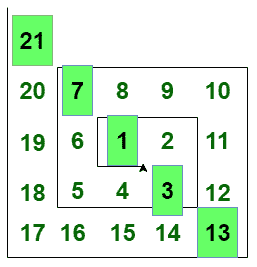

# 找到第 n 个猪食号

> 原文:[https://www.geeksforgeeks.org/find-the-nth-hogben-numbers/](https://www.geeksforgeeks.org/find-the-nth-hogben-numbers/)

给定一个编号 **N** ，任务是打印**N<sup>th</sup>T5**hog Ben 编号**。** 

> **猪食编号:**在整数的螺旋排列中，**猪食编号**出现在主对角线上(见下图)。
> 
> 
> 
> 前几个 Hogben 数字是 1、3、7、13、21、31、43、57、73、91、111、133、157、183、211、241、273……还有更多。

**例:**

> **输入:** N = 4
> **输出:** 3
> **解释:**
> 位于螺旋图案对角线上的第 4 个 Hogben 数是 13。
> **输入:** N = 7
> **输出:** 43
> **解释:**
> 位于螺旋图案对角线上的第 7 个 Hogben 数为 43。

**进场:**
我们从法令号的顺序可以观察到 **N <sup>th</sup>** 法令号 H <sub>N</sub> 等于。
以下是上述办法的实施情况。

## C++

```
// C++ program to print
// N-th Hogben Number

#include <bits/stdc++.h>
using namespace std;

// Function returns N-th
// Hogben Number
int HogbenNumber(int a)
{
    int p = (pow(a, 2) - a + 1);
    return p;
}

// Driver code
int main()
{
    int N = 10;

    cout << HogbenNumber(N);

    return 0;
}
```

## Java 语言(一种计算机语言，尤用于创建网站)

```
// Java program to print
// N-th Hogben Number
import java.util.*;

class GFG{

// Function returns N-th
// Hogben Number
public static int HogbenNumber(int a)
{
    int p = (int)(Math.pow(a, 2) - a + 1);
    return p;
}

// Driver code
public static void main(String args[])
{
    int N = 10;

    System.out.print(HogbenNumber(N));
}
}

// This code is contributed by Akanksha_Rai
```

## 蟒蛇 3

```
# Python3 program to print
# N-th Hogben Number

# Function returns N-th
# Hogben Number
def HogbenNumber(a):

    p = (pow(a, 2) - a + 1)
    return p

# Driver code
N = 10

print(HogbenNumber(N))

# This code is contributed by shubhamsingh10
```

## C#

```
// C# program to print
// N-th Hogben Number
using System;
class GFG{

// Function returns N-th
// Hogben Number
public static int HogbenNumber(int a)
{
    int p = (int)(Math.Pow(a, 2) - a + 1);
    return p;
}

// Driver code
public static void Main()
{
    int N = 10;

    Console.Write(HogbenNumber(N));
}
}

// This code is contributed by Code_Mech
```

## java 描述语言

```
<script>

// Javascript program to print
// N-th Hogben Number

// Function returns N-th
// Hogben Number
function HogbenNumber(a)
{
    let p = (Math.pow(a, 2) - a + 1);
    return p;
}

  // Driver Code

    let N = 10;

    document.write(HogbenNumber(N));

</script>
```

**Output:** 

```
91
```