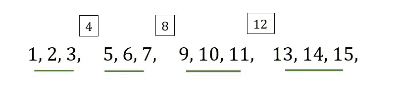

# 求不能被 A 整除的第 n 个自然数

> 原文:[https://www . geesforgeks . org/find-第 n 个不能被 a 整除的自然数/](https://www.geeksforgeeks.org/find-the-nth-natural-number-which-is-not-divisible-by-a/)

给定**两个整数 A 和 N** ，我们的任务是找到不能被 A 整除的第 N 个自然数。

**示例:**

> **输入:** A = 4，N = 12
> **输出:** 15
> **说明:**
> 从 1 开始除 A 的倍数外的数列为 1、2、3、5、6、7、9、10、11、13、14、15、17，不能被 4 整除的第 12 项为 15。
> 
> **输入:** A = 3，N = 20
> **输出:** 29
> **说明:**
> 除 A 的倍数外，从 1 开始的数列为 1、2、4、5、7、8、10、11 等，不能被 3 整除的第 N 个数为 29。

**进场:**

为了解决上面提到的问题，我们必须观察到每(A–1)个整数后都有一个**间隙，因为跳过了 A 的倍数。为了发现数字 N 位于哪个集合中，我们将 N 除以(A–1)，并将其存储在一个变量中，让我们说*商*。现在将 A 与那个变量相乘，并将余数相加，我们将得到结果。**

```
If A = 4, N = 7:
quotient = 7 / 3 = 2 
remainder = 7 % 3 = 1

So the answer is 
(A * quotient) + remainder 
= 4 * 2 + 1 = 9
```



但是如果余数为 0，则意味着它是集合中的最后一个元素。让我们通过一个例子来理解它。

```
If A = 4, N = 6:
quotient = 6 / 3 = 2 
remainder = 6 % 3 = 0

So the answer is 
(A * quotient) - 1 
= 4 * 2 - 1 = 7
```

下面是上述方法的实现:

## C++

```
// C++ code to Find the Nth number which
// is not divisible by A from the series
#include<bits/stdc++.h>
using namespace std;

void findNum(int n, int k)
{

    // Find the quotient and the remainder
    // when k is divided by n-1
    int q = k / (n - 1);
    int r = k % (n - 1);
    int a;

    // If the remainder is not 0
    // multiply n by q and subtract 1
    // if remainder is 0 then
    // multiply n by q
    // and add the remainder
    if(r != 0)
       a = (n * q) + r;
    else
       a = (n * q) - 1;

    // Print the answer
    cout << a;
}

// Driver code
int main()
{
    int A = 4, N = 6;

    findNum(A, N);
    return 0;
}

// This code is contributed by PratikBasu
```

## Java 语言(一种计算机语言，尤用于创建网站)

```
// Java code to Find the Nth number which
// is not divisible by A from the series
class GFG {

static void findNum(int n, int k)
{

    // Find the quotient and the remainder
    // when k is divided by n-1
    int q = k / (n - 1);
    int r = k % (n - 1);
    int a = 0;

    // If the remainder is not 0
    // multiply n by q and subtract 1
    // if remainder is 0 then
    // multiply n by q
    // and add the remainder
    if (r != 0)
        a = (n * q) + r;
    else
        a = (n * q) - 1;

    // Print the answer
    System.out.println(a);
}

// Driver code
public static void main(String[] args)
{
    int A = 4;
    int N = 6;

    findNum(A, N);
}
}

// This code is contributed by 29AjayKumar
```

## 蟒蛇 3

```
# Python3 code to Find the Nth number which
# is not divisible by A from the series

def findNum(n, k):

    # Find the quotient and the remainder
    # when k is divided by n-1
    q = k//(n-1)
    r = k % (n-1)

    # if the remainder is not 0
    # multiply n by q and subtract 1

    # if remainder is 0 then
    # multiply n by q
    # and add the remainder
    if(r != 0):
        a = (n * q)+r
    else:
        a = (n * q)-1

    # print the answer
    print(a)

# driver code
A = 4
N = 6
findNum(A, N)
```

## C#

```
// C# code to find the Nth number which
// is not divisible by A from the series
using System;

class GFG{

static void findNum(int n, int k)
{

    // Find the quotient and the remainder
    // when k is divided by n-1
    int q = k / (n - 1);
    int r = k % (n - 1);
    int a = 0;

    // If the remainder is not 0
    // multiply n by q and subtract 1
    // if remainder is 0 then
    // multiply n by q
    // and add the remainder
    if (r != 0)
        a = (n * q) + r;
    else
        a = (n * q) - 1;

    // Print the answer
    Console.WriteLine(a);
}

// Driver code
public static void Main(String[] args)
{
    int A = 4;
    int N = 6;

    findNum(A, N);
}
}

// This code is contributed by amal kumar choubey
```

## java 描述语言

```
<script>

// Javascript code to Find the Nth number which
// is not divisible by A from the series
function findNum(n, k)
{

    // Find the quotient and the remainder
    // when k is divided by n-1
    let q = parseInt(k / (n - 1));
    let r = k % (n - 1);
    let a;

    // If the remainder is not 0
    // multiply n by q and subtract 1
    // if remainder is 0 then
    // multiply n by q
    // and add the remainder
    if (r != 0)
        a = (n * q) + r;
    else
        a = (n * q) - 1;

    // Print the answer
    document.write(a);
}

// Driver code
let A = 4, N = 6;

findNum(A, N);

// This code is contributed by rishavmahato348

</script>
```

**Output:** 

```
7
```