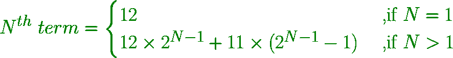

# 找出系列 12、35、81、173、357 中的第 n 项，…

> 原文:[https://www . geesforgeks . org/find-the-n-term-in-series-12-35-81-173-357/](https://www.geeksforgeeks.org/find-the-nth-term-in-series-12-35-81-173-357/)

给定一个数字 **N** ，任务是找到系列 **12、35、81、173、357、……**
**中的**第 N 个**术语示例:**

```
Input: N = 2
Output: 35
2nd term = (12*2) + 11
         = 35

Input: N = 5
Output: 357
5th term = (12*(2^4))+11*((2^4)-1)
         = 357
```

**进场:**

*   每一个数都是通过将前一个数乘以 2，再加上 11 得到的。
*   因为起始号码是 12。

```
1st term = 12
2nd term = (12 * 2) / 11 = 35
3rd term = (35 * 2) / 11 = 81
4th term = (81 * 2) / 11 = 173
And, so on....
```

*   一般来说，第 n 个数字由公式获得:



以下是上述方法的实现:

## C++

```
// C++ program to find the Nth term
// in series 12, 35, 81, 173, 357, ...

#include <bits/stdc++.h>
using namespace std;

// Function to find Nth term
int nthTerm(int N)
{
    int nth = 0, first_term = 12;

    // Nth term
    nth = (first_term * (pow(2, N - 1)))
          + 11 * ((pow(2, N - 1)) - 1);

    return nth;
}

// Driver Method
int main()
{
    int N = 5;
    cout << nthTerm(N) << endl;

    return 0;
}
```

## Java 语言(一种计算机语言，尤用于创建网站)

```
// Java program to find the Nth term
// in series 12, 35, 81, 173, 357, ...
class GFG
{

// Function to find Nth term
static int nthTerm(int N)
{
    int nth = 0, first_term = 12;

    // Nth term
    nth = (int) ((first_term * (Math.pow(2, N - 1)))
        + 11 * ((Math.pow(2, N - 1)) - 1));

    return nth;
}

// Driver code
public static void main(String[] args)
{
    int N = 5;
    System.out.print(nthTerm(N) +"\n");
}
}

// This code is contributed by Rajput-Ji
```

## 蟒蛇 3

```
# Python3 program to find the Nth term
# in series 12, 35, 81, 173, 357, ...

# Function to find Nth term
def nthTerm(N) :

    nth = 0; first_term = 12;

    # Nth term
    nth = (first_term * (pow(2, N - 1))) + \
            11 * ((pow(2, N - 1)) - 1);

    return nth;

# Driver Method
if __name__ == "__main__" :

    N = 5;
    print(nthTerm(N)) ;

# This code is contributed by AnkitRai01
```

## C#

```
// C# program to find the Nth term
// in series 12, 35, 81, 173, 357, ...
using System;

class GFG
{

// Function to find Nth term
static int nthTerm(int N)
{
    int nth = 0, first_term = 12;

    // Nth term
    nth = (int) ((first_term * (Math.Pow(2, N - 1)))
        + 11 * ((Math.Pow(2, N - 1)) - 1));

    return nth;
}

// Driver code
public static void Main(String[] args)
{
    int N = 5;
    Console.Write(nthTerm(N) +"\n");
}
}

// This code is contributed by PrinciRaj1992
```

## java 描述语言

```
<script>
    // Javascript program to find the Nth term
    // in series 12, 35, 81, 173, 357, ...

    // Function to find Nth term
    function nthTerm(N)
    {
        let nth = 0, first_term = 12;

        // Nth term
        nth = (first_term * (Math.pow(2, N - 1)))
              + 11 * ((Math.pow(2, N - 1)) - 1);

        return nth;
    }

      let N = 5;
    document.write(nthTerm(N));

// This code is contributed by divyeshrabadiya07.
</script>
```

**Output:** 

```
357
```