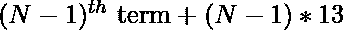

# 求数列 2、15、41、80、132 的第 n 项……

> 原文:[https://www . geesforgeks . org/find-the-n-term-of-series-2-15-41-80-132/](https://www.geeksforgeeks.org/find-the-nth-term-of-the-series-2-15-41-80-132/)

给定一个数字 **N** ，任务是找到系列 **2，15，41，80，132…** 的**N**项。
**举例:**

> **输入:** N = 2
> **输出:** 15
> **输入:** N = 5
> **输出:** 132

**方法:**从给定的系列中，第 n 项的公式可以发现为:

```
1st term = 2
2nd term = 2 + 1 * 13 = 15
3rd term = 15 + 2 * 13 = 41
4th term = 41 + 3 * 13 = 80
.
.
Nth term = (N - 1)th term
         + (N - 1) * 13
```

因此，该系列的**第 N 项**给出为

以下是使用[递归](https://www.geeksforgeeks.org/recursion/) :
从值 **N** :
递归迭代找到**第 N 项**的步骤

*   **基本情况:**如果递归调用的值是 1，那么它就是数列的第一项。因此，从函数返回 2。

```
if(N == 1) 
  return 2;
```

*   **递归调用:**如果不满足基本情况，则根据系列:
    的**第 n 项**从函数中递归迭代

```
(N - 1) * 13 + func(N - 1);
```

*   **Return 语句:**每次递归调用时(基本情况除外)，返回递归函数进行下一次迭代。

```
return ((13 * (N - 1))
       + func(N, i + 1));
```

以下是上述方法的实现:

## C++

```
// C++ program for the above approach

#include <bits/stdc++.h>
using namespace std;

// Recursive function to find Nth term
int nthTerm(int N)
{
    // Base Case
    if (N == 1) {
        return 2;
    }

    // Recursive Call according to
    // Nth term of the series
    return ((N - 1) * 13)
           + nthTerm(N - 1);
}

// Driver Code
int main()
{
    // Input Nth term
    int N = 17;

    // Function call
    cout << nthTerm(N) << endl;
    return 0;
}
```

## Java 语言(一种计算机语言，尤用于创建网站)

```
// Java program for the above approach

class GFG{

// Recursive function to find Nth term
static int nthTerm(int N)
{
    // Base Case
    if (N == 1)
    {
        return 2;
    }

    // Recursive Call according to
    // Nth term of the series
    return ((N - 1) * 13) +
            nthTerm(N - 1);
}

// Driver Code
public static void main(String[] args)
{
    // Input Nth term
    int N = 17;

    // Function call
    System.out.print(nthTerm(N) + "\n");
}
}

// This code is contributed by 29AjayKumar
```

## 蟒蛇 3

```
# Python 3 program for the above approach

# Recursive function to find Nth term
def nthTerm(N):

    # Base Case
    if (N == 1):
        return 2

    # Recursive Call according to
    # Nth term of the series
    return ((N - 1) * 13) + nthTerm(N - 1)

# Driver Code
if __name__ == '__main__':

    # Input Nth term
    N = 17

    # Function call
    print(nthTerm(N))

# This code is contributed by Bhupendra_Singh
```

## C#

```
// C# program for the above approach
using System;

public class GFG{

// Recursive function to find Nth term
static public int nthTerm(int N)
{
    // Base Case
    if (N == 1)
    {
        return 2;
    }

    // Recursive Call according to
    // Nth term of the series
    return ((N - 1) * 13) + nthTerm(N - 1);
}

// Driver Code
static public void Main ()
{
    // Input Nth term
    int N = 17;

    // Function call
    Console.WriteLine(nthTerm(N));
}
}

//This code is contributed by shubhamsingh10
```

## java 描述语言

```
<script>
// javascript program for the above approach

// Recursive function to find Nth term
function nthTerm( N)
{

    // Base Case
    if (N == 1) {
        return 2;
    }

    // Recursive Call according to
    // Nth term of the series
    return ((N - 1) * 13)
           + nthTerm(N - 1);
}

// Driver Code

    // Input Nth term
    let N = 17;

    // Function call
   document.write( nthTerm(N) );

// This code is contributed by Rajput-Ji

</script>
```

**Output**

```
1770
```

**动态编程**(使用记忆自顶向下):

## C++

```
// C++ program for the above approach
#include <bits/stdc++.h>
using namespace std;

int static dp[1001];

// function to find Nth term
int nthTerm(int N)
{
    // Base Case
    if (N == 1) {
        return 2;
    }

    // If a value already present,
    // return it
    if(dp[N] != -1) {
        return dp[N];
    }
    // Recursive Call according to
    // Nth term of the series and
    // store it in dp
    dp[N] = ((N - 1) * 13) + nthTerm(N - 1);

    // Return dp
    return dp[N];
}

// Driver Code
int main()
{
    // Input Nth term
    int N = 17;

    memset(dp, -1, sizeof(dp));

    // Function call
    cout << nthTerm(N) << endl;
    return 0;
}
// This code is contributed by Samim Hossain Mondal.
```

## Java 语言(一种计算机语言，尤用于创建网站)

```
// Java implementation of above approach
import java.util.*;
public class GFG{

  static int []dp = new int[1001];

  // function to find Nth term
  static int nthTerm(int N)
  {
    // Base Case
    if (N == 1) {
      return 2;
    }

    // If a value already present,
    // return it
    if(dp[N] != -1) {
      return dp[N];
    }
    // Recursive Call according to
    // Nth term of the series and
    // store it in dp
    dp[N] = ((N - 1) * 13) + nthTerm(N - 1);

    // Return dp
    return dp[N];
  }

  // Driver code
  public static void main(String []args)
  {
    // Input Nth term
    int N = 17;

    for(int i = 0; i < 1001; i++) {
      dp[i] = -1;
    }

    System.out.println(nthTerm(N));
  }
}

// This code is contributed by Samim Hossain Mondal.
```

## 计算机编程语言

```
# Pythonnprogram for the above approach

# Taking the matrix as globally
dp = [-1 for i in range(1001)]

# Function to find Nth term
def nthTerm(N):

    # Base Case
    if (N == 1):
        return 2

    # If a value already present,
    # return it
    if(dp[N] != -1):
        return dp[N]

    # Recursive Call according to
    # Nth term of the series and
    # store it in dp
    dp[N] = ((N - 1) * 13) + nthTerm(N - 1)

    # Return dp
    return dp[N]

# Driver Code
if __name__ == '__main__':

    # Input Nth term
    N = 17

    # Function call
    print(nthTerm(N))

# This code is contributed by Samim Hossain Mondal.
```

## C#

```
// C# implementation of above approach
using System;
class GFG
{
  static int []dp = new int[1001];

  // function to find Nth term
  static int nthTerm(int N)
  {

    // Base Case
    if (N == 1) {
      return 2;
    }

    // If a value already present,
    // return it
    if(dp[N] != -1) {
      return dp[N];
    }

    // Recursive Call according to
    // Nth term of the series and
    // store it in dp
    dp[N] = ((N - 1) * 13) + nthTerm(N - 1);

    // Return dp
    return dp[N];
  }

  // Driver code
  public static void Main()
  {

    // Input Nth term
    int N = 17;

    for(int i = 0; i < 1001; i++) {
      dp[i] = -1;
    }

    Console.Write(nthTerm(N));
  }
}

// This code is contributed by Samim Hossain Mondal.
```

## java 描述语言

```
<script>
// Javascript program for the above approach

let dp = [];

// function to find Nth term
function nthTerm(N)
{
    // Base Case
    if (N == 1) {
        return 2;
    }

    // If a value already present,
    // return it
    if(dp[N] != -1) {
        return dp[N];
    }
    // Recursive Call according to
    // Nth term of the series and
    // store it in dp
    dp[N] = ((N - 1) * 13) + nthTerm(N - 1);

    // Return dp
    return dp[N];
}

// Driver Code

// Input Nth term
let N = 17;

for(let i = 0; i < 1001; i++) {
    dp[i] = -1;
}

// Function call
document.write(nthTerm(N));

// This code is contributed by Samim Hossain Mondal.
</script>
```

**Output**

```
1770
```

***时间复杂度:** O(N)*

***辅助空间:** O(N)*