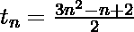

# 求数列 2 + 6 + 13 + 23 +的第 n 项。。。

> 原文:[https://www . geesforgeks . org/find-the-n-term-of-series-2-6-13-23/](https://www.geeksforgeeks.org/find-the-nth-term-of-the-series-2-6-13-23/)

给定一个整数 **N** 。任务是编写一个程序来找到给定系列的第 n 个术语**:** 

> 2 + 6 + 13 + 23 + …

**示例** :

```
Input : N = 5
Output : 36

Input : N = 10
Output : 146
```

参考[如何找到级数的第 n 项](https://www.geeksforgeeks.org/sum-of-first-n-terms-of-quadratic-sequence-3-7-13/)一文，了解找到任意给定级数的第 n 项背后的想法。
给定系列的广义**第 N 个**术语为:

以下是上述方法的实施:

## C++

```
//CPP program to find Nth term of the series
// 2 + 6 + 13 + 23 + 36 + ...
#include<bits/stdc++.h>
using namespace std;

// calculate Nth term of given series
int Nth_Term(int n)
{

return (3 * pow(n, 2) - n + 2) / (2);

}

// Driver code
int main()
{

int N = 5;
cout<<Nth_Term(N)<<endl;

}
```

## Java 语言(一种计算机语言，尤用于创建网站)

```
//Java program to find Nth term of the series
// 2 + 6 + 13 + 23 + 36 + ...
import java.io.*;

class GFG {

// calculate Nth term of given series
static int Nth_Term(int n)
{

return (int)(3 * Math.pow(n, 2) - n + 2) / (2);

}

// Driver code

    public static void main (String[] args) {
    int N = 5;
    System.out.println(Nth_Term(N));
    }
}
// This code is contributed by anuj_67..
```

## 蟒蛇 3

```
# Python program to find Nth term of the series
# 2 + 6 + 13 + 23 + 36 + ...

# calculate Nth term of given series
def Nth_Term(n):
    return (3 * pow(n, 2) - n + 2) // (2)

# Driver code
N = 5
print(Nth_Term(N))
```

## C#

```
// C# program to find Nth term of the series
// 2 + 6 + 13 + 23 + 36 + ...

class GFG
{

// calculate Nth term of given series
static int Nth_Term(int n)
{

    return (int)(3 * System.Math.Pow(n, 2) -
                              n + 2) / (2);
}

// Driver code
static void Main ()
{
    int N = 5;
    System.Console.WriteLine(Nth_Term(N));
}
}

// This code is contributed by mits
```

## 服务器端编程语言（Professional Hypertext Preprocessor 的缩写）

```
<?php
// PHP program to find
// Nth term of the series
// 2 + 6 + 13 + 23 + 36 + ...

// calculate Nth term of given series
function Nth_Term($n)
{
    return (3 * pow($n, 2) - $n + 2) / (2);
}

// Driver code
$N = 5;
echo (Nth_Term($N));

// This code is contributed
// by Sach_Code
?>
```

## java 描述语言

```
<script>

// java script program to find
// Nth term of the series
// 2 + 6 + 13 + 23 + 36 + ...

// calculate Nth term of given series
function Nth_Term(n)
{
    return (3 * Math.pow(n, 2) - n + 2) / (2);
}

// Driver code
let N = 5;
document.write (Nth_Term(N));

// This code is contributed
// by bobby
</script>
```

**Output:** 

```
36
```