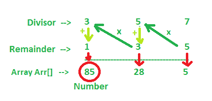

# 连续除法后求数

> 原文:[https://www . geeksforgeeks . org/连续除法后找到数字/](https://www.geeksforgeeks.org/find-the-number-after-successive-division/)

给定两个数组 *div* 和 *rem* ，这两个数组保存了*因子*和*余数*的值，任务是找到在被 *div* 数组的元素连续除之后剩下的余数，这些余数在 *rem* 数组中。
**注:**第一次除法的商除以第二个元素，然后所得的商除以第三个元素(与给定的余数相匹配)等等。
**举例:**

> **输入:** div[] = {3，5，7}，rem[] = {1，3，5}
> **输出:** 85
> 85 在 3 叶余数 1 的除法上用商 28
> 28 在 5 叶余数 3 的除法上用商 5
> 5 在 7 叶余数 5 的除法上用
> **输入:** div[] = {7，9}，rem[] = {2，2}
> **输出:**

**进场:**



*   将最后一个余数的值存储在一个变量中，比如 *num* 。
*   [从 *n-2 向后遍历数组*](https://www.geeksforgeeks.org/loops-in-c/)到 0 并将 *num* 更新为 *num = num * div[i] + rem[i]*
*   最后打印 *num* 。

以下是上述方法的实现:

## C++

```
// C++ program to implement above approach
#include <bits/stdc++.h>
using namespace std;

// Function to find the number
int findNum(int div[], int rem[], int N)
{
    int num = rem[N - 1];

    for (int i = N - 2; i >= 0; i--) {
        num = num * div[i] + rem[i];
    }

    return num;
}

// Driver Code
int main()
{
    int div[] = { 8, 3 };
    int rem[] = { 2, 2 };
    int N = sizeof(div) / sizeof(div[0]);

    cout << findNum(div, rem, N);

    return 0;
}
```

## Java 语言(一种计算机语言，尤用于创建网站)

```
// Java implementation of the above approach

public class GFG{

    // Function to find the number
    static int findNum(int div[], int rem[], int N)
    {
        int num = rem[N - 1];

        for (int i = N - 2; i >= 0; i--) {
            num = num * div[i] + rem[i];
        }

        return num;
    }

     // Driver Code
     public static void main(String []args){
            int div[] = { 8, 3 };
            int rem[] = { 2, 2 };
            int N = div.length;

            System.out.println(findNum(div, rem, N));

     }
     // This code is contributed by ANKITRAI1
}
```

## 蟒蛇 3

```
# Python 3 program to implement
# above approach

# Function to find the number
def findNum(div, rem, N):
    num = rem[N - 1]
    i = N - 2
    while(i >= 0):
        num = num * div[i] + rem[i]

        i -= 1

    return num

# Driver Code
if __name__ == '__main__':
    div = [8, 3]
    rem = [2, 2]
    N = len(div)

    print(findNum(div, rem, N))

# This code is contributed by
# Surendra_Gangwar
```

## C#

```
// C# implementation of the
// above approach
using System;

class GFG
{

// Function to find the number
static int findNum(int []div,
                   int []rem, int N)
{
    int num = rem[N - 1];

    for (int i = N - 2; i >= 0; i--)
    {
        num = num * div[i] + rem[i];
    }

    return num;
}

// Driver Code
static public void Main ()
{
    int []div = { 8, 3 };
    int []rem = { 2, 2 };
    int N = div.Length;

    Console.WriteLine(findNum(div, rem, N));

}
}

// This code is contributed by ajit
```

## 服务器端编程语言（Professional Hypertext Preprocessor 的缩写）

```
<?php
// PHP program to implement
// above approach

// Function to find the number
function findNum($div, $rem, $N)
{
    $num = $rem[$N - 1];

    for ($i = $N - 2; $i >= 0; $i--)
    {
        $num = $num * $div[$i] + $rem[$i];
    }

    return $num;
}

// Driver Code
$div = array( 8, 3 );
$rem = array(2, 2 );
$N = sizeof($div);

echo findNum($div, $rem, $N);

// This code is contributed by ajit
?>
```

## java 描述语言

```
<script>

// Javascript program to implement above approach

// Function to find the number
function findNum(div, rem, N)
{
    var num = rem[N - 1];

    for (var i = N - 2; i >= 0; i--) {
        num = num * div[i] + rem[i];
    }

    return num;
}

// Driver Code
var div = [ 8, 3 ];
var rem = [ 2, 2 ];
var N = div.length;
document.write( findNum(div, rem, N));

</script>
```

**Output:** 

```
18
```