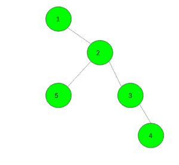
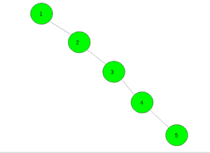

# 找出一棵树中距离正好为 k 的不同顶点对的数量

> 原文:[https://www . geeksforgeeks . org/find-不同顶点对的数量-这些顶点对在树中具有精确的 k 距离/](https://www.geeksforgeeks.org/find-the-number-of-distinct-pairs-of-vertices-which-have-a-distance-of-exactly-k-in-a-tree/)

给定一个整数 **k** 和一个节点为 **n** 的树。任务是计算精确距离为 **k** 的不同顶点对的数量。

**示例:**

> **输入:** k = 2
> 
> 
> 
> **输出:**4
> T3】输入: k = 3
> 
> 
> 
> **输出:** 2

**方法:**这个问题可以用动态规划来解决。对于树的每个顶点 v，我们计算值 d[v][lev] (0 < = lev < = k)。该值表示距离 v 的顶点数。注意 d[v][0] = 1。
然后我们计算答案。对于任何顶点 v，对的数量将是 j–1 级和 k–j 级顶点数量的乘积。

下面是上述方法的实现:

## C++

```
// C++ implementation of the approach
#include <bits/stdc++.h>
using namespace std;
#define N 5005

// To store vertices and value of k
int n, k;

vector<int> gr[N];

// To store number vertices at a level i
int d[N][505];

// To store the final answer
int ans = 0;

// Function to add an edge between two nodes
void Add_edge(int x, int y)
{
    gr[x].push_back(y);
    gr[y].push_back(x);
}

// Function to find the number of distinct
// pairs of the vertices which have a distance
// of exactly k in a tree
void dfs(int v, int par)
{
    // At level zero vertex itself is counted
    d[v][0] = 1;
    for (auto i : gr[v]) {
        if (i != par) {
            dfs(i, v);

            // Count the pair of vertices at
            // distance k
            for (int j = 1; j <= k; j++)
                ans += d[i][j - 1] * d[v][k - j];

            // For all levels count vertices
            for (int j = 1; j <= k; j++)
                d[v][j] += d[i][j - 1];
        }
    }
}

// Driver code
int main()
{
    n = 5, k = 2;

    // Add edges
    Add_edge(1, 2);
    Add_edge(2, 3);
    Add_edge(3, 4);
    Add_edge(2, 5);

    // Function call
    dfs(1, 0);

    // Required answer
    cout << ans;

    return 0;
}
```

## Java 语言(一种计算机语言，尤用于创建网站)

```
// Java implementation of the approach
import java.util.*;

class GFG
{
    static final int N = 5005;

    // To store vertices and value of k
    static int n, k;

    static Vector<Integer>[] gr = new Vector[N];

    // To store number vertices at a level i
    static int[][] d = new int[N][505];

    // To store the final answer
    static int ans = 0;

    // Function to add an edge between two nodes
    static void Add_edge(int x, int y)
    {
        gr[x].add(y);
        gr[y].add(x);
    }

    // Function to find the number of distinct
    // pairs of the vertices which have a distance
    // of exactly k in a tree
    static void dfs(int v, int par)
    {
        // At level zero vertex itself is counted
        d[v][0] = 1;
        for (Integer i : gr[v])
        {
            if (i != par)
            {
                dfs(i, v);

                // Count the pair of vertices at
                // distance k
                for (int j = 1; j <= k; j++)
                    ans += d[i][j - 1] * d[v][k - j];

                // For all levels count vertices
                for (int j = 1; j <= k; j++)
                    d[v][j] += d[i][j - 1];
            }
        }
    }

    // Driver code
    public static void main(String[] args)
    {
        n = 5;
        k = 2;
        for (int i = 0; i < N; i++)
            gr[i] = new Vector<Integer>();

        // Add edges
        Add_edge(1, 2);
        Add_edge(2, 3);
        Add_edge(3, 4);
        Add_edge(2, 5);

        // Function call
        dfs(1, 0);

        // Required answer
        System.out.print(ans);

    }
}

// This code is contributed by PrinciRaj1992
```

## 蟒蛇 3

```
# Python3 implementation of the approach
N = 5005

# To store vertices and value of k
n, k = 0, 0

gr = [[] for i in range(N)]

# To store number vertices at a level i
d = [[0 for i in range(505)]
        for i in range(N)]

# To store the final answer
ans = 0

# Function to add an edge between two nodes
def Add_edge(x, y):
    gr[x].append(y)
    gr[y].append(x)

# Function to find the number of distinct
# pairs of the vertices which have a distance
# of exactly k in a tree
def dfs(v, par):
    global ans

    # At level zero vertex itself is counted
    d[v][0] = 1
    for i in gr[v]:
        if (i != par):
            dfs(i, v)

            # Count the pair of vertices at
            # distance k
            for j in range(1, k + 1):
                ans += d[i][j - 1] * d[v][k - j]

            # For all levels count vertices
            for j in range(1, k + 1):
                d[v][j] += d[i][j - 1]

# Driver code
n = 5
k = 2

# Add edges
Add_edge(1, 2)
Add_edge(2, 3)
Add_edge(3, 4)
Add_edge(2, 5)

# Function call
dfs(1, 0)

# Required answer
print(ans)

# This code is contributed by Mohit Kumar
```

## C#

```
// C# implementation of the approach
using System;
using System.Collections.Generic;

class GFG
{
    static readonly int N = 5005;

    // To store vertices and value of k
    static int n, k;

    static List<int>[] gr = new List<int>[N];

    // To store number vertices at a level i
    static int[,] d = new int[N, 505];

    // To store the readonly answer
    static int ans = 0;

    // Function to add an edge between two nodes
    static void Add_edge(int x, int y)
    {
        gr[x].Add(y);
        gr[y].Add(x);
    }

    // Function to find the number of distinct
    // pairs of the vertices which have a distance
    // of exactly k in a tree
    static void dfs(int v, int par)
    {
        // At level zero vertex itself is counted
        d[v, 0] = 1;
        foreach (int i in gr[v])
        {
            if (i != par)
            {
                dfs(i, v);

                // Count the pair of vertices at
                // distance k
                for (int j = 1; j <= k; j++)
                    ans += d[i, j - 1] * d[v, k - j];

                // For all levels count vertices
                for (int j = 1; j <= k; j++)
                    d[v, j] += d[i, j - 1];
            }
        }
    }

    // Driver code
    public static void Main(String[] args)
    {
        n = 5;
        k = 2;
        for (int i = 0; i < N; i++)
            gr[i] = new List<int>();

        // Add edges
        Add_edge(1, 2);
        Add_edge(2, 3);
        Add_edge(3, 4);
        Add_edge(2, 5);

        // Function call
        dfs(1, 0);

        // Required answer
        Console.Write(ans);

    }
}

// This code is contributed by Rajput-Ji
```

## 服务器端编程语言（Professional Hypertext Preprocessor 的缩写）

```
<?php
// PHP implementation of the approach
$N = 5005;

// To store vertices and value of k
$gr = array_fill(0, $N, array());

// To store number vertices
// at a level i
$d = array_fill(0, $N,
     array_fill(0, 505, 0));

// To store the final answer
$ans = 0;

// Function to add an edge between
// two nodes
function Add_edge($x, $y)
{
    global $gr;
    array_push($gr[$x], $y);
    array_push($gr[$y], $x);
}

// Function to find the number of distinct
// pairs of the vertices which have a
// distance of exactly k in a tree
function dfs($v, $par)
{
    global $d, $ans, $k, $gr;

    // At level zero vertex itself
    // is counted
    $d[$v][0] = 1;
    foreach ($gr[$v] as &$i)
    {
        if ($i != $par)
        {
            dfs($i, $v);

            // Count the pair of vertices
            // at distance k
            for ($j = 1; $j <= $k; $j++)
                $ans += $d[$i][$j - 1] *
                        $d[$v][$k - $j];

            // For all levels count vertices
            for ($j = 1; $j <= $k; $j++)
                $d[$v][$j] += $d[$i][$j - 1];
        }
    }
}

// Driver code
$n = 5;
$k = 2;

// Add edges
Add_edge(1, 2);
Add_edge(2, 3);
Add_edge(3, 4);
Add_edge(2, 5);

// Function call
dfs(1, 0);

// Required answer
echo $ans;

// This code is contributed by mits
?>
```

## java 描述语言

```
<script>

// Javascript implementation of the approach
let N = 5005;

// To store vertices and value of k
let n, k;
let gr = new Array(N);

// To store number vertices at a level i
let d = new Array(N);
for(let i = 0 ; i < N; i++)
{
    d[i] = new Array(505);
    for(let j = 0; j < 505; j++)
    {
        d[i][j] = 0;
    }
}

// To store the final answer
let ans = 0;

// Function to add an edge between two nodes
function Add_edge(x, y)
{
    gr[x].push(y);
    gr[y].push(x);
}

// Function to find the number of distinct
// pairs of the vertices which have a distance
// of exactly k in a tree
function dfs(v, par)
{

    // At level zero vertex itself is counted
    d[v][0] = 1;
    for(let i = 0; i < gr[v].length; i++)
    {
        if (gr[v][i] != par)
        {
            dfs(gr[v][i], v);

            // Count the pair of vertices at
            // distance k
            for(let j = 1; j <= k; j++)
                ans += d[gr[v][i]][j - 1] * d[v][k - j];

            // For all levels count vertices
            for(let j = 1; j <= k; j++)
                d[v][j] += d[gr[v][i]][j - 1];
        }
    }
}

// Driver code
n = 5;
k = 2;
for(let i = 0; i < N; i++)
    gr[i] = [];

// Add edges
Add_edge(1, 2);
Add_edge(2, 3);
Add_edge(3, 4);
Add_edge(2, 5);

// Function call
dfs(1, 0);

// Required answer
document.write(ans);

// This code is contributed by unknown2108

</script>
```

**Output:** 

```
4
```