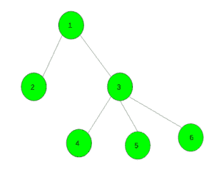

# 求给定树中理想节点对的个数

> 原文:[https://www . geesforgeks . org/find-给定树中理想节点对的数量/](https://www.geeksforgeeks.org/find-the-number-of-pair-of-ideal-nodes-in-a-given-tree/)

给定一个由 **N** 个节点和一个整数 **K** 组成的树，每个节点在 **1** 和 **N** 之间编号。任务是找到树中理想节点对的数量。

一对节点 **(a，b)** 称为理想 if

1.  **a** 是 **b** 的祖先。
2.  并且，**ABS(a–b)≤K**

**示例:**

```
Input:
```



```
K = 2
Output: 4
(1, 2), (1, 3), (3, 4), (3, 5) are such pairs.

Input: Consider the graph in example 1 and k = 3
Output: 6
(1, 2), (1, 3), (1, 4), (3, 4), (3, 5), (3, 6) are such pairs.
```

**方法:**首先，我们需要使用 [DFS](https://www.geeksforgeeks.org/depth-first-traversal-for-a-graph/) 遍历树，所以我们需要找到根节点，没有父节点的节点。当我们遍历每个节点时，我们将它存储在一个数据结构中，以跟踪下一个节点的所有祖先。在此之前，获取范围[presentNode–k，presentNode + k]中节点祖先的数量，然后将其添加到总对中。
我们需要一个能够:

1.  当我们遍历树时插入一个节点。
2.  返回时移除一个节点。
3.  给出已存储的[presentNode–k，PresentNode + k]范围内的节点数。

[二进制索引树](https://www.geeksforgeeks.org/binary-indexed-tree-or-fenwick-tree-2/)完成上述三个操作。
我们可以通过将 BIT 的所有索引值初始化为 0，然后:

1.  通过将节点的索引更新为 1 来插入该节点。
2.  通过将节点的索引更新为 0 来删除该节点。
3.  通过查询范围[presentNode–k，PresentNode + k]的总和，获得该节点祖先的相似对的数量

下面是上述方法的实现:

## C++

```
// C++ implementation of the approach
#include <bits/stdc++.h>
using namespace std;
#define N 100005

int n, k;

// Adjacency list
vector<int> al[N];
long long Ideal_pair;
long long bit[N];
bool root_node[N];

// bit : bit array
// i and j are starting and
// ending index INCLUSIVE
long long bit_q(int i, int j)
{
    long long sum = 0ll;
    while (j > 0) {
        sum += bit[j];
        j -= (j & (j * -1));
    }
    i--;
    while (i > 0) {
        sum -= bit[i];
        i -= (i & (i * -1));
    }
    return sum;
}

// bit : bit array
// n : size of bit array
// i is the index to be updated
// diff is (new_val - old_val)
void bit_up(int i, long long diff)
{
    while (i <= n) {
        bit[i] += diff;
        i += i & -i;
    }
}

// DFS function to find ideal pairs
void dfs(int node)
{
    Ideal_pair += bit_q(max(1, node - k),
                        min(n, node + k));
    bit_up(node, 1);
    for (int i = 0; i < al[node].size(); i++)
        dfs(al[node][i]);
    bit_up(node, -1);
}

// Function for initialisation
void initialise()
{
    Ideal_pair = 0;
    for (int i = 0; i <= n; i++) {
        root_node[i] = true;
        bit[i] = 0LL;
    }
}

// Function to add an edge
void Add_Edge(int x, int y)
{
    al[x].push_back(y);
    root_node[y] = false;
}

// Function to find number of ideal pairs
long long Idealpairs()
{
    // Find root of the tree
    int r = -1;
    for (int i = 1; i <= n; i++)
        if (root_node[i]) {
            r = i;
            break;
        }

    dfs(r);

    return Ideal_pair;
}

// Driver code
int main()
{
    n = 6, k = 3;

    initialise();

    // Add edges
    Add_Edge(1, 2);
    Add_Edge(1, 3);
    Add_Edge(3, 4);
    Add_Edge(3, 5);
    Add_Edge(3, 6);

    // Function call
    cout << Idealpairs();

    return 0;
}
```

## Java 语言(一种计算机语言，尤用于创建网站)

```
// Java implementation of the approach
import java.util.*;

class GFG{

static final int N  = 100005;

static int n, k;

// Adjacency list
@SuppressWarnings("unchecked")
static Vector<Integer> []al = new Vector[N];
static long Ideal_pair;
static long []bit = new long[N];
static boolean []root_node = new boolean[N];

// bit : bit array
// i and j are starting and
// ending index INCLUSIVE
static long bit_q(int i, int j)
{
    long sum = 0;
    while (j > 0)
    {
        sum += bit[j];
        j -= (j & (j * -1));
    }
    i--;
    while (i > 0)
    {
        sum -= bit[i];
        i -= (i & (i * -1));
    }
    return sum;
}

// bit : bit array
// n : size of bit array
// i is the index to be updated
// diff is (new_val - old_val)
static void bit_up(int i, long diff)
{
    while (i <= n)
    {
        bit[i] += diff;
        i += i & -i;
    }
}

// DFS function to find ideal pairs
static void dfs(int node)
{
    Ideal_pair += bit_q(Math.max(1, node - k),
                        Math.min(n, node + k));
    bit_up(node, 1);

    for(int i = 0; i < al[node].size(); i++)
        dfs(al[node].get(i));

    bit_up(node, -1);
}

// Function for initialisation
static void initialise()
{
    Ideal_pair = 0;
    for (int i = 0; i <= n; i++) {
        root_node[i] = true;
        bit[i] = 0;
    }
}

// Function to add an edge
static void Add_Edge(int x, int y)
{
    al[x].add(y);
    root_node[y] = false;
}

// Function to find number of ideal pairs
static long Idealpairs()
{

    // Find root of the tree
    int r = -1;
    for(int i = 1; i <= n; i++)
        if (root_node[i])
        {
            r = i;
            break;
        }

    dfs(r);

    return Ideal_pair;
}

// Driver code
public static void main(String[] args)
{
    n = 6;
    k = 3;

    for(int i = 0; i < al.length; i++)
        al[i] = new Vector<Integer>();

    initialise();

    // Add edges
    Add_Edge(1, 2);
    Add_Edge(1, 3);
    Add_Edge(3, 4);
    Add_Edge(3, 5);
    Add_Edge(3, 6);

    // Function call
    System.out.print(Idealpairs());
}
}

// This code is contributed by Amit Katiyar
```

## 蟒蛇 3

```
# Python3 implementation of the approach
N = 100005
Ideal_pair = 0

# Adjacency list
al = [[] for i in range(100005)]
bit = [0 for i in range(N)]
root_node = [0 for i in range(N)]

# bit : bit array
# i and j are starting and
# ending index INCLUSIVE
def bit_q(i, j):
    sum = 0
    while (j > 0):
        sum += bit[j]
        j -= (j & (j * -1))

    i -= 1
    while (i > 0):
        sum -= bit[i]
        i -= (i & (i * -1))
    return sum

# bit : bit array
# n : size of bit array
# i is the index to be updated
# diff is (new_val - old_val)
def bit_up(i, diff):
    while (i <= n):
        bit[i] += diff
        i += i & -i

# DFS function to find ideal pairs
def dfs(node, x):
    Ideal_pair = x
    Ideal_pair += bit_q(max(1, node - k),
                        min(n, node + k))
    bit_up(node, 1)
    for i in range(len(al[node])):
        Ideal_pair = dfs(al[node][i], Ideal_pair)
    bit_up(node, -1)

    return Ideal_pair

# Function for initialisation
def initialise():
    Ideal_pair = 0;
    for i in range(n + 1):
        root_node[i] = True
        bit[i] = 0

# Function to add an edge
def Add_Edge(x, y):
    al[x].append(y)
    root_node[y] = False

# Function to find number of ideal pairs
def Idealpairs():

    # Find root of the tree
    r = -1
    for i in range(1, n + 1, 1):
        if (root_node[i]):
            r = i
            break

    Ideal_pair = dfs(r, 0)

    return Ideal_pair

# Driver code
if __name__ == '__main__':
    n = 6
    k = 3

    initialise()

    # Add edges
    Add_Edge(1, 2)
    Add_Edge(1, 3)
    Add_Edge(3, 4)
    Add_Edge(3, 5)
    Add_Edge(3, 6)

    # Function call
    print(Idealpairs())

# This code is contributed by
# Surendra_Gangwar
```

## C#

```
// C# implementation of the
// above approach
using System;
using System.Collections.Generic;
class GFG{

static readonly int N  = 100005;

static int n, k;

// Adjacency list
static List<int> []al =
       new List<int>[N];
static long Ideal_pair;
static long []bit =
       new long[N];
static bool []root_node =
       new bool[N];

// bit : bit array
// i and j are starting and
// ending index INCLUSIVE
static long bit_q(int i,
                  int j)
{
  long sum = 0;
  while (j > 0)
  {
    sum += bit[j];
    j -= (j & (j * -1));
  }
  i--;
  while (i > 0)
  {
    sum -= bit[i];
    i -= (i & (i * -1));
  }
  return sum;
}

// bit : bit array
// n : size of bit array
// i is the index to be updated
// diff is (new_val - old_val)
static void bit_up(int i,
                   long diff)
{
  while (i <= n)
  {
    bit[i] += diff;
    i += i & -i;
  }
}

// DFS function to find
// ideal pairs
static void dfs(int node)
{
  Ideal_pair += bit_q(Math.Max(1,
                               node - k),
                      Math.Min(n,
                               node + k));
  bit_up(node, 1);

  for(int i = 0;
          i < al[node].Count; i++)
    dfs(al[node][i]);

  bit_up(node, -1);
}

// Function for
// initialisation
static void initialise()
{
  Ideal_pair = 0;
  for (int i = 0; i <= n; i++)
  {
    root_node[i] = true;
    bit[i] = 0;
  }
}

// Function to add an edge
static void Add_Edge(int x,
                     int y)
{
  al[x].Add(y);
  root_node[y] = false;
}

// Function to find number
// of ideal pairs
static long Idealpairs()
{    
  // Find root of the tree
  int r = -1;

  for(int i = 1; i <= n; i++)
    if (root_node[i])
    {
      r = i;
      break;
    }

  dfs(r);
  return Ideal_pair;
}

// Driver code
public static void Main(String[] args)
{
  n = 6;
  k = 3;

  for(int i = 0; i < al.Length; i++)
    al[i] = new List<int>();

  initialise();

  // Add edges
  Add_Edge(1, 2);
  Add_Edge(1, 3);
  Add_Edge(3, 4);
  Add_Edge(3, 5);
  Add_Edge(3, 6);

  // Function call
  Console.Write(Idealpairs());
}
}

// This code is contributed by Amit Katiyar
```

## java 描述语言

```
<script>
// Javascript implementation of the approach
let N = 100005;
let n, k;

// Adjacency list
let al = new Array(N).fill(0).map((t) => []);
let Ideal_pair;
let bit = new Array(N);
let root_node = new Array(N);

// bit : bit array
// i and j are starting and
// ending index INCLUSIVE
function bit_q(i, j) {
    let sum = 0;
    while (j > 0) {
        sum += bit[j];
        j -= (j & (j * -1));
    }
    i--;
    while (i > 0) {
        sum -= bit[i];
        i -= (i & (i * -1));
    }
    return sum;
}

// bit : bit array
// n : size of bit array
// i is the index to be updated
// diff is (new_val - old_val)
function bit_up(i, diff) {
    while (i <= n) {
        bit[i] += diff;
        i += i & -i;
    }
}

// DFS function to find ideal pairs
function dfs(node) {
    Ideal_pair += bit_q(Math.max(1, node - k),
        Math.min(n, node + k));
    bit_up(node, 1);
    for (let i = 0; i < al[node].length; i++)
        dfs(al[node][i]);
    bit_up(node, -1);
}

// Function for initialisation
function initialise() {
    Ideal_pair = 0;
    for (let i = 0; i <= n; i++) {
        root_node[i] = true;
        bit[i] = 0;
    }
}

// Function to add an edge
function Add_Edge(x, y) {
    al[x].push(y);
    root_node[y] = false;
}

// Function to find number of ideal pairs
function Idealpairs() {
    // Find root of the tree
    let r = -1;
    for (let i = 1; i <= n; i++)
        if (root_node[i]) {
            r = i;
            break;
        }

    dfs(r);

    return Ideal_pair;
}

// Driver code
n = 6, k = 3;
initialise();

// Add edges
Add_Edge(1, 2);
Add_Edge(1, 3);
Add_Edge(3, 4);
Add_Edge(3, 5);
Add_Edge(3, 6);

// Function call
document.write(Idealpairs());

// This code is contributed by _saurabh_jaiswal
</script>
```

**Output:** 

```
6
```

**时间复杂度:** O(N*log(N))
**辅助空间:** O(N)