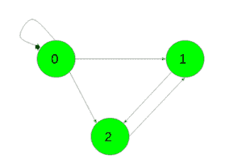

# 在有向图

中找到长度为 K 的路径数

> 原文： [https://www.geeksforgeeks.org/find-the-number-of-paths-of-length-k-in-a-directed-graph/](https://www.geeksforgeeks.org/find-the-number-of-paths-of-length-k-in-a-directed-graph/)

给定一个有向非加权图，该图具有`N`个顶点和一个整数`K`。 任务是找到每对顶点**（u，v）**的长度`K`的路径数。 路径不必很简单，即可以在一条路径中多次访问顶点和边。

该图表示为[邻接矩阵](http://www.geeksforgeeks.org/graph-and-its-representations/)，其中值 **G [i] [j] = 1** 表示从顶点`i`到 顶点`j`和 **G [i] [j] = 0** 表示从`i`到`j`没有边。

**示例**：

> **输入**：K = 2，
> 
> **输出**：
> 1 2 2
> 0 1 0
> 0 0 1
> 长度为 k 的从 0 到 0 的路径数为 1（{0- > 0- > 0}）
> 长度为 k 的从 0 到 1 的路径数为 2（{0- > 0 -> 1}，{0- > 2- > 1}）
> 从 0 到 2 的长度为 k 的路径数为 2（{0- > 0- > 2} ，{0- > 1- > 2}）
> 从 1 到 1 的长度为 k 的路径数为 1（{1- > 2- > 1}）
> 长度为 k 的 2 到 2 的路径为 1（{2- > 1- > 2}）
> 
> **输入**：K = 3，
> 
> **输出**：
> 1 0 0
> 0 1 0
> 0 0 1
> 长度为 k 的从 0 到 0 的路径数是 1（{0- > 1- > 2- > 0}）
> 长度为 k 的从 1 到 1 的路径数是 1（{1 -> 2- > 0- > 1}）
> 从 2 到 2 的长度为 k 的路径数为 1（{2- > 1- > 0- > 2 }）

**先决条件**：[矩阵乘幂](http://www.geeksforgeeks.org/matrix-exponentiation/)，[矩阵乘法](https://www.geeksforgeeks.org/c-program-multiply-two-matrices/)

**方法**：很明显，给定的邻接矩阵是在 **k = 1** 的情况下问题的答案。 它包含每对顶点之间长度为`1`的路径数。

假设某些`k`的答案是 **Mat <sub>k</sub>** ，而 **k +1** 的答案是 **Mat <sub>k +1</sub>** 。

**Mat <sub>k + 1</sub> [i] [j] = ∑ <sub>p = 1</sub> <sup>N</sup> Mat <sub>k</sub> [i] [p ] * G [p] [j]**

不难看出，该公式除了矩阵 **Mat <sub>k</sub>** 和`G`的乘积，即 **Mat <sub>k + 1</sub> = Mat <sub>k</sub> * G**

因此，问题的解决方案可以表示为 **Mat <sub>k</sub> = G * G *…* G（k 次）= G <sup>k</sup>**

下面是上述方法的实现：

## C++

```cpp

// C++ implementation of the approach 
#include <bits/stdc++.h> 
using namespace std; 

#define N 3 

// Function to multiply two matrices 
void multiply(int a[][N], int b[][N], int res[][N]) 
{ 
    int mul[N][N]; 
    for (int i = 0; i < N; i++) { 
        for (int j = 0; j < N; j++) { 
            mul[i][j] = 0; 
            for (int k = 0; k < N; k++) 
                mul[i][j] += a[i][k] * b[k][j]; 
        } 
    } 

    // Storing the multiplication result in res[][] 
    for (int i = 0; i < N; i++) 
        for (int j = 0; j < N; j++) 
            res[i][j] = mul[i][j]; 
} 

// Function to compute G raised to the power n 
void power(int G[N][N], int res[N][N], int n) 
{ 

    // Base condition 
    if (n == 1) { 
        for (int i = 0; i < N; i++) 
            for (int j = 0; j < N; j++) 
                res[i][j] = G[i][j]; 
        return; 
    } 

    // Recursion call for first half 
    power(G, res, n / 2); 

    // Multiply two halves 
    multiply(G, G, res); 

    // If n is odd 
    if (n % 2 != 0) 
        multiply(res, G, res); 
} 

// Driver code 
int main() 
{ 
    int G[N][N] = { { 1, 1, 1 }, 
                    { 0, 0, 1 }, 
                    { 0, 1, 0 } }; 

    int k = 2, res[N][N]; 

    power(G, res, k); 

    for (int i = 0; i < N; i++) { 
        for (int j = 0; j < N; j++) 
            cout << res[i][j] << " "; 
        cout << "\n"; 
    } 

    return 0; 
} 

```