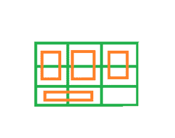

# 求大小为 2*1 的矩形可以放在大小为 n*m 的矩形内的个数

> 原文:[https://www . geeksforgeeks . org/find-大小为 21 的矩形的数量-可以放置在大小为 nm 的矩形内/](https://www.geeksforgeeks.org/find-the-number-of-rectangles-of-size-21-which-can-be-placed-inside-a-rectangle-of-size-nm/)

给定两个整数、。找出可以放在 n*m 大小的矩形内的 2*1 大小的矩形数量
**注:**

> 1.  No two small rectangles overlap.
> 2.  Each small rectangle is completely inside the big rectangle. Allow touching the edges of large rectangles.



**示例**:

```
Input : n = 3, m =3
Output : 4

Input : n = 2, m = 4
Output : 4
```

**进场:**

1.  如果 N 为偶数，则放置 M 行 N/2 个小矩形，覆盖整个大矩形。
2.  如果 M 是偶数，那么放置 N 行 M/2 个小矩形，覆盖整个大矩形。
3.  如果两者都是奇数，那么用小矩形覆盖 N-1 行板，并将地板(M/2)小矩形放在最后一行。在最坏的情况下(N 和 M 是奇数)，一个单元仍然未被覆盖。

下面是上述方法的实现:

## C++

```
// CPP program to Find the number of
// rectangles of size 2*1 can be placed
// inside a rectangle of size n*m
#include <bits/stdc++.h>
using namespace std;

// function to Find the number of
// rectangles of size 2*1 can be placed
// inside a rectangle of size n*m
int NumberOfRectangles(int n, int m)
{
    // if n is even
    if (n % 2 == 0)
        return (n / 2) * m;

    // if m is even
    else if (m % 2 == 0)
        return (m / 2) * n;

    // if both are odd
    return (n * m - 1) / 2;
}

// Driver code
int main()
{
    int n = 3, m = 3;

    // function call
    cout << NumberOfRectangles(n, m);

    return 0;
}
```

## Java 语言(一种计算机语言，尤用于创建网站)

```
// Java program to Find the number of
// rectangles of size 2*1 can be placed
// inside a rectangle of size n*m

public class GFG {

    // function to Find the number of
    // rectangles of size 2*1 can be placed
    // inside a rectangle of size n*m
    static int NumberOfRectangles(int n, int m)
    {
        // if n is even
        if (n % 2 == 0)
            return (n / 2) * m;

        // if m is even
        else if (m % 2 == 0)
            return (m / 2) * n;

        // if both are odd
        return (n * m - 1) / 2;
    }
    public static void main(String args[])
    {
         int n = 3, m = 3;

            // function call
            System.out.println(NumberOfRectangles(n, m));

    }
    // This Code is contributed by ANKITRAI1
}
```

## 蟒蛇 3

```
# Python 3 program to Find the
# number of rectangles of size
# 2*1 can be placed inside a
# rectangle of size n*m

# function to Find the number
# of rectangles of size 2*1
# can be placed inside a
# rectangle of size n*m
def NumberOfRectangles(n, m):

    # if n is even
    if (n % 2 == 0):
        return (n / 2) * m

    # if m is even
    elif (m % 2 == 0):
        return (m // 2) * n

    # if both are odd
    return (n * m - 1) // 2

# Driver code
if __name__ == "__main__":
    n = 3
    m = 3

    # function call
    print(NumberOfRectangles(n, m))

# This code is contributed
# by ChitraNayal
```

## C#

```
// C# program to Find the number of
// rectangles of size 2*1 can be placed
// inside a rectangle of size n*m
using System;

class GFG
{

// function to Find the number of
// rectangles of size 2*1 can be placed
// inside a rectangle of size n*m
static int NumberOfRectangles(int n, int m)
{
    // if n is even
    if (n % 2 == 0)
        return (n / 2) * m;

    // if m is even
    else if (m % 2 == 0)
        return (m / 2) * n;

    // if both are odd
    return (n * m - 1) / 2;
}

// Driver Code
public static void Main()
{
    int n = 3, m = 3;

    // function call
    Console.WriteLine(NumberOfRectangles(n, m));

}
// This code is contributed
// by Akanksha Rai(Abby_akku)
}
```

## 服务器端编程语言（Professional Hypertext Preprocessor 的缩写）

```
<?php

// PHP program to Find the number of
// rectangles of size 2*1 can be placed
// inside a rectangle of size n*m

// function to Find the number of
// rectangles of size 2*1 can be placed
// inside a rectangle of size n*m
function NumberOfRectangles($n, $m)
{

    // if n is even
    if ($n % 2 == 0)
        return ($n / 2) * $m;

    // if m is even
    else if ($m % 2 == 0)
        return ($m / 2) * $n;

    // if both are odd
    return ($n * $m - 1) / 2;
}

// Driver code
$n = 3;
$m = 3;

// function call
echo NumberOfRectangles($n, $m);

// This code is contributed
// by Shivi_Aggarwal
?>
```

## java 描述语言

```
<script>

// Javascript program to Find the number of
// rectangles of size 2*1 can be placed
// inside a rectangle of size n*m

// Function to Find the number of
// rectangles of size 2*1 can be placed
// inside a rectangle of size n*m
function NumberOfRectangles(n, m)
{

    // If n is even
    if (n % 2 == 0)
        return (n / 2) * m;

    // If m is even
    else if (m % 2 == 0)
        return (m / 2) * n;

    // If both are odd
    return (n * m - 1) / 2;
}

// Driver Code
var n = 3, m = 3;

// Function call
document.write(NumberOfRectangles(n, m));

// This code is contributed by Ankita saini

</script>
```

**Output:** 

```
4
```