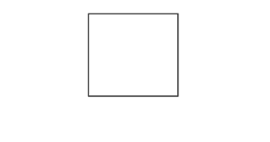
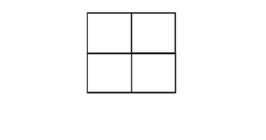

# 求给定方格内的方格数

> 原文:[https://www . geeksforgeeks . org/find-给定方格内的方格数/](https://www.geeksforgeeks.org/find-the-number-of-squares-inside-the-given-square-grid/)

给定一个边 **N * N** 的网格，任务是找出其中存在的方块总数。所有选定的方块可以是任意长度。
**例:**

> **输入:**N = 1
> T3】输出: 1
> 
> 
> 
> **输入:**N = 2
> T3】输出: 5
> 
> 
> 
> **输入:**N = 4
> T3】输出: 30

**进场 1:** 举几个例子，可以观察到对于一个大小为 **N * N** 的格子，里面的方块数会是**1<sup>2</sup>+2<sup>2</sup>+3<sup>2</sup>+…+N<sup>2</sup>**
以下是上述进场的实施:

## C++

```
// C++ implementation of the approach
#include <bits/stdc++.h>
using namespace std;

// Function to return the number
// of squares inside an n*n grid
int cntSquares(int n)
{
    int squares = 0;
    for (int i = 1; i <= n; i++) {
        squares += pow(i, 2);
    }
    return squares;
}

// Driver code
int main()
{
    int n = 4;

    cout << cntSquares(4);

    return 0;
}
```

## Java 语言(一种计算机语言，尤用于创建网站)

```
// Java implementation of the approach
class GFG {

    // Function to return the number
    // of squares inside an n*n grid
    static int cntSquares(int n)
    {
        int squares = 0;
        for (int i = 1; i <= n; i++) {
            squares += Math.pow(i, 2);
        }
        return squares;
    }

    // Driver code
    public static void main(String args[])
    {
        int n = 4;

        System.out.print(cntSquares(4));
    }
}
```

## 蟒蛇 3

```
# Python3 implementation of the approach

# Function to return the number
# of squares inside an n*n grid
def cntSquares(n) :

    squares = 0;
    for i in range(1, n + 1) :
        squares += i ** 2;

    return squares;

# Driver code
if __name__ == "__main__" :

    n = 4;

    print(cntSquares(4));

# This code is contributed by AnkitRai01
```

## C#

```
// C# implementation of the approach
using System;

class GFG
{

    // Function to return the number
    // of squares inside an n*n grid
    static int cntSquares(int n)
    {
        int squares = 0;
        for (int i = 1; i <= n; i++)
        {
            squares += (int)Math.Pow(i, 2);
        }
        return squares;
    }

    // Driver code
    public static void Main(String []args)
    {
        int n = 4;

        Console.Write(cntSquares(n));
    }
}

// This code is contributed by 29AjayKumar
```

## java 描述语言

```
<script>

    // JavaScript implementation of the approach

    // Function to return the number
    // of squares inside an n*n grid
    function cntSquares(n)
    {
        let squares = 0;
        for (let i = 1; i <= n; i++)
        {
            squares += Math.pow(i, 2);
        }
        return squares;
    }

    let n = 4;

      document.write(cntSquares(n));

</script>
```

**Output:** 

```
30
```

**方法 2:** 通过使用直接公式。
然而，和具有封闭形式(直接公式)。因此，我们可以用它来计算时间内的总和。
以下是上述方法的实现:

## C++

```
// C++ implementation of the approach
#include <iostream>

using namespace std;

int cnt_squares (int n)
{
    /* Function to return the number
     of squares inside an n*n grid */

    return n * (n + 1) * (2 * n + 1) / 6;
}

// Driver code
int main()
{
    cout << cnt_squares (4) << endl;

    return 0;
}
```

## Java 语言(一种计算机语言，尤用于创建网站)

```
// Java implementation of the approach
class GFG {
    static int cntSquares (int n) {
        /* Function to return the number
        of squares inside an n*n grid */

        return n * (n + 1) * (2 * n + 1) / 6;
    }

    // Driver code
    public static void main(String args[]) {
        System.out.println (cntSquares(4));
    }
}
```

## 蟒蛇 3

```
# Python3 implementation of the approach

"""
Function to return the number
of squares inside an n*n grid
"""

def cntSquares(n) :
    return int (n * (n + 1) * (2 * n + 1) / 6)

# Driver code
if __name__ == "__main__" :
    print (cntSquares (4));
```

## C#

```
// C# implementation of the approach
using System;

class GFG
{

    /* Function to return the number
     of squares inside an n*n grid */
    static int cntSquares (int n)
    {
        return n * (n + 1) * (2 * n + 1) / 6;
    }

    // Driver code
    public static void Main (String[] args)
    {
        Console.Write (cntSquares (4));
    }
}
```

## java 描述语言

```
<script>
    // Javascript implementation of the approach

    /* Function to return the number
     of squares inside an n*n grid */
    function cntSquares (n)
    {
        return n * (n + 1) * (2 * n + 1) / 6;
    }

    document.write(cntSquares(4));

// This code is contributed by divyeshrabadiya07.
</script>
```

**Output:** 

```
30
```