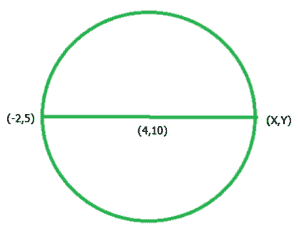

# 求圆内直径的另一端坐标

> 原文:[https://www . geeksforgeeks . org/find-另一端-圆内直径坐标/](https://www.geeksforgeeks.org/find-the-other-end-coordinates-of-diameter-in-a-circle/)

给定圆心坐标(c1，c2)和圆直径的一个坐标(x1，y1)，求直径的另一个端点坐标点(x2，y2)。



示例:

```
Input  : x1 = –1, y1 = 2, and c1 = 3, c2 = –6
Output : x2 = 7, y2 = -14

Input  : x1 = 6.4, y1 = 3 and c1 = –10.7, c2 = 4
Output : x2 = -27.8, y2 = 5
```

**中点公式:**
两端坐标点的中点，(x1，y2)和(x2，y2)是 M 点可以用:
找到

我们需要一个(x2，y2)坐标，所以我们应用公式的中点

```
          c1 = ((x1+x2)/2),  c2 = ((y1+y2)/2)
          2*c1 = (x1+x2),  2*c2 = (y1+y2)
 x<sub>2 = (2*c1 - x1),  y2 = (2*c2 - y1)</sub>
```

## C++

```
// CPP program to find the
// other-end point of diameter
#include <iostream>
using namespace std;

// function to find the
// other-end point of diameter
void endPointOfDiameterofCircle(int x1,
                    int y1, int c1, int c2)
{
    // find end point for x coordinates
    cout << "x2 = "
            << (float)(2 * c1 - x1)<< "  ";

    // find end point for y coordinates
    cout << "y2 = " << (float)(2 * c2 - y1);

}
// Driven Program
int main()
{
    int x1 = -4, y1 = -1;
    int c1 = 3, c2 = 5;

    endPointOfDiameterofCircle(x1, y1, c1, c2);

    return 0;
}
```

## Java 语言(一种计算机语言，尤用于创建网站)

```
// Java program to find the other-end point of
// diameter
import java.io.*;

class GFG {

    // function to find the other-end point of
    // diameter
    static void endPointOfDiameterofCircle(int x1,
                        int y1, int c1, int c2)
    {

        // find end point for x coordinates
        System.out.print( "x2 = "
                            + (2 * c1 - x1) + " ");

        // find end point for y coordinates
        System.out.print("y2 = " + (2 * c2 - y1));
    }

    // Driven Program
    public static void main (String[] args)
    {
        int x1 = -4, y1 = -1;
        int c1 = 3, c2 = 5;

        endPointOfDiameterofCircle(x1, y1, c1, c2);
    }
}

// This code is contributed by anuj_67.
```

## 蟒蛇 3

```
# Python3 program to find the
# other-end point of diameter

# function to find the
# other-end point of diameter
def endPointOfDiameterofCircle(x1, y1, c1, c2):

    # find end point for x coordinates
    print("x2 =", (2 * c1 - x1), end=" ")

    # find end point for y coordinates
    print("y2 =" , (2 * c2 - y1))

# Driven Program
x1 = -4
y1 = -1
c1 = 3
c2 = 5

endPointOfDiameterofCircle(x1, y1, c1, c2)

# This code is contributed by Smitha.
```

## C#

```
// C# program to find the other -
// end point of diameter
using System;
class GFG {

    // function to find the other - end
    // point of  diameter
    static void endPointOfDiameterofCircle(int x1,
                                           int y1,
                                           int c1,
                                           int c2)
    {
        // find end point for x coordinates
        Console.Write("x2 = "+ (2 * c1 - x1) + " ");

        // find end point for y coordinates
        Console.Write("y2 = " + (2 * c2 - y1));
    }

    // Driver Code
    public static void Main ()
    {
        int x1 = -4, y1 = -1;
        int c1 = 3, c2 = 5;

        endPointOfDiameterofCircle(x1, y1, c1, c2);
    }
}

// This code is contributed by anuj_67.
```

## 服务器端编程语言（Professional Hypertext Preprocessor 的缩写）

```
<?php
// PHP program to find the
// other-end point of diameter

// function to find the
// other-end point of diameter
function endPointOfDiameterofCircle($x1,
                          $y1, $c1, $c2)
{
    // find end point for x coordinates
    echo "x2 = ",(2 * $c1 - $x1)," ";

    // find end point for y coordinates
    echo "y2 = " , (2 * $c2 - $y1);
}

// Driven Program
$x1 = -4;
$y1 = -1;
$c1 = 3;
$c2 = 5;

endPointOfDiameterofCircle($x1, $y1,
                          $c1, $c2);

// This code is contributed by Smitha
?>
```

## java 描述语言

```
<script>

// Javascript program to find the
// other-end point of diameter

// Function to find the
// other-end point of diameter
function endPointOfDiameterofCircle(x1, y1, c1, c2)
{

    // Find end point for x coordinates
    document.write("x2 = " + (2 * c1 - x1) + "  ");

    // Find end point for y coordinates
    document.write("y2 = " + (2 * c2 - y1));

}

// Driver code
let x1 = -4, y1 = -1;
let c1 = 3, c2 = 5;

endPointOfDiameterofCircle(x1, y1, c1, c2);

// This code is contributed by jana_sayantan   

</script>
```

**输出**

```
x2 = 10 y2 = 11
```

**类似地，如果我们给定一个直径的中心(c1，c2)和另一端坐标(x2，y2)，我们找到一个(x1，y1)坐标**

```
 Proof for (x1, y1) :
          c1 = ((x1+x2)/2),  c2 = ((y1+y2)/2)
          2*c1 = (x1+x2),  2*c2 = (y1+y2)
          x1 = (2*c1 - x2),  y1 = (2*c2 - y2)
```

**所以直径的另一端坐标(x1，y1)是**

```
         x1 = (2*c1 - x2),  y1 = (2*c2 - y2)
```