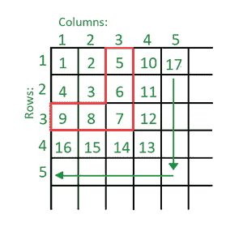

# 从左上角开始找到无限螺旋矩阵中给定元素 N 的位置

> 原文:[https://www . geesforgeks . org/find-给定元素的位置-n-in-无限螺旋-矩阵-从左上角开始/](https://www.geeksforgeeks.org/find-the-position-of-given-element-n-in-infinite-spiral-matrix-starting-from-top-left/)

给定一个数字 **N** 和一个无限的 [2D 矩阵](https://www.geeksforgeeks.org/multidimensional-arrays-c-cpp/)，使用下面给出的算法进行填充，任务是找到矩阵中给定元素的坐标。算法如下:

*   矩阵最左边和最上面的单元格用 1 填充。然后，所有单元格都用从 2 开始的连续数字填充
*   第一行最左边的未填充单元格已填充。然后，当最后填充的单元格的左邻被填充时，其下的单元格被填充，直到最后填充的单元格具有未填充的左邻
*   接下来，从右向左填充单元格，直到第一列。然后，再次填充第一行中最左边的未填充单元格
*   以上两个步骤无限重复



**示例:**

> ***输入:*** N = 12
> ***输出:*** 3 4
> ***说明:*** 12 位于行为 3、列为 4 的单元格中
> 
> ***输入:*** N = 10549857
> ***输出:*** 353 3249
> ***说明:*** 10549857 位于行为 353、列为 3249 的单元格中

**方法:**可以进行以下观察:

*   在上图中，由第三行和第三列形成的红色突出显示部分或“倒 L”由所有大于 4 且小于 10 的数字组成。类似地，由第 4 行和第 4 列形成的“倒 L”由大于 9 且小于 17 的数字组成
*   换句话说，当前的数字不包括当前的[完美方块](https://www.geeksforgeeks.org/check-if-given-number-is-perfect-square-in-cpp/)，直到包括下一个[完美方块](https://www.geeksforgeeks.org/check-if-given-number-is-perfect-square-in-cpp/)
*   要找到数字所在的“倒 L”，找到数字的[平方根的](https://www.geeksforgeeks.org/square-root-of-an-integer/)[上限](https://www.geeksforgeeks.org/ceil-floor-functions-cpp/)
*   计算“倒 L”的平方与给定数字之间的[差，比如 **d**](https://www.geeksforgeeks.org/square-difference-of-two-large-consecutive-numbers/)
*   如果 **l** 是数字所在的“倒 L”并且 **n** 表示给定的数字，那么:

> d = l^2–n

*   如果该差值 **d** 小于 **n** ，则 **n** 的行 **r** 和列 **c** 由下式给出:

> r = l
> c = d + l

*   如果该差值 **d** 大于或等于 **n** ，则 **n** 的行 **r** 和列 **c** 由下式给出:

> r = 2l–d–1
> c = l

下面是上述方法的实现:

## C++

```
// C++ Implementation for the above approach

#include <bits/stdc++.h>
using namespace std;

// Function to find the coordinates of n
void findCoordinates(int n)
{
    // Store the row and column of
    // n respectively
    int r, c;

    // Stores the inverted L
    // in which n lies
    int l = ceil(sqrt(n));

    // Stores the difference between
    // square of l and n
    int d = (l * l) - n;

    // If d is less than l
    if (d < l) {
        r = l;
        c = d + 1;
    }
    else {
        c = l;
        r = (2 * l) - d - 1;
    }

    cout << r << " " << c;
}

// Driver code
int main()
{
    // Given n
    int N = 10549857;

    // Function call
    findCoordinates(N);

    return 0;
}
```

## Java 语言(一种计算机语言，尤用于创建网站)

```
// Java Implementation for the above approach

public class GFG {

// Function to find the coordinates of n
static void findCoordinates(int n)
{

    // Store the row and column of
    // n respectively
    int r, c;

    // Stores the inverted L
    // in which n lies
    int l = (int)Math.ceil(Math.sqrt(n));

    // Stores the difference between
    // square of l and n
    int d = (l * l) - n;

    // If d is less than l
    if (d < l) {
        r = l;
        c = d + 1;
    }
    else {
        c = l;
        r = (2 * l) - d - 1;
    }

    System.out.print(r + " " + c);
}

    // Driver code
    public static void main (String[] args) {
        // Given n
        int N = 10549857;

        // Function call
        findCoordinates(N);

    }
}

// This code is contributed by AnkThon
```

## 蟒蛇 3

```
# Python Program to implement
# the above approach
import math

# Function to find the coordinates of n
def findCoordinates(n):

    # Store the row and column of
    # n respectively
    #let r, c

    # Stores the inverted L
    # in which n lies
    l = math.ceil(math.sqrt(n))

    # Stores the difference between
    # square of l and n
    d = (l * l) - n

    # If d is less than l
    if (d < l):
        r = l
        c = d + 1
    else:
        c = l
        r = (2 * l) - d - 1

    print(f"{r} {c}")

# Driver code

# Given n
N = 10549857

# Function call
findCoordinates(N)

# This code is contributed by Saurabh Jaiswal
```

## C#

```
// C# Implementation for the above approach
using System;
public class GFG {

// Function to find the coordinates of n
static void findCoordinates(int n)
{

    // Store the row and column of
    // n respectively
    int r, c;

    // Stores the inverted L
    // in which n lies
    int l = (int)Math.Ceiling(Math.Sqrt(n));

    // Stores the difference between
    // square of l and n
    int d = (l * l) - n;

    // If d is less than l
    if (d < l) {
        r = l;
        c = d + 1;
    }
    else {
        c = l;
        r = (2 * l) - d - 1;
    }

    Console.Write(r + " " + c);
}

    // Driver code
    public static void Main (string[] args) {
        // Given n
        int N = 10549857;

        // Function call
        findCoordinates(N);

    }
}

// This code is contributed by shivanisinghss2110
```

## java 描述语言

```
<script>
        // JavaScript Program to implement
        // the above approach

        // Function to find the coordinates of n
        function findCoordinates(n) {
            // Store the row and column of
            // n respectively
            let r, c;

            // Stores the inverted L
            // in which n lies
            let l = Math.ceil(Math.sqrt(n));

            // Stores the difference between
            // square of l and n
            let d = (l * l) - n;

            // If d is less than l
            if (d < l) {
                r = l;
                c = d + 1;
            }
            else {
                c = l;
                r = (2 * l) - d - 1;
            }

            document.write(r + " " + c);
        }

        // Driver code

        // Given n
        let N = 10549857;

        // Function call
        findCoordinates(N);

// This code is contributed by Potta Lokesh
    </script>
```

**Output**

```
353 3249
```

***时间复杂度:**O(1)*
T5**辅助空间:** O(1)