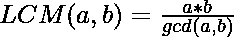

# 求给定数组的 LCM 与 GCD 的比值

> 原文:[https://www . geeksforgeeks . org/find-给定阵列的 lcm 与 gcd 之比/](https://www.geeksforgeeks.org/find-the-ratio-of-lcm-to-gcd-of-a-given-array/)

给定一个正整数数组 **arr[]** ，任务是求给定数组的 **LCM** 和 **GCD** 的比值。
**示例:**

> **输入:** arr[] = {2，3，5，9}
> **输出:** 90:1
> **解释:**
> 给定数组的 GCD 为 1，LCM 为 90。
> 因此，该比例被评估为 90:1。
> **输入:** arr[] = {6，12，36}
> **输出:** 6:1
> **解释:**
> 给定数组的 GCD 为 6，LCM 为 36。
> 因此，该比例评估为 6:1。

**进场:**
按照以下步骤解决问题:

1.  首先，我们会找到给定数组的 GCD。为此，我们可以使用 STL 提供的 GCD 的[内置函数，也可以使用](https://www.geeksforgeeks.org/stdgcd-c-inbuilt-function-finding-gcd/)[欧几里德算法](https://www.geeksforgeeks.org/euclidean-algorithms-basic-and-extended/)。

2.  然后，我们将使用下面的公式找到阵列的 LCM:
    

3.  最后，我们会找到所需的比率。

下面是上述方法的实现:

## C++

```
// C++ Program to implement
// above approach
#include <bits/stdc++.h>
using namespace std;

// Function to calculate and
// return GCD of the given array
int findGCD(int arr[], int n)
{
    // Initialise GCD
    int gcd = arr[0];
    for (int i = 1; i < n; i++) {
        gcd = __gcd(arr[i], gcd);

        // Once GCD is 1, it
        // will always be 1 with
        // all other elements
        if (gcd == 1) {
            return 1;
        }
    }

    // Return GCD
    return gcd;
}

// Function to calculate and
// return LCM of the given array
int findLCM(int arr[], int n)
{
    // Initialise LCM
    int lcm = arr[0];

    // LCM of two numbers is
    // evaluated as [(a*b)/gcd(a, b)]
    for (int i = 1; i < n; i++) {
        lcm = (((arr[i] * lcm))
               / (__gcd(arr[i], lcm)));
    }

    // Return LCM
    return lcm;
}

// Function to print the ratio
// of LCM to GCD of the given array
void findRatio(int arr[], int n)
{
    int gcd = findGCD(arr, n);
    int lcm = findLCM(arr, n);

    cout << lcm / gcd << ":"
         << 1 << endl;
}

// Driver Code
int main()
{
    int arr[] = { 6, 12, 36 };
    int N = sizeof(arr) / sizeof(arr[0]);

    findRatio(arr, N);

    return 0;
}
```

## Java 语言(一种计算机语言，尤用于创建网站)

```
// Java Program to implement
// above approach
class GFG{

// Function to calculate and
// return GCD of the given array
static int __gcd(int a, int b)
{
    if (b == 0)
        return a;
    return __gcd(b, a % b);
}

static int findGCD(int arr[], int n)
{
    // Initialise GCD
    int gcd = arr[0];
    for (int i = 1; i < n; i++)
    {
        gcd = __gcd(arr[i], gcd);

        // Once GCD is 1, it
        // will always be 1 with
        // all other elements
        if (gcd == 1)
        {
            return 1;
        }
    }

    // Return GCD
    return gcd;
}

// Function to calculate and
// return LCM of the given array
static int findLCM(int arr[], int n)
{
    // Initialise LCM
    int lcm = arr[0];

    // LCM of two numbers is
    // evaluated as [(a*b)/gcd(a, b)]
    for (int i = 1; i < n; i++)
    {
        lcm = (((arr[i] * lcm)) /
          (__gcd(arr[i], lcm)));
    }

    // Return LCM
    return lcm;
}

// Function to print the ratio
// of LCM to GCD of the given array
static void findRatio(int arr[], int n)
{
    int gcd = findGCD(arr, n);
    int lcm = findLCM(arr, n);

    System.out.print((lcm / gcd));
    System.out.print(":1");
}

// Driver Code
public static void main (String[] args)
{
    int arr[] = new int[]{ 6, 12, 36 };
    int N = 3;

    findRatio(arr, N);
}
}

// This code is contributed by Ritik Bansal
```

## 蟒蛇 3

```
# Python3 program to implement
# above approach
import math

# Function to calculate and
# return GCD of the given array
def findGCD(arr, n):

    # Initialise GCD
    gcd = arr[0]

    for i in range(1, n):
        gcd = int(math.gcd(arr[i], gcd))

        # Once GCD is 1, it
        # will always be 1 with
        # all other elements
        if (gcd == 1):
            return 1

    # Return GCD
    return gcd

# Function to calculate and
# return LCM of the given array
def findLCM(arr, n):

    # Initialise LCM
    lcm = arr[0]

    # LCM of two numbers is
    # evaluated as [(a*b)/gcd(a, b)]
    for i in range(1, n):
        lcm = int((((arr[i] * lcm)) /
           (math.gcd(arr[i], lcm))))

    # Return LCM
    return lcm

# Function to print the ratio
# of LCM to GCD of the given array
def findRatio(arr, n):

    gcd = findGCD(arr, n)
    lcm = findLCM(arr, n)

    print(int(lcm / gcd), ":", "1")

# Driver Code
arr = [ 6, 12, 36 ]
N = len(arr)

findRatio(arr, N)

# This code is contributed by sanjoy_62
```

## C#

```
// C# Program to implement
// above approach
using System;
class GFG{

// Function to calculate and
// return GCD of the given array
static int __gcd(int a, int b)
{
    if (b == 0)
        return a;
    return __gcd(b, a % b);
}

static int findGCD(int []arr, int n)
{
    // Initialise GCD
    int gcd = arr[0];
    for (int i = 1; i < n; i++)
    {
        gcd = __gcd(arr[i], gcd);

        // Once GCD is 1, it
        // will always be 1 with
        // all other elements
        if (gcd == 1)
        {
            return 1;
        }
    }

    // Return GCD
    return gcd;
}

// Function to calculate and
// return LCM of the given array
static int findLCM(int []arr, int n)
{
    // Initialise LCM
    int lcm = arr[0];

    // LCM of two numbers is
    // evaluated as [(a*b)/gcd(a, b)]
    for (int i = 1; i < n; i++)
    {
        lcm = (((arr[i] * lcm)) /
          (__gcd(arr[i], lcm)));
    }

    // Return LCM
    return lcm;
}

// Function to print the ratio
// of LCM to GCD of the given array
static void findRatio(int []arr, int n)
{
    int gcd = findGCD(arr, n);
    int lcm = findLCM(arr, n);

    Console.Write((lcm / gcd));
    Console.Write(":1");
}

// Driver Code
public static void Main()
{
    int []arr = new int[]{ 6, 12, 36 };
    int N = 3;

    findRatio(arr, N);
}
}

// This code is contributed by Code_Mech
```

## java 描述语言

```
<script>
// javascript Program to implement
// above approach   

    // Function to calculate and
    // return GCD of the given array
    function __gcd(a , b)
    {
        if (b == 0)
            return a;
        return __gcd(b, a % b);
    }

    function findGCD(arr, n)
    {

        // Initialise GCD
        var gcd = arr[0];
        for (i = 1; i < n; i++)
        {
            gcd = __gcd(arr[i], gcd);

            // Once GCD is 1, it
            // will always be 1 with
            // all other elements
            if (gcd == 1) {
                return 1;
            }
        }

        // Return GCD
        return gcd;
    }

    // Function to calculate and
    // return LCM of the given array
    function findLCM(arr, n)
    {

        // Initialise LCM
        var lcm = arr[0];

        // LCM of two numbers is
        // evaluated as [(a*b)/gcd(a, b)]
        for (i = 1; i < n; i++)
        {
            lcm = (((arr[i] * lcm)) / (__gcd(arr[i], lcm)));
        }

        // Return LCM
        return lcm;
    }

    // Function to print the ratio
    // of LCM to GCD of the given array
    function findRatio(arr , n) {
        var gcd = findGCD(arr, n);
        var lcm = findLCM(arr, n);

        document.write((lcm / gcd));
        document.write(":1");
    }

    // Driver Code
        var arr = [ 6, 12, 36 ];
        var N = 3;

        findRatio(arr, N);

// This code is contributed by todaysgaurav.
</script>
```

**Output:** 

```
6:1
```

***时间复杂度:** O(N * logN)*
***辅助空间:** O(1)*