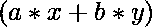
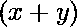
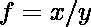
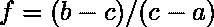

# 从两个数组的单个平均值和组合平均值中找出两个数组中元素数量的比率

> 原文:[https://www . geeksforgeeks . org/从单个和组合平均值中找出两个数组中元素的数量比率/](https://www.geeksforgeeks.org/find-the-ratio-of-number-of-elements-in-two-arrays-from-their-individual-and-combined-average/)

给定两个数组中元素的平均值分别为“a”和“b”，它们的组合平均值为“c”，任务是找出两个数组中元素数量的比率。
**例:**

```
Input:  a = 2, b = 8, c = 5
Output: 1:1

Input: a = 4, b = 10, c = 6
Output: 2:1
```

**进场:**

*   设两个数组中的元素个数分别为 x 和 y。
*   所以组合数组中所有元素的和就是。
*   组合数组中的元素总数为，让。
*   所以，
    
    
    所以，
*   这是我们需要的答案。

以下是上述方法的实施:

## C++

```
// C++ program to Find the Ratio
// of number of Elements in two Arrays
// from their individual and combined Average

#include <bits/stdc++.h>
using namespace std;

// C++ function to find the ratio
// of number of array elements
void FindRatio(int a, int b, int c)
{

    int up = abs(b - c);
    int down = abs(c - a);

    // calculating GCD of them
    int g = __gcd(up, down);

    // make neumarator and
    // denominator coprime
    up /= g;
    down /= g;

    cout << up << ":"
         << down << "\n";
}

// Driver Code
int main()
{

    int a = 4, b = 10, c = 6;

    FindRatio(a, b, c);

    return 0;
}
```

## Java 语言(一种计算机语言，尤用于创建网站)

```
// Java program to Find the Ratio
// of number of Elements in two Arrays
// from their individual and combined Average
class GFG
{
    static int gcd(int a, int b)
    {
        if (b == 0)
            return a;
        return gcd(b, a % b);

    }

    // function to find the ratio
    // of number of array elements
    static void FindRatio(int a, int b, int c)
    {
        int up = Math.abs(b - c);
        int down = Math.abs(c - a);

        // calculating GCD of them
        int g = gcd(up, down);

        // make neumarator and
        // denominator coprime
        up /= g;
        down /= g;

        System.out.println(up + ":" + down);
    }

    // Driver Code
    public static void main (String[] args)
    {
        int a = 4, b = 10, c = 6;

        FindRatio(a, b, c);
    }
}

// This code is contributed by AnkitRai01
```

## 蟒蛇 3

```
# Python3 program to Find the Ratio
# of number of Elements in two Arrays
# from their individual and combined Average
from math import gcd

# function to find the ratio
# of number of array elements
def FindRatio(a, b, c):

    up = abs(b - c)
    down = abs(c - a)

    # calculating GCD of them
    g = gcd(up, down)

    # make neumarator and
    # denominator coprime
    up //= g
    down //= g

    print(up,":", down)

# Driver Code
a = 4
b = 10
c = 6

FindRatio(a, b, c)

# This code is contributed by Mohit Kumar
```

## C#

```
// C# program to Find the Ratio
// of number of Elements in two Arrays
// from their individual and combined Average
using System;

class GFG
{
    static int gcd(int a, int b)
    {
        if (b == 0)
            return a;
        return gcd(b, a % b);

    }

    // function to find the ratio
    // of number of array elements
    static void FindRatio(int a, int b, int c)
    {
        int up = Math.Abs(b - c);
        int down = Math.Abs(c - a);

        // calculating GCD of them
        int g = gcd(up, down);

        // make neumarator and
        // denominator coprime
        up /= g;
        down /= g;

        Console.WriteLine(up + ":" + down);
    }

    // Driver Code
    public static void Main (String []args)
    {
        int a = 4, b = 10, c = 6;

        FindRatio(a, b, c);
    }
}

// This code is contributed by Arnab Kundu
```

## java 描述语言

```
<script>
// Javascript program to Find the Ratio
// of number of Elements in two Arrays
// from their individual and combined Average

// Javascript function to find the ratio
// of number of array elements
function FindRatio(a, b, c)
{

    let up = Math.abs(b - c);
    let down = Math.abs(c - a);

    // calculating GCD of them
    let g = gcd(up, down);

    // make neumarator and
    // denominator coprime
    up = parseInt(up / g);
    down = parseInt(down / g);

    document.write(up + ":"
         + down + "<br>");
}

function gcd(a, b)
{
  if (b == 0)
      return a;
  return gcd(b, a % b);

}

// Driver Code

    let a = 4, b = 10, c = 6;

    FindRatio(a, b, c);

</script>
```

**Output:** 

```
2:1
```