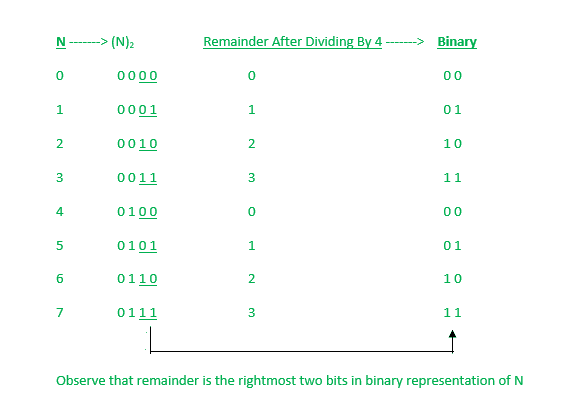

# 使用按位与运算符

求 N 除以 4 后的余数

> 原文:[https://www . geeksforgeeks . org/使用按位与运算符/](https://www.geeksforgeeks.org/find-the-remainder-when-n-is-divided-by-4-using-bitwise-and-operator/) 求 n 除以 4 后的余数

给定一个数字 **N** ，任务是使用按位“与”运算符找到 N 除以 4 时的余数。
**例:**

```
Input: N = 98 
Output: 2
Explanation: 
98 % 4 = 2\. Hence the output is 2.

Input: 200
Output: 0
Explanation: 
200 % 4 = 0\. Hence output is 0.
```

**天真方法:**
为了解决上述问题，我们可以使用天真的方法，使用 [**模(%)运算符**](https://www.geeksforgeeks.org/modulo-operator-in-c-cpp-with-examples/) 来寻找余数。但是，模运算符计算量大，并且该方法效率低。
**高效方法:**
如果我们仔细观察 N 及其余数为 4 的二进制表示，我们观察到余数只是 N 中最右边的两个位，为了得到 N 中最右边的两个位，我们对 3 执行按位 AND ( &)，因为二进制中的 3 是 0011。为了更好地理解这种方法，让我们看看下图:



**以下是上述方法的实施:**

## C

```
// C implementation to find N
// modulo 4 using Bitwise AND operator

#include <stdio.h>

// Function to find the remainder
int findRemainder(int n)
{

    // Bitwise AND with 3
    int x = n & 3;

    // return  x
    return x;
}

// Driver code
int main()
{

    int N = 43;
    int ans = findRemainder(N);

    printf("%d", ans);

    return 0;
}
```

## C++

```
// C++ implementation to find N
// modulo 4 using Bitwise AND operator

#include <bits/stdc++.h>
using namespace std;

// Function to find the remainder
int findRemainder(int n)
{
    // Bitwise AND with 3
    int x = n & 3;

    // Return  x
    return x;
}

// Driver code
int main()
{

    int N = 43;

    int ans = findRemainder(N);

    cout << ans << endl;

    return 0;
}
```

## Java 语言(一种计算机语言，尤用于创建网站)

```
// Java implementation to find N
// modulo 4 using Bitwise AND operator

class Main {

    // Driver code
    public static void main(String[] args)
    {

        int N = 43;

        int ans = findRemainder(N);

        System.out.println(ans);
    }

    // Function to find the remainder
    public static int findRemainder(int n)
    {
        // Bitwise AND with 3
        int x = n & 3;

        // return  x
        return x;
    }
}
```

## 蟒蛇 3

```
# Python 3 implementation to find N
# modulo 4 using Bitwise AND operator

# Function to find the remainder
def findRemainder(n):
    # Bitwise AND with 3
    x = n & 3

    # Return  x
    return x

# Driver code
if __name__ == '__main__':
    N = 43

    ans = findRemainder(N)

    print(ans)

# This code is contributed by Surendra_Gangwar
```

## C#

```
// C# implementation to find N
// modulo 4 using Bitwise AND operator
using System;

class GFG {

    // Driver code
    public static void Main()
    {

        int N = 43;

        int ans = findRemainder(N);

        Console.Write(ans);
    }

    // Function to find the remainder
    public static int findRemainder(int n)
    {
        // Bitwise AND with 3
        int x = n & 3;

        // return  x
        return x;
    }
}

# This code is contributed by chitranayal
```

## java 描述语言

```
<script>

// Javascript program implementation to find N
// modulo 4 using Bitwise AND operator

// Function to find the remainder
    function findRemainder(n)
    {
        // Bitwise AND with 3
        let x = n & 3;

        // return  x
        return x;
    }

// Driver Code

        let N = 43;

        let ans = findRemainder(N);

        document.write(ans);

</script>
```

**Output:** 

```
3
```

***时间复杂度:** O(1)*