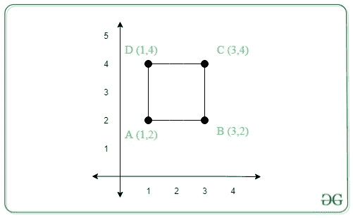

# 从两个给定的顶点中找出一个正方形的剩余顶点

> 原文:[https://www . geeksforgeeks . org/从给定的两个顶点中找出正方形的剩余顶点/](https://www.geeksforgeeks.org/find-the-remaining-vertices-of-a-square-from-two-given-vertices/)

给定一个正方形的任意两个顶点 **(X <sub>1</sub> 、Y <sub>1</sub> )** 和 **(X <sub>2</sub> 、Y <sub>2</sub> )** 的坐标，任务是找出另外两个顶点的坐标。如果用这两个顶点不能形成正方形，打印 **-1** 。

**示例:**

> **输入:** X <sub>1</sub> = 1，Y <sub>1</sub> = 2，X <sub>2</sub> = 3，Y <sub>2 = 4</sub>
> **输出:** (1，4)、(3，2)
> **解释:**
> 
> 
> 
> 从上图来看，正方形的另外两个顶点是(1，4)和(3，2)。
> 
> **输入:** X <sub>1</sub> = -5，Y <sub>1</sub> = 5，X <sub>2</sub> = 5，Y <sub>2</sub> = -5
> **输出:** (-5，-5)，(5，5)

**进场:**进场的依据是正方形所有边的长度相等。如果不能获得所有边的长度相等的顶点，则打印**-1”**。按照以下步骤解决问题:

*   给定的两个顶点可以是正方形边的顶点，也可以是对角线的顶点。
*   如果给定两个顶点的 **x 坐标**相等，那么其他两个顶点的坐标将为:

> (X<sub>1</sub>+Y<sub>2</sub>–Y<sub>1</sub>、Y <sub>1</sub> )和(X<sub>2</sub>+Y<sub>2</sub>–Y<sub>1</sub>、Y <sub>2</sub> )

*   如果给定两个顶点的 **y 坐标**相等，那么另外两个顶点的坐标将为:

> (X <sub>1</sub> ，Y<sub>1</sub>+X<sub>2</sub>–X<sub>1</sub>)和(X <sub>2</sub> ，Y<sub>2</sub>+X<sub>2</sub>–X<sub>1</sub>)

*   否则，给定的坐标是正方形的对角线。因此，另外两个顶点的坐标将是:

> (X <sub>1</sub> ，Y <sub>2</sub> )和(X <sub>2</sub> ，Y <sub>1</sub>

下面是上述方法的实现:

## C++

```
// C++ program for the above approach

#include <cstdlib>
#include <iostream>
using namespace std;

// Function to find the remaining
// vertices of a square
void findVertices(int x1, int y1,
                  int x2, int y2)
{
    // Check if the x-coordinates
    // are equal
    if (x1 == x2) {
        cout << (x1 + y2 - y1)
             << ", " << y1 << endl;

        cout << (x2 + y2 - y1)
             << ", " << y2;
    }

    // Check if the y-coordinates
    // are equal
    else if (y1 == y2) {
        cout << x1 << ", "
             << (y1 + x2 - x1)
             << endl;

        cout << x2 << ", "
             << (y2 + x2 - x1);
    }

    // If the the given coordinates
    // forms a diagonal of the square
    else if (abs(x2 - x1)
             == abs(y2 - y1)) {

        cout << x1 << ", " << y2
             << endl;
        cout << x2 << ", " << y1;
    }

    // Otherwise
    else

        // Square does not exist
        cout << "-1";
}

// Driver Code
int main()
{
    // Given two vertices
    int x1 = 1, y1 = 2;
    int x2 = 3, y2 = 4;
    findVertices(x1, y1, x2, y2);

    return 0;
}
```

## Java 语言(一种计算机语言，尤用于创建网站)

```
// Java program for the above approach
import java.util.*;

class GFG{

// Function to find the remaining
// vertices of a square
static void findVertices(int x1, int y1,
                         int x2, int y2)
{

    // Check if the x-coordinates
    // are equal
    if (x1 == x2)
    {
        System.out.print((x1 + y2 - y1) +
                        ", " + y1 + "\n");

        System.out.print((x2 + y2 - y1) +
                        ", " + y2);
    }

    // Check if the y-coordinates
    // are equal
    else if (y1 == y2)
    {
        System.out.print(x1 + ", " +
                        (y1 + x2 - x1) + "\n");

        System.out.print(x2 + ", " +
                        (y2 + x2 - x1));
    }

    // If the the given coordinates
    // forms a diagonal of the square
    else if (Math.abs(x2 - x1) ==
             Math.abs(y2 - y1))
    {
        System.out.print(x1 + ", " + y2 + "\n");
        System.out.print(x2 + ", " + y1);
    }

    // Otherwise
    else

        // Square does not exist
        System.out.print("-1");
}

// Driver Code
public static void main(String[] args)
{

    // Given two vertices
    int x1 = 1, y1 = 2;
    int x2 = 3, y2 = 4;

    findVertices(x1, y1, x2, y2);
}
}

// This code is contributed by Amit Katiyar
```

## 蟒蛇 3

```
# Python3 program for the above approach

# Function to find the remaining
# vertices of a square
def findVertices(x1, y1, x2, y2):

    # Check if the x-coordinates
    # are equal
    if (x1 == x2):
        print((x1 + y2 - y1), ",", y1)

        print((x2 + y2 - y1), ",", y2)

    # Check if the y-coordinates
    # are equal
    elif (y1 == y2):
        print(x1, ",", (y1 + x2 - x1))

        print(x2, ",", (y2 + x2 - x1))

    # If the the given coordinates
    # forms a diagonal of the square
    elif (abs(x2 - x1) == abs(y2 - y1)):
        print(x1, ",", y2)
        print(x2, ",", y1)

    # Otherwise
    else:

        # Square does not exist
        print("-1")

# Driver Code
if __name__ == '__main__':

    # Given two vertices
    x1 = 1
    y1 = 2
    x2 = 3
    y2 = 4

    findVertices(x1, y1, x2, y2)

# This code is contributed by mohit kumar 29
```

## C#

```
// C# program for the above approach
using System;
class GFG{

// Function to find the remaining
// vertices of a square
static void findVertices(int x1, int y1,
                         int x2, int y2)
{   
  // Check if the x-coordinates
  // are equal
  if (x1 == x2)
  {
    Console.Write((x1 + y2 - y1) +
                  ", " + y1 + "\n");

    Console.Write((x2 + y2 - y1) +
                  ", " + y2);
  }

  // Check if the y-coordinates
  // are equal
  else if (y1 == y2)
  {
    Console.Write(x1 + ", " +
                  (y1 + x2 - x1) + "\n");

    Console.Write(x2 + ", " +
                  (y2 + x2 - x1));
  }

  // If the the given coordinates
  // forms a diagonal of the square
  else if (Math.Abs(x2 - x1) ==
           Math.Abs(y2 - y1))
  {
    Console.Write(x1 + ", " + y2 + "\n");
    Console.Write(x2 + ", " + y1);
  }

  // Otherwise
  else

    // Square does not exist
    Console.Write("-1");
}

// Driver Code
public static void Main(String[] args)
{
  // Given two vertices
  int x1 = 1, y1 = 2;
  int x2 = 3, y2 = 4;
  findVertices(x1, y1, x2, y2);
}
}

// This code is contributed by Rajput-Ji
```

## java 描述语言

```
<script>

// JavaScript program for the above approach

// Function to find the remaining
// vertices of a square
function findVertices(x1, y1, x2, y2)
{
    // Check if the x-coordinates
    // are equal
    if (x1 == x2) {
        document.write((x1 + y2 - y1)
            + ", " + y1 + "<br>");

        document.write((x2 + y2 - y1)
            + ", " + y2);
    }

    // Check if the y-coordinates
    // are equal
    else if (y1 == y2) {
        document.write(x1 + ", "
            + (y1 + x2 - x1)
            + "<br>");

        document.write(x2 + ", "
            + (y2 + x2 - x1));
    }

    // If the the given coordinates
    // forms a diagonal of the square
    else if (Math.abs(x2 - x1)
            === Math.abs(y2 - y1)) {

        document.write(x1 + ", " + y2
            + "<br>");
        document.write(x2 + ", " + y1);
    }

    // Otherwise
    else

        // Square does not exist
        document.write("-1");
}

// Driver Code

    // Given two vertices
    let x1 = 1, y1 = 2;
    let x2 = 3, y2 = 4;
    findVertices(x1, y1, x2, y2);

// This code is contributed by Surbhi Tyagi.

</script>
```

**Output**

```
1, 4
3, 2
```

***时间复杂度:**O(1)*
T5**辅助空间:** O(1)