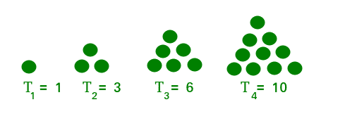

# 求一个三角数的序号

> 原文:[https://www . geeksforgeeks . org/find-三角数的序号/](https://www.geeksforgeeks.org/find-the-sequence-number-of-a-triangular-number/)

给定一个整数 **N** 打印给定[三角数](https://www.geeksforgeeks.org/triangular-numbers/)的序号。如果数字不是三角形，则打印-1。

> 如果我们能以点的三角形网格的形式来表示一个数，使得这些点形成一个等边三角形，并且每行包含与行号一样多的点，即第一行有一个点，第二行有两个点，第三行有三个点，以此类推，那么这个数就被称为三角形数。
> 前 10 个三角形数为:1、3、6、10、15、21、28、36、45、55。
> 
> 

**例:**

> **输入:** N = 21
> **输出:** 6
> **解释:**
> 因为 15 是第 6 个三角形数。
> **输入:** N = 12
> **输出:** -1
> **解释:**
> 因为 12 不是一个三角形数

**进场:**

1.  由于三角形数是自然数的和，所以可以推广为二次方程。

## C++

```
// C++ code to print sequence
// number of a triangular number
#include<bits/stdc++.h>
using namespace std;

int main()
{
    int N = 21;
    int A = sqrt(2 * N + 0.25) - 0.5;
    int B = A;

    // If N is not tringular number
    if (B != A)
        cout << "-1";
    else
        cout << B;
}

// This code is contributed by yatinagg
```

## Java 语言(一种计算机语言，尤用于创建网站)

```
// Java code to print sequence
// number of a triangular number
import java.util.*;
class GFG{

public static void main(String args[])
{
    int N = 21;
    int A = (int)(Math.sqrt(2 * N + 0.25) - 0.5);
    int B = A;

    // If N is not tringular number
    if (B != A)
        System.out.print("-1");
    else
        System.out.print(B);
}
}

// This code is contributed by Akanksha_Rai
```

## 蟒蛇 3

```
# Python3 code to print sequence
# number of a triangular number

import math

N = 21
A = math.sqrt(2 * N + 0.25)-0.5
B = int(A)

# if N is not tringular number
if B != A:
    print(-1)
else:
    print(B)        
```

## C#

```
// C# code to print sequence
// number of a triangular number
using System;
class GFG{

public static void Main()
{
    int N = 21;
    int A = (int)(Math.Sqrt(2 * N + 0.25) - 0.5);
    int B = A;

    // If N is not tringular number
    if (B != A)
        Console.Write("-1");
    else
        Console.Write(B);
}
}

// This code is contributed by Code_Mech
```

## java 描述语言

```
<script>
// javascript code to print sequence
// number of a triangular number
    let N = 21;
    let A = Math.sqrt(2 * N + 0.25) - 0.5;
    let B = A;

    // If N is not tringular number
    if (B != A)
         document.write("-1");
    else
         document.write(B);

// This code is contributed by Rajput-Ji

</script>
```

**Output:** 

```
6
```

***时间复杂度:** O(1)*
***辅助空间:** O(1)*