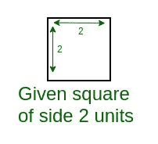
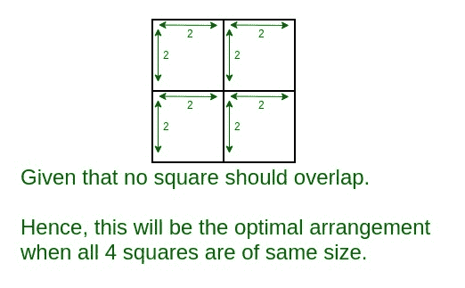
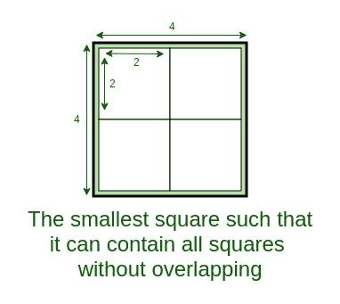
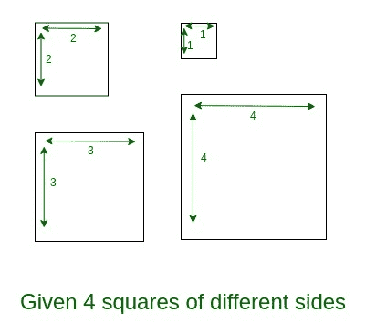
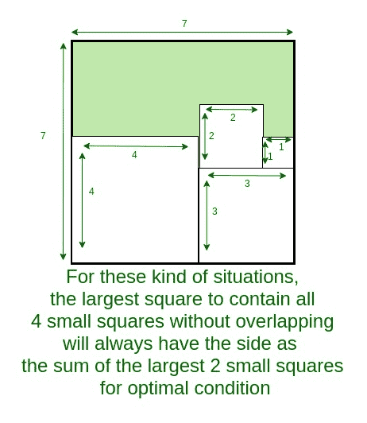

# 找到可以包含给定 4 个大正方形的最小正方形的边

> 原文:[https://www . geesforgeks . org/find-the-side-of-the-the-the-the-the-the-the-the-side-of-the-the-the-the-the-the-the-the-of-the-the-the-the-the-the-the-the-the-the-the-the-the-the-the-the](https://www.geeksforgeeks.org/find-the-side-of-the-smallest-square-that-can-contain-given-4-big-squares/)

给定四个小正方形的边。你必须找到最小正方形的边，这样它就可以包含所有给定的 4 个正方形而不会重叠。正方形的一边可以延伸到 10^16.
**例:**

```
Input: side1 = 2, side2 = 2, side3 = 2, side4 = 2
Output: 4

Input: side1 = 100000000000000, side2 = 123450000000000, 
       side3 = 987650000000000, side4 = 987654321000000
Output: 1975304321000000
```

**进场:**
给出两个方块不会重叠。因此，为了找到最小的合适正方形的边，我们将找到所有四个边，此时正方形将以 2×2 的方式放置。也就是说，两个方块将并排放置，剩下的两个将放在一起。
所以我们计算所有四条边，选择一条最大。
**例:当所有小方块都在同一侧时。**







**例:当所有的小方块都是不同边的时候。**





以下是上述方法的实现:

## C++

```
// C++ program to Find the Side
// of the smallest Square
// that can contain given 4 Big Squares

#include <bits/stdc++.h>
using namespace std;

// Function to find the maximum of two values
long long int max(long long a, long long b)
{
    if (a > b)
        return a;
    else
        return b;
}

// Function to find the smallest side
// of the suitable suitcase
long long int smallestSide(long long int a[])
{
    // sort array to find the smallest
    // and largest side of suitcases
    sort(a, a + 4);

    long long side1, side2, side3, side4,
        side11, side12, sideOfSquare;

    // side of the suitcase will be smallest
    // if they arranged in 2 x 2 way
    // so find all possible sides of that arrangement
    side1 = a[0] + a[3];
    side2 = a[1] + a[2];
    side3 = a[0] + a[1];
    side4 = a[2] + a[3];

    // since suitcase should be square
    // so find maximum of all four side
    side11 = max(side1, side2);
    side12 = max(side3, side4);

    // now find greatest side and
    // that will be the smallest square
    sideOfSquare = max(side11, side12);

    // return the result
    return sideOfSquare;
}

// Driver program
int main()
{
    long long int side[4];

    cout << "Test Case 1\n";

    // Get the side of the 4 small squares
    side[0] = 2;
    side[1] = 2;
    side[2] = 2;
    side[3] = 2;

    // Find the smallest side
    cout << smallestSide(side) << endl;

    cout << "\nTest Case 2\n";

    // Get the side of the 4 small squares
    side[0] = 100000000000000;
    side[1] = 123450000000000;
    side[2] = 987650000000000;
    side[3] = 987654321000000;

    // Find the smallest side
    cout << smallestSide(side) << endl;

    return 0;
}
```

## Java 语言(一种计算机语言，尤用于创建网站)

```
// Java program to Find the Side
// of the smallest Square that
// can contain given 4 Big Squares
// Java implementation of the approach
import java.util.Arrays;

class GFG
{

// Function to find the maximum of two values
static long max(long a, long b)
{
    if (a > b)
        return a;
    else
        return b;
}

// Function to find the smallest side
// of the suitable suitcase
static long smallestSide(long a[])
{
    // sort array to find the smallest
    // and largest side of suitcases
    Arrays.sort(a);

    long side1, side2, side3, side4,
        side11, side12, sideOfSquare;

    // side of the suitcase will be smallest
    // if they arranged in 2 x 2 way
    // so find all possible sides of that arrangement
    side1 = a[0] + a[3];
    side2 = a[1] + a[2];
    side3 = a[0] + a[1];
    side4 = a[2] + a[3];

    // since suitcase should be square
    // so find maximum of all four side
    side11 = max(side1, side2);
    side12 = max(side3, side4);

    // now find greatest side and
    // that will be the smallest square
    sideOfSquare = max(side11, side12);

    // return the result
    return sideOfSquare;
}

// Driver program
public static void main(String[] args)
{
    long side[] = new long[4];

    System.out.println("Test Case 1");

    // Get the side of the 4 small squares
    side[0] = 2;
    side[1] = 2;
    side[2] = 2;
    side[3] = 2;

    // Find the smallest side
    System.out.println(smallestSide(side));

    System.out.println("\nTest Case 2");

    // Get the side of the 4 small squares
    side[0] = 100000000000000L;
    side[1] = 123450000000000L;
    side[2] = 987650000000000L;
    side[3] = 987654321000000L;

    // Find the smallest side
    System.out.println(smallestSide(side));

    }
}

/* This code contributed by PrinciRaj1992 */
```

## 蟒蛇 3

```
# Python 3 program to Find the Side
# of the smallest Square that 
# can contain given 4 Big Squares

# Function to find the maximum
# of two values
def max(a, b):
    if (a > b):
        return a
    else:
        return b

# Function to find the smallest side
# of the suitable suitcase
def smallestSide(a):

    # sort array to find the smallest
    # and largest side of suitcases
    a.sort(reverse = False)

    # side of the suitcase will be
    # smallest if they arranged in
    # 2 x 2 way so find all possible
    # sides of that arrangement
    side1 = a[0] + a[3]
    side2 = a[1] + a[2]
    side3 = a[0] + a[1]
    side4 = a[2] + a[3]

    # since suitcase should be square
    # so find maximum of all four side
    side11 = max(side1, side2)
    side12 = max(side3, side4)

    # now find greatest side and
    # that will be the smallest square
    sideOfSquare = max(side11, side12)

    # return the result
    return sideOfSquare

# Driver Code
if __name__ == '__main__':
    side = [0 for i in range(4)]

    print("Test Case 1")

    # Get the side of the 4
    # small squares
    side[0] = 2
    side[1] = 2
    side[2] = 2
    side[3] = 2

    # Find the smallest side
    print(smallestSide(side))

    print("\n", end = "")
    print("Test Case 2")

    # Get the side of the 4 small squares
    side[0] = 100000000000000
    side[1] = 123450000000000
    side[2] = 987650000000000
    side[3] = 987654321000000

    # Find the smallest side
    print(smallestSide(side))

# This code is contributed by
# Surendra_Gangwar
```

## C#

```
// C# program to Find the Side
// of the smallest Square that
// can contain given 4 Big Squares
// Java implementation of the approach
using System;

class GFG
{

// Function to find the maximum of two values
static long max(long a, long b)
{
    if (a > b)
        return a;
    else
        return b;
}

// Function to find the smallest side
// of the suitable suitcase
static long smallestSide(long []a)
{
    // sort array to find the smallest
    // and largest side of suitcases
    Array.Sort(a);

    long side1, side2, side3, side4,
        side11, side12, sideOfSquare;

    // side of the suitcase will be smallest
    // if they arranged in 2 x 2 way
    // so find all possible sides of that arrangement
    side1 = a[0] + a[3];
    side2 = a[1] + a[2];
    side3 = a[0] + a[1];
    side4 = a[2] + a[3];

    // since suitcase should be square
    // so find maximum of all four side
    side11 = max(side1, side2);
    side12 = max(side3, side4);

    // now find greatest side and
    // that will be the smallest square
    sideOfSquare = max(side11, side12);

    // return the result
    return sideOfSquare;
}

// Driver code
public static void Main(String[] args)
{
    long []side = new long[4];

    Console.WriteLine("Test Case 1");

    // Get the side of the 4 small squares
    side[0] = 2;
    side[1] = 2;
    side[2] = 2;
    side[3] = 2;

    // Find the smallest side
    Console.WriteLine(smallestSide(side));

    Console.WriteLine("\nTest Case 2");

    // Get the side of the 4 small squares
    side[0] = 100000000000000L;
    side[1] = 123450000000000L;
    side[2] = 987650000000000L;
    side[3] = 987654321000000L;

    // Find the smallest side
    Console.WriteLine(smallestSide(side));
}
}

// This code contributed by Rajput-Ji
```

## 服务器端编程语言（Professional Hypertext Preprocessor 的缩写）

```
<?php
// PHP program to Find the Side
// of the smallest Square
// that can contain given 4 Big Squares

// Function to find the maximum of two values
function max1($a, $b)
{
    if ($a > $b)
        return $a;
    else
        return $b;
}

// Function to find the smallest side
// of the suitable suitcase
function smallestSide($a)
{
    // sort array to find the smallest
    // and largest side of suitcases
    sort($a, 0);

    // side of the suitcase will be smallest
    // if they arranged in 2 x 2 way
    // so find all possible sides of that arrangement
    $side1 = $a[0] + $a[3];
    $side2 = $a[1] + $a[2];
    $side3 = $a[0] + $a[1];
    $side4 = $a[2] + $a[3];

    // since suitcase should be square
    // so find maximum of all four side
    $side11 = max1($side1, $side2);
    $side12 = max1($side3, $side4);

    // now find greatest side and
    // that will be the smallest square
    $sideOfSquare = max1($side11, $side12);

    // return the result
    return $sideOfSquare;
}

// Driver program
$side = array();

echo "Test Case 1\n";

// Get the side of the 4 small squares
$side[0] = 2;
$side[1] = 2;
$side[2] = 2;
$side[3] = 2;

// Find the smallest side
echo smallestSide($side) . "\n";

echo "\nTest Case 2\n";

// Get the side of the 4 small squares
$side[0] = 100000000000000;
$side[1] = 123450000000000;
$side[2] = 987650000000000;
$side[3] = 987654321000000;

// Find the smallest side
echo smallestSide($side) . "\n";

// This code is contributed
// by Akanksha Rai
?>
```

## java 描述语言

```
<script>

// javascript program to Find the Side
// of the smallest Square that
// can contain given 4 Big Squares<script>

// Function to find the maximum of two values
function max(a , b)
{
    if (a > b)
        return a;
    else
        return b;
}

// Function to find the smallest side
// of the suitable suitcase
function smallestSide(a)
{
    // sort array to find the smallest
    // and largest side of suitcases
    a.sort();

    var side1, side2, side3, side4,
        side11, side12, sideOfSquare;

    // side of the suitcase will be smallest
    // if they arranged in 2 x 2 way
    // so find all possible sides of that arrangement
    side1 = a[0] + a[3];
    side2 = a[1] + a[2];
    side3 = a[0] + a[1];
    side4 = a[2] + a[3];

    // since suitcase should be square
    // so find maximum of all four side
    side11 = max(side1, side2);
    side12 = max(side3, side4);

    // now find greatest side and
    // that will be the smallest square
    sideOfSquare = max(side11, side12);

    // return the result
    return sideOfSquare;
}

// Driver program

    var side = Array.from({length: 4}, (_, i) => 0);

    document.write("Test Case 1<br>");

    // Get the side of the 4 small squares
    side[0] = 2;
    side[1] = 2;
    side[2] = 2;
    side[3] = 2;

    // Find the smallest side
    document.write(smallestSide(side));

    document.write("<br>Test Case 2<br>");

    // Get the side of the 4 small squares
    side[0] = 100000000000000;
    side[1] = 123450000000000;
    side[2] = 987650000000000;
    side[3] = 987654321000000;

    // Find the smallest side
    document.write(smallestSide(side));

// This code is contributed by 29AjayKumar

</script>
```

**Output:** 

```
Test Case 1
4

Test Case 2
1975304321000000
```