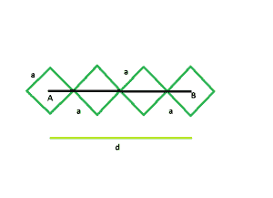

# 找出对角线倾斜且排成一排的正方形的一边

> 原文:[https://www . geeksforgeeks . org/find-一排斜对角排列的正方形侧面/](https://www.geeksforgeeks.org/find-the-side-of-the-squares-which-are-inclined-diagonally-and-lined-in-a-row/)

这里给出的是 **n** 个正方形，它们是倾斜的，在顶点处相互接触，并排成一排。给出了第一个正方形和最后一个正方形的中心之间的距离。正方形的边长相等。任务是找到每个正方形的边。
**例:**

> **输入:** d = 42，n = 4
> **输出:**每个方块的边长为 9.899
> **输入:** d = 54，n = 7
> **输出:**每个方块的边长为 6.364



**接近** :
有 n 个正方形，每个正方形的边长为 a，第一个正方形和最后一个正方形之间的距离等于 d。从图中可以清楚地看出，它们是由对角线连接的。每条对角线的长度等于**一√2** 。
对于第一个和最后一个正方形，长度 d 下只覆盖对角线的一半，对于其余(n-2)个正方形，完整的对角线被 d 覆盖，因此 a 和 d 的关系如下:

> a/√2+a/√2+(n-2)* a√2 = d
> =>a√2+√2na–2a√2 = d
> =>n√2a–a√2 = d
> =>a = d/((n-1)*(√2))
> 正方形的边=中心之间的距离/((正方形的数目-1) * sqrt(2))。

以下是上述方法的实现:

## C++

```
// C++ program to find side of the squares
// inclined and touch each other externally
// at vertices and are lined in a row
// and distance between the
// centers of first and last squares is given
#include <bits/stdc++.h>
using namespace std;

void radius(double n, double d)
{
    cout << "The side of each square is "
         << d / ((n - 1) * sqrt(2)) << endl;
}

// Driver code
int main()
{
    double d = 42, n = 4;
    radius(n, d);
    return 0;
}
```

## Java 语言(一种计算机语言，尤用于创建网站)

```
// Java program to find side of the squares
// inclined and touch each other externally
// at vertices and are lined in a row
// and distance between the
// centers of first and last squares is given
import java.io.*;

class GFG
{

static void radius(double n, double d)
{
    System.out.print( "The side of each square is "+
        d / ((n - 1) * Math.sqrt(2)));
}

// Driver code
public static void main (String[] args)
{
    double d = 42, n = 4;
    radius(n, d);
}
}

// This code is contributed by anuj_67..
```

## 蟒蛇 3

```
# Python program to find side of the squares
# inclined and touch each other externally
# at vertices and are lined in a row
# and distance between the
# centers of first and last squares is given

def radius(n, d):

    print("The side of each square is ",
        d / ((n - 1) * (2**(1/2))));

# Driver code
d = 42; n = 4;
radius(n, d);

# This code is contributed by Rajput-Ji
```

## C#

```
// C# program to find side of the squares
// inclined and touch each other externally
// at vertices and are lined in a row
// and distance between the
// centers of first and last squares is given
using System;

class GFG
{

static void radius(double n, double d)
{
    Console.WriteLine( "The side of each square is "+
        d / ((n - 1) * Math.Sqrt(2)));
}

// Driver code
public static void Main ()
{
    double d = 42, n = 4;
    radius(n, d);
}
}

// This code is contributed by anuj_67..
```

## java 描述语言

```
<script>

// javascript program to find side of the squares
// inclined and touch each other externally
// at vertices and are lined in a row
// and distance between the
// centers of first and last squares is given

function radius(n , d)
{
    document.write( "The side of each square is "+
        (d / ((n - 1) * Math.sqrt(2))).toFixed(5));
}

// Driver code
var d = 42, n = 4;
radius(n, d);

// This code is contributed by Amit Katiyar

</script>
```

**Output:** 

```
The side of each square is 9.89949
```

**时间复杂度:** O(1)