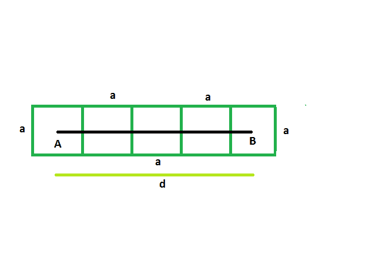
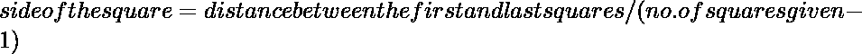

# 找出排成一行的方块的边，给出第一个和最后一个方块的中心之间的距离

> 原文:[https://www . geeksforgeeks . org/find-排列成行的正方形的边以及给出的第一个和最后一个正方形的中心之间的距离/](https://www.geeksforgeeks.org/find-the-side-of-the-squares-which-are-lined-in-a-row-and-distance-between-the-centers-of-first-and-last-square-is-given/)

这里给出的是外部互相接触的 **n** 个方块，排成一排。给出了第一个正方形和最后一个正方形的中心之间的距离。正方形的边长相等。任务是找到每个正方形的边。
**例:**

```
Input: d = 42, n = 4
Output: The side of each square is 14

Input: d = 36, n = 5
Output: The side of each square is 9
```



**方法:**
假设有 n 个正方形，每个正方形的边长为 **a** 。
让，第一个和最后一个方块之间的距离= **d**
从图中可以明显看出，
**a/2+a/2+(n-2)* a = d**
T13】a+na–2a = d
T16】na–a = d
所以，**a = d/(n-1)**
T23】

## C++

```
// C++ program to find side of the squares
// which are lined in a row and distance between the
// centers of first and last squares is given

#include <bits/stdc++.h>
using namespace std;

void radius(int n, int d)
{
    cout << "The side of each square is "
         << d / (n - 1) << endl;
}

// Driver code
int main()
{
    int d = 42, n = 4;
    radius(n, d);
    return 0;
}
```

## Java 语言(一种计算机语言，尤用于创建网站)

```
// Java program to find side of the squares
// which are lined in a row and distance between the
// centers of first and last squares is given
import java.io.*;

class GFG
{

static void radius(int n, int d)
{
    System.out.print( "The side of each square is "
        + d / (n - 1));
}

// Driver code
public static void main (String[] args)
{
    int d = 42, n = 4;
    radius(n, d);
}
}

// This code is contributed by vt_m.
```

## 蟒蛇 3

```

# Python program to find side of the squares
# which are lined in a row and distance between the
# centers of first and last squares is given

def radius(n, d):

    print("The side of each square is ",
          d / (n - 1));

d = 42; n = 4;
radius(n, d);

# This code contributed by PrinciRaj1992
```

## C#

```
// C# program to find side of the squares
// which are lined in a row and distance between the
// centers of first and last squares is given
using System;

class GFG
{

static void radius(int n, int d)
{
    Console.Write( "The side of each square is "
        + d / (n - 1));
}

// Driver code
public static void Main ()
{
    int d = 42, n = 4;
    radius(n, d);
}
}

// This code is contributed by anuj_67..
```

## java 描述语言

```
<script>
// javascript program to find side of the squares
// which are lined in a row and distance between the
// centers of first and last squares is given
function radius(n , d)
{
    document.write( "The side of each square is "
        + d / (n - 1));
}

// Driver code
var d = 42, n = 4;
radius(n, d);

// This code is contributed by 29AjayKumar
</script>
```

**Output:** 

```
The side of each square is 14
```