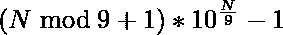

# 求位数之和为 N 的最小数

> 原文:[https://www . geesforgeks . org/find-最小数字-其数字总和为-n/](https://www.geeksforgeeks.org/find-the-smallest-number-whose-sum-of-digits-is-n/)

给定一个正整数 **N** ，任务是找出数字之和为 N 的最小数
**例:**

```
Input: N = 10
Output: 19
Explanation:
1 + 9 = 10 = N

Input: N = 18
Output: 99
Explanation:
9 + 9 = 18 = N
```

**天真的方法:**

*   一种简单的方法是从 0 开始运行 I 的循环，找到 I 的[位数之和](https://www.geeksforgeeks.org/program-for-sum-of-the-digits-of-a-given-number/)，并检查它是否等于 N。

下面是上述方法的实现。

## C++

```
// C++ program to find the smallest
// number whose sum of digits is also N
#include <iostream>
#include <math.h>
using namespace std;

// Function to get sum of digits
int getSum(int n)
{
    int sum = 0;
    while (n != 0) {
        sum = sum + n % 10;
        n = n / 10;
    }
    return sum;
}

// Function to find the smallest
// number whose sum of digits is also N
void smallestNumber(int N)
{
    int i = 1;
    while (1) {
        // Checking if number has
        // sum of digits = N
        if (getSum(i) == N) {
            cout << i;
            break;
        }
        i++;
    }
}

// Driver code
int main()
{
    int N = 10;
    smallestNumber(N);

    return 0;
}
```

## Java 语言(一种计算机语言，尤用于创建网站)

```
// Java program to find the smallest
// number whose sum of digits is also N
class GFG{

// Function to get sum of digits
static int getSum(int n)
{
    int sum = 0;
    while (n != 0)
    {
        sum = sum + n % 10;
        n = n / 10;
    }
    return sum;
}

// Function to find the smallest
// number whose sum of digits is also N
static void smallestNumber(int N)
{
    int i = 1;
    while (1 != 0)
    {
        // Checking if number has
        // sum of digits = N
        if (getSum(i) == N)
        {
            System.out.print(i);
            break;
        }
        i++;
    }
}

// Driver code
public static void main(String[] args)
{
    int N = 10;
    smallestNumber(N);
}
}

// This code is contributed
// by shivanisinghss2110
```

## 蟒蛇 3

```
# Python3 program to find the smallest
# number whose sum of digits is also N

# Function to get sum of digits
def getSum(n):

    sum1 = 0;
    while (n != 0):
        sum1 = sum1 + n % 10;
        n = n // 10;

    return sum1;

# Function to find the smallest
# number whose sum of digits is also N
def smallestNumber(N):

    i = 1;
    while (1):
        # Checking if number has
        # sum of digits = N
        if (getSum(i) == N):
            print(i);
            break;

        i += 1;

# Driver code
N = 10;
smallestNumber(N);

# This code is contributed by Code_Mech
```

## C#

```
// C# program to find the smallest
// number whose sum of digits is also N
using System;

class GFG{

// Function to get sum of digits
static int getSum(int n)
{
    int sum = 0;
    while (n != 0)
    {
        sum = sum + n % 10;
        n = n / 10;
    }
    return sum;
}

// Function to find the smallest
// number whose sum of digits is also N
static void smallestNumber(int N)
{
    int i = 1;
    while (1 != 0)
    {

        // Checking if number has
        // sum of digits = N
        if (getSum(i) == N)
        {
            Console.Write(i);
            break;
        }
        i++;
    }
}

// Driver code
public static void Main(String[] args)
{
    int N = 10;

    smallestNumber(N);
}
}

// This code is contributed by Amit Katiyar
```

## java 描述语言

```
<script>

//Javascript program to find /the smallest
// number whose sum of digits is also N

// Function to get sum of digits
function getSum(n)
{
    let sum = 0;
    while (n != 0) {
        sum = sum + n % 10;
        n = Math.floor(n / 10);
    }
    return sum;
}

// Function to find the smallest
// number whose sum of digits is also N
function smallestNumber(N)
{
    let i = 1;
    while (1) {
        // Checking if number has
        // sum of digits = N
        if (getSum(i) == N) {
            document.write(i);
            break;
        }
        i++;
    }
}

// Driver code

    let N = 10;
    smallestNumber(N);

// This code is contributed by Mayank Tyagi

</script>
```

**Output**

```
19
```

**时间复杂度:** O(N)。
**高效进场:**

*   解决这个问题的有效方法是观察。让我们看一些例子。
    *   如果 N = 10，那么 ans = 19
    *   如果 N = 20，那么 ans = 299
    *   如果 N = 30，那么 ans = 3999
*   所以，很明显，答案除了第一个数字外，所有数字都是 9，这样我们就得到最小的数字。
*   所以，第 n 项将是=



以下是上述方法的实施

## C++

```
// C++ program to find the smallest
// number whose sum of digits is also N
#include <iostream>
#include <math.h>
using namespace std;

// Function to find the smallest
// number whose sum of digits is also N
void smallestNumber(int N)
{
    cout << (N % 9 + 1)
                    * pow(10, (N / 9))
                - 1;
}

// Driver code
int main()
{
    int N = 10;
    smallestNumber(N);

    return 0;
}
```

## Java 语言(一种计算机语言，尤用于创建网站)

```
// Java program to find the smallest
// number whose sum of digits is also N
class GFG{

// Function to find the smallest
// number whose sum of digits is also N
static void smallestNumber(int N)
{
    System.out.print((N % 9 + 1) *
            Math.pow(10, (N / 9)) - 1);
}

// Driver code
public static void main(String[] args)
{
    int N = 10;
    smallestNumber(N);
}
}

// This code is contributed by sapnasingh4991
```

## 蟒蛇 3

```
# Python3 program to find the smallest
# number whose sum of digits is also N

# Function to find the smallest
# number whose sum of digits is also N
def smallestNumber(N):

    print((N % 9 + 1) * pow(10, (N // 9)) - 1)

# Driver code
N = 10
smallestNumber(N)

# This code is contributed by Code_Mech
```

## C#

```
// C# program to find the smallest
// number whose sum of digits is also N
using System;
class GFG{

// Function to find the smallest
// number whose sum of digits is also N
static void smallestNumber(int N)
{
    Console.WriteLine((N % 9 + 1) *
             Math.Pow(10, (N / 9)) - 1);
}

// Driver code
public static void Main()
{
    int N = 10;

    smallestNumber(N);
}
}

// This code is contributed by Ritik Bansal
```

## java 描述语言

```
<script>

    // Javascript program to find the smallest
    // number whose sum of digits is also N

    // Function to find the smallest
    // number whose sum of digits is also N
    function smallestNumber(N)
    {
        document.write( (N % 9 + 1) * Math.pow(10, parseInt(N / 9, 10)) - 1 );
    }

    let N = 10;
    smallestNumber(N);

</script>
```

**Output**

```
19
```