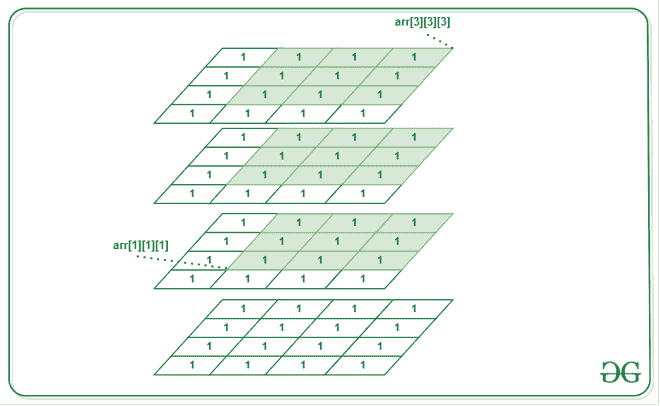
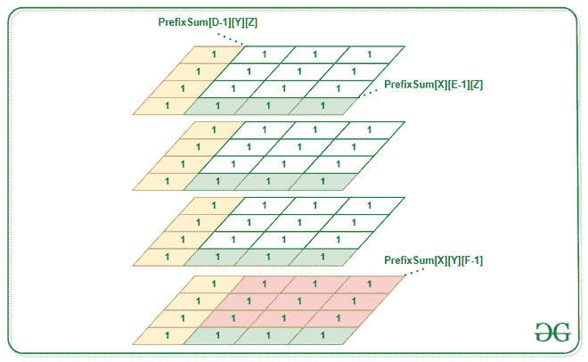
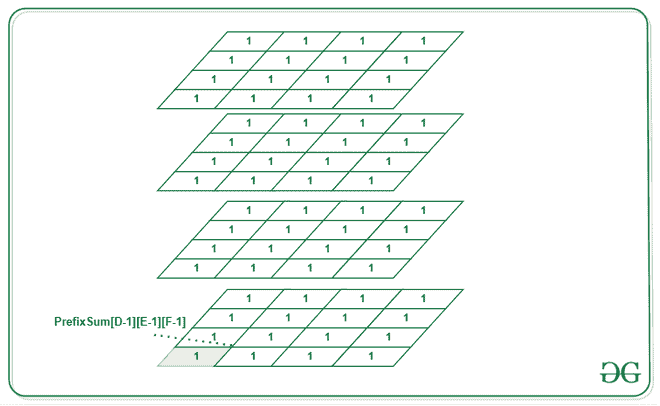

# 求三维数组中给定单元格之间的和

> 原文:[https://www . geeksforgeeks . org/find-3d 数组中给定单元格之间的和/](https://www.geeksforgeeks.org/find-the-sum-between-given-cells-of-a-3d-array/)

**先决条件** : [<u>前缀总和–3D</u>](https://www.geeksforgeeks.org/prefix-sum-of-3d-array/)

给定一个由整数 arr[L][R][C](其中 L、R 和 C 是数组的维数)和 6 个整数 D、E、F、X、Y、Z 组成的 [<u>三维数组</u>](https://www.geeksforgeeks.org/multidimensional-arrays-c-cpp/) ，求 **arr[D][E][F]** 和 **arr[X][Y][Z]** 之间的整数之和。

### 示例:

> ***输入:***
> A[L][R][C]:
> { { 1，1，1，1 }
> { 1，1，1，1 }，
> { 1，1，1，1，1 }，
> { 1，1，1，1，1 } }，
> { { 1，1，1，1，1 }
> { 1，1，1，1 }，
> { 1，1，1，1 }，
> { 1 1 }、
> { 1、1、1、1 }、
> { 1、1、1、1 } }、
> { { 1、1、1、1 }
> { 1、1、1、1 }、
> { 1、1、1、1、1 }、
> { 1、1、1、1 } } }；
> 
> A: 1，B: 1，C: 1，X: 1，Y: 1，Z: 1
> 
> ***输出:*** 27
> 
> **说明:**
> arr(1，1，1)和 arr(3，3，3)之和是 27
> 
> 

***进场:***

*   计算给定数组 arr 的前缀和**【L】【R】【C】**并将其存储在变量 **prefixSum** 中(参见[本](https://www.geeksforgeeks.org/prefix-sum-of-3d-array/)参考)**。**
*   创建一个变量 sum，它将存储答案，即 arr[D][E][F]和 arr[X][Y][Z]之间的和，并用前缀 sum 初始化它，直到 X，Y，Z。因此，**sum =前缀 Sum[X][Y][Z]** 。
*   现在，去掉前缀和中不需要的单元格的值。这可以通过以下方式实现:
    *   删除前缀和直到(D-1，Y，Z):从所需区域的左侧删除不必要的单元格。
    *   移除前缀和直到(X，E-1，Z):从每个层的底部移除不必要的单元格，不存在于所需的区域。
    *   删除前缀和直到(X，Y，F-1):删除所需区域下面不必要的层。



*   现在下面的区域(D-1，E-1，Z)，(X，E-1，F-1)，(D-1，Y，F-1)被删除了两次。为了弥补这一点，添加前缀 sum，直到所有这些点都成为总和。


*   现在，在补偿两次移除的细胞的同时，再次考虑下面的细胞(D-1、E-1、F-1)。移除它们以获得最终答案。



下面是上述方法的实现:

## C++

```
// C++ program for the above approach.
#include <bits/stdc++.h>
using namespace std;

// Declaring size of the array
#define L 4 // Layer
#define R 4 // Row
#define C 4 // Column

// Calculating prefix sum array
void prefixSum3d(
    vector<vector<vector<int> > >& arr,
    vector<vector<vector<int> > >& prefixSum)
{
    // Step 0:
    prefixSum[0][0][0] = arr[0][0][0];

    // Step 1: Filling the first row,
    // column, and pile of ceils.
    // Using prefix sum of 1d array
    for (int i = 1; i < L; i++)
        prefixSum[i][0][0]
            = prefixSum[i - 1][0][0] + arr[i][0][0];

    for (int i = 1; i < R; i++)
        prefixSum[0][i][0]
            = prefixSum[0][i - 1][0] + arr[0][i][0];

    for (int i = 1; i < C; i++)
        prefixSum[0][0][i]
            = prefixSum[0][0][i - 1] + arr[0][0][i];

    // Step 2: Filling the cells
    // of sides(made up using cells)
    // which have common element arr[0][0][0].
    // using prefix sum on 2d array
    for (int k = 1; k < L; k++) {
        for (int i = 1; i < R; i++) {
            prefixSum[k][i][0]
                = arr[k][i][0] + prefixSum[k - 1][i][0]
                  + prefixSum[k][i - 1][0]
                  - prefixSum[k - 1][i - 1][0];
        }
    }
    for (int i = 1; i < R; i++) {
        for (int j = 1; j < C; j++) {
            prefixSum[0][i][j]
                = arr[0][i][j] + prefixSum[0][i - 1][j]
                  + prefixSum[0][i][j - 1]
                  - prefixSum[0][i - 1][j - 1];
        }
    }
    for (int j = 1; j < C; j++) {
        for (int k = 1; k < L; k++) {
            prefixSum[k][0][j]
                = arr[k][0][j] + prefixSum[k - 1][0][j]
                  + prefixSum[k][0][j - 1]
                  - prefixSum[k - 1][0][j - 1];
        }
    }

    // Step 3: Filling value
    // in remaining cells using formula
    for (int k = 1; k < L; k++) {
        for (int i = 1; i < R; i++) {
            for (int j = 1; j < C; j++) {
                prefixSum[k][i][j]
                    = arr[k][i][j]

                      + prefixSum[k - 1][i][j]
                      + prefixSum[k][i - 1][j]
                      + prefixSum[k][i][j - 1]

                      - prefixSum[k - 1][i - 1][j]
                      - prefixSum[k][i - 1][j - 1]
                      - prefixSum[k - 1][i][j - 1]

                      + prefixSum[k - 1][i - 1][j - 1];
            }
        }
    }
}

int calculateSum(
    vector<vector<vector<int> > >& arr,
    vector<vector<vector<int> > >& prefixSum,
    int D, int E, int F, int X, int Y, int Z)
{

    // store prefix sum up to arr[X][Y][Z]:
    int sum = prefixSum[X][Y][Z];

    // Remove prefix sum till D, E, F.
    if (D > 0) {
        sum -= prefixSum[D - 1][Y][Z];
    }
    if (E > 0) {
        sum -= prefixSum[X][E - 1][Z];
    }
    if (F > 0) {
        sum -= prefixSum[X][Y][F - 1];
    }

    // Add to compensate cells removed multiple times.
    if (D > 0 && E > 0) {
        sum += prefixSum[D - 1][E - 1][Z];
    }
    if (E > 0 && F > 0) {
        sum += prefixSum[X][E - 1][F - 1];
    }
    if (F > 0 && D > 0) {
        sum += prefixSum[D - 1][Y][F - 1];
    }

    // Removing cells added twice in the above step.
    if (D > 0 && E > 0 && F > 0) {
        sum -= prefixSum[D - 1][E - 1][F - 1];
    }

    return sum;
}

// Driver Code
int main()
{
    // Given 3D array:
    vector<vector<vector<int> > > arr(
        L, vector<vector<int> >(R, vector<int>(C)));
    arr = { { { 1, 1, 1, 1 },
              { 1, 1, 1, 1 },
              { 1, 1, 1, 1 },
              { 1, 1, 1, 1 } },

            { { 1, 1, 1, 1 },
              { 1, 1, 1, 1 },
              { 1, 1, 1, 1 },
              { 1, 1, 1, 1 } },

            { { 1, 1, 1, 1 },
              { 1, 1, 1, 1 },
              { 1, 1, 1, 1 },
              { 1, 1, 1, 1 } },

            { { 1, 1, 1, 1 },
              { 1, 1, 1, 1 },
              { 1, 1, 1, 1 },
              { 1, 1, 1, 1 } } };

    // To store the prefixSum
    vector<vector<vector<int> > > prefixSum(
        L, vector<vector<int> >(R, vector<int>(C)));

    // To calculate the prefixSum
    prefixSum3d(arr, prefixSum);
    int D, E, F, X, Y, Z;
    D = 1;
    E = 1;
    F = 1;
    X = 3;
    Y = 3;
    Z = 3;

    cout << calculateSum(arr, prefixSum, D, E, F, X, Y, Z);
    return 0;
}
```

## Java 语言(一种计算机语言，尤用于创建网站)

```
// Java program for the above approach.
import java.util.*;

class GFG{

// Declaring size of the array
static final int L = 4; // Layer
static final int R = 4; // Row
static final int C = 4; // Column

// Calculating prefix sum array
static void prefixSum3d(
    int [][][] arr,
    int [][][] prefixSum)
{
    // Step 0:
    prefixSum[0][0][0] = arr[0][0][0];

    // Step 1: Filling the first row,
    // column, and pile of ceils.
    // Using prefix sum of 1d array
    for (int i = 1; i < L; i++)
        prefixSum[i][0][0]
            = prefixSum[i - 1][0][0] + arr[i][0][0];

    for (int i = 1; i < R; i++)
        prefixSum[0][i][0]
            = prefixSum[0][i - 1][0] + arr[0][i][0];

    for (int i = 1; i < C; i++)
        prefixSum[0][0][i]
            = prefixSum[0][0][i - 1] + arr[0][0][i];

    // Step 2: Filling the cells
    // of sides(made up using cells)
    // which have common element arr[0][0][0].
    // using prefix sum on 2d array
    for (int k = 1; k < L; k++) {
        for (int i = 1; i < R; i++) {
            prefixSum[k][i][0]
                = arr[k][i][0] + prefixSum[k - 1][i][0]
                  + prefixSum[k][i - 1][0]
                  - prefixSum[k - 1][i - 1][0];
        }
    }
    for (int i = 1; i < R; i++) {
        for (int j = 1; j < C; j++) {
            prefixSum[0][i][j]
                = arr[0][i][j] + prefixSum[0][i - 1][j]
                  + prefixSum[0][i][j - 1]
                  - prefixSum[0][i - 1][j - 1];
        }
    }
    for (int j = 1; j < C; j++) {
        for (int k = 1; k < L; k++) {
            prefixSum[k][0][j]
                = arr[k][0][j] + prefixSum[k - 1][0][j]
                  + prefixSum[k][0][j - 1]
                  - prefixSum[k - 1][0][j - 1];
        }
    }

    // Step 3: Filling value
    // in remaining cells using formula
    for (int k = 1; k < L; k++) {
        for (int i = 1; i < R; i++) {
            for (int j = 1; j < C; j++) {
                prefixSum[k][i][j]
                    = arr[k][i][j]

                      + prefixSum[k - 1][i][j]
                      + prefixSum[k][i - 1][j]
                      + prefixSum[k][i][j - 1]

                      - prefixSum[k - 1][i - 1][j]
                      - prefixSum[k][i - 1][j - 1]
                      - prefixSum[k - 1][i][j - 1]

                      + prefixSum[k - 1][i - 1][j - 1];
            }
        }
    }
}

static int calculateSum(
    int [][][] arr,
    int [][][] prefixSum,
    int D, int E, int F, int X, int Y, int Z)
{

    // store prefix sum up to arr[X][Y][Z]:
    int sum = prefixSum[X][Y][Z];

    // Remove prefix sum till D, E, F.
    if (D > 0) {
        sum -= prefixSum[D - 1][Y][Z];
    }
    if (E > 0) {
        sum -= prefixSum[X][E - 1][Z];
    }
    if (F > 0) {
        sum -= prefixSum[X][Y][F - 1];
    }

    // Add to compensate cells removed multiple times.
    if (D > 0 && E > 0) {
        sum += prefixSum[D - 1][E - 1][Z];
    }
    if (E > 0 && F > 0) {
        sum += prefixSum[X][E - 1][F - 1];
    }
    if (F > 0 && D > 0) {
        sum += prefixSum[D - 1][Y][F - 1];
    }

    // Removing cells added twice in the above step.
    if (D > 0 && E > 0 && F > 0) {
        sum -= prefixSum[D - 1][E - 1][F - 1];
    }

    return sum;
}

// Driver Code
public static void main(String[] args)
{

    // Given 3D array:
    int [][][] arr = { { { 1, 1, 1, 1 },
              { 1, 1, 1, 1 },
              { 1, 1, 1, 1 },
              { 1, 1, 1, 1 } },

            { { 1, 1, 1, 1 },
              { 1, 1, 1, 1 },
              { 1, 1, 1, 1 },
              { 1, 1, 1, 1 } },

            { { 1, 1, 1, 1 },
              { 1, 1, 1, 1 },
              { 1, 1, 1, 1 },
              { 1, 1, 1, 1 } },

            { { 1, 1, 1, 1 },
              { 1, 1, 1, 1 },
              { 1, 1, 1, 1 },
              { 1, 1, 1, 1 } } };

    // To store the prefixSum
    int [][][] prefixSum= new int[L][R][C];

    // To calculate the prefixSum
    prefixSum3d(arr, prefixSum);
    int D, E, F, X, Y, Z;
    D = 1;
    E = 1;
    F = 1;
    X = 3;
    Y = 3;
    Z = 3;

    System.out.print(calculateSum(arr, prefixSum, D, E, F, X, Y, Z));
}
}

// This code is contributed by 29AjayKumar
```

## 蟒蛇 3

```
# Python3 program for the above approach.

# Declaring size of the array
L = 4  # Layer
R = 4  # Row
C = 4  # Column

# Calculating prefix sum array
def prefixSum3d(arr, prefixSum):

        # Step 0:
    prefixSum[0][0][0] = arr[0][0][0]

    # Step 1: Filling the first row,
    # column, and pile of ceils.
    # Using prefix sum of 1d array
    for i in range(1, L):
        prefixSum[i][0][0] = prefixSum[i - 1][0][0] + arr[i][0][0]

    for i in range(1, R):
        prefixSum[0][i][0] = prefixSum[0][i - 1][0] + arr[0][i][0]

    for i in range(1, C):
        prefixSum[0][0][i] = prefixSum[0][0][i - 1] + arr[0][0][i]

        # Step 2: Filling the cells
        # of sides(made up using cells)
        # which have common element arr[0][0][0].
        # using prefix sum on 2d array
    for k in range(1, L):
        for i in range(1, R):
            prefixSum[k][i][0] = arr[k][i][0] + prefixSum[k - 1][i][0] + \
                prefixSum[k][i - 1][0] - prefixSum[k - 1][i - 1][0]

    for i in range(1, R):
        for j in range(1, C):
            prefixSum[0][i][j] = arr[0][i][j] + prefixSum[0][i - 1][j] + \
                prefixSum[0][i][j - 1] - prefixSum[0][i - 1][j - 1]

    for j in range(1, C):
        for k in range(1, L):
            prefixSum[k][0][j] = arr[k][0][j] + prefixSum[k - 1][0][j] + \
                prefixSum[k][0][j - 1] - prefixSum[k - 1][0][j - 1]

        # Step 3: Filling value
        # in remaining cells using formula
    for k in range(1, L):
        for i in range(1, R):
            for j in range(1, C):
                prefixSum[k][i][j] = arr[k][i][j] + prefixSum[k - 1][i][j] + prefixSum[k][i - 1][j] + prefixSum[k][i][j - 1] - \
                    prefixSum[k - 1][i - 1][j] - prefixSum[k][i - 1][j - 1] - \
                    prefixSum[k - 1][i][j - 1] + prefixSum[k - 1][i - 1][j - 1]

def calculateSum(arr, prefixSum, D, E, F, X, Y, Z):

        # store prefix sum up to arr[X][Y][Z]:
    sum = prefixSum[X][Y][Z]

    # Remove prefix sum till D, E, F.
    if (D > 0):
        sum -= prefixSum[D - 1][Y][Z]

    if (E > 0):
        sum -= prefixSum[X][E - 1][Z]

    if (F > 0):
        sum -= prefixSum[X][Y][F - 1]

    # Add to compensate cells removed multiple times.
    if (D > 0 and E > 0):
        sum += prefixSum[D - 1][E - 1][Z]

    if (E > 0 and F > 0):
        sum += prefixSum[X][E - 1][F - 1]

    if (F > 0 and D > 0):
        sum += prefixSum[D - 1][Y][F - 1]

    # Removing cells added twice in the above step.
    if (D > 0 and E > 0 and F > 0):
        sum -= prefixSum[D - 1][E - 1][F - 1]

    return sum

# Driver Code
if __name__ == "__main__":

    # Given 3D array:

    arr = [[[1, 1, 1, 1],
            [1, 1, 1, 1],
            [1, 1, 1, 1],
            [1, 1, 1, 1]],

           [[1, 1, 1, 1],
            [1, 1, 1, 1],
            [1, 1, 1, 1],
            [1, 1, 1, 1]],

           [[1, 1, 1, 1],
            [1, 1, 1, 1],
            [1, 1, 1, 1],
            [1, 1, 1, 1]],

           [[1, 1, 1, 1],
            [1, 1, 1, 1],
            [1, 1, 1, 1],
            [1, 1, 1, 1]]]

    # To store the prefixSum
    prefixSum = [[[0 for _ in range(C)] for _ in range(R)] for _ in range(L)]

    # To calculate the prefixSum
    prefixSum3d(arr, prefixSum)
    D = 1
    E = 1
    F = 1
    X = 3
    Y = 3
    Z = 3

    print(calculateSum(arr, prefixSum, D, E, F, X, Y, Z))

    # This code is contributed by rakeshsahni
```

## C#

```
// C# program for the above approach.
using System;

public class GFG{

// Declaring size of the array
static readonly int L = 4; // Layer
static readonly int R = 4; // Row
static readonly int C = 4; // Column

// Calculating prefix sum array
static void prefixSum3d(
    int [,,] arr,
    int [,,] prefixSum)
{
    // Step 0:
    prefixSum[0,0,0] = arr[0,0,0];

    // Step 1: Filling the first row,
    // column, and pile of ceils.
    // Using prefix sum of 1d array
    for (int i = 1; i < L; i++)
        prefixSum[i,0,0]
            = prefixSum[i - 1,0,0] + arr[i,0,0];

    for (int i = 1; i < R; i++)
        prefixSum[0,i,0]
            = prefixSum[0,i - 1,0] + arr[0,i,0];

    for (int i = 1; i < C; i++)
        prefixSum[0,0,i]
            = prefixSum[0,0,i - 1] + arr[0,0,i];

    // Step 2: Filling the cells
    // of sides(made up using cells)
    // which have common element arr[0,0,0].
    // using prefix sum on 2d array
    for (int k = 1; k < L; k++) {
        for (int i = 1; i < R; i++) {
            prefixSum[k,i,0]
                = arr[k,i,0] + prefixSum[k - 1,i,0]
                  + prefixSum[k,i - 1,0]
                  - prefixSum[k - 1,i - 1,0];
        }
    }
    for (int i = 1; i < R; i++) {
        for (int j = 1; j < C; j++) {
            prefixSum[0,i,j]
                = arr[0,i,j] + prefixSum[0,i - 1,j]
                  + prefixSum[0,i,j - 1]
                  - prefixSum[0,i - 1,j - 1];
        }
    }
    for (int j = 1; j < C; j++) {
        for (int k = 1; k < L; k++) {
            prefixSum[k,0,j]
                = arr[k,0,j] + prefixSum[k - 1,0,j]
                  + prefixSum[k,0,j - 1]
                  - prefixSum[k - 1,0,j - 1];
        }
    }

    // Step 3: Filling value
    // in remaining cells using formula
    for (int k = 1; k < L; k++) {
        for (int i = 1; i < R; i++) {
            for (int j = 1; j < C; j++) {
                prefixSum[k,i,j]
                    = arr[k,i,j]

                      + prefixSum[k - 1,i,j]
                      + prefixSum[k,i - 1,j]
                      + prefixSum[k,i,j - 1]

                      - prefixSum[k - 1,i - 1,j]
                      - prefixSum[k,i - 1,j - 1]
                      - prefixSum[k - 1,i,j - 1]

                      + prefixSum[k - 1,i - 1,j - 1];
            }
        }
    }
}

static int calculateSum(
    int [,,] arr,
    int [,,] prefixSum,
    int D, int E, int F, int X, int Y, int Z)
{

    // store prefix sum up to arr[X,Y,Z]:
    int sum = prefixSum[X,Y,Z];

    // Remove prefix sum till D, E, F.
    if (D > 0) {
        sum -= prefixSum[D - 1,Y,Z];
    }
    if (E > 0) {
        sum -= prefixSum[X,E - 1,Z];
    }
    if (F > 0) {
        sum -= prefixSum[X,Y,F - 1];
    }

    // Add to compensate cells removed multiple times.
    if (D > 0 && E > 0) {
        sum += prefixSum[D - 1,E - 1,Z];
    }
    if (E > 0 && F > 0) {
        sum += prefixSum[X,E - 1,F - 1];
    }
    if (F > 0 && D > 0) {
        sum += prefixSum[D - 1,Y,F - 1];
    }

    // Removing cells added twice in the above step.
    if (D > 0 && E > 0 && F > 0) {
        sum -= prefixSum[D - 1,E - 1,F - 1];
    }

    return sum;
}

// Driver Code
public static void Main(String[] args)
{

    // Given 3D array:
    int [,,] arr = { { { 1, 1, 1, 1 },
              { 1, 1, 1, 1 },
              { 1, 1, 1, 1 },
              { 1, 1, 1, 1 } },

            { { 1, 1, 1, 1 },
              { 1, 1, 1, 1 },
              { 1, 1, 1, 1 },
              { 1, 1, 1, 1 } },

            { { 1, 1, 1, 1 },
              { 1, 1, 1, 1 },
              { 1, 1, 1, 1 },
              { 1, 1, 1, 1 } },

            { { 1, 1, 1, 1 },
              { 1, 1, 1, 1 },
              { 1, 1, 1, 1 },
              { 1, 1, 1, 1 } } };

    // To store the prefixSum
    int [,,] prefixSum= new int[L,R,C];

    // To calculate the prefixSum
    prefixSum3d(arr, prefixSum);
    int D, E, F, X, Y, Z;
    D = 1;
    E = 1;
    F = 1;
    X = 3;
    Y = 3;
    Z = 3;

    Console.Write(calculateSum(arr, prefixSum, D, E, F, X, Y, Z));
}
}

// This code is contributed by 29AjayKumar
```

## java 描述语言

```
<script>
// Javascript program for the above approach.

// Declaring size of the array
let L = 4; // Layer
let R = 4; // Row
let C = 4; // Column

// Calculating prefix sum array
function prefixSum3d(arr, prefixSum) {
  // Step 0:
  prefixSum[0][0][0] = arr[0][0][0];

  // Step 1: Filling the first row,
  // column, and pile of ceils.
  // Using prefix sum of 1d array
  for (let i = 1; i < L; i++)
    prefixSum[i][0][0] = prefixSum[i - 1][0][0] + arr[i][0][0];

  for (let i = 1; i < R; i++)
    prefixSum[0][i][0] = prefixSum[0][i - 1][0] + arr[0][i][0];

  for (let i = 1; i < C; i++)
    prefixSum[0][0][i] = prefixSum[0][0][i - 1] + arr[0][0][i];

  // Step 2: Filling the cells
  // of sides(made up using cells)
  // which have common element arr[0][0][0].
  // using prefix sum on 2d array
  for (let k = 1; k < L; k++) {
    for (let i = 1; i < R; i++) {
      prefixSum[k][i][0] =
        arr[k][i][0] +
        prefixSum[k - 1][i][0] +
        prefixSum[k][i - 1][0] -
        prefixSum[k - 1][i - 1][0];
    }
  }
  for (let i = 1; i < R; i++) {
    for (let j = 1; j < C; j++) {
      prefixSum[0][i][j] =
        arr[0][i][j] +
        prefixSum[0][i - 1][j] +
        prefixSum[0][i][j - 1] -
        prefixSum[0][i - 1][j - 1];
    }
  }
  for (let j = 1; j < C; j++) {
    for (let k = 1; k < L; k++) {
      prefixSum[k][0][j] =
        arr[k][0][j] +
        prefixSum[k - 1][0][j] +
        prefixSum[k][0][j - 1] -
        prefixSum[k - 1][0][j - 1];
    }
  }

  // Step 3: Filling value
  // in remaining cells using formula
  for (let k = 1; k < L; k++) {
    for (let i = 1; i < R; i++) {
      for (let j = 1; j < C; j++) {
        prefixSum[k][i][j] =
          arr[k][i][j] +
          prefixSum[k - 1][i][j] +
          prefixSum[k][i - 1][j] +
          prefixSum[k][i][j - 1] -
          prefixSum[k - 1][i - 1][j] -
          prefixSum[k][i - 1][j - 1] -
          prefixSum[k - 1][i][j - 1] +
          prefixSum[k - 1][i - 1][j - 1];
      }
    }
  }
}

function calculateSum(arr, prefixSum, D, E, F, X, Y, Z) {
  // store prefix sum up to arr[X][Y][Z]:
  let sum = prefixSum[X][Y][Z];

  // Remove prefix sum till D, E, F.
  if (D > 0) {
    sum -= prefixSum[D - 1][Y][Z];
  }
  if (E > 0) {
    sum -= prefixSum[X][E - 1][Z];
  }
  if (F > 0) {
    sum -= prefixSum[X][Y][F - 1];
  }

  // Add to compensate cells removed multiple times.
  if (D > 0 && E > 0) {
    sum += prefixSum[D - 1][E - 1][Z];
  }
  if (E > 0 && F > 0) {
    sum += prefixSum[X][E - 1][F - 1];
  }
  if (F > 0 && D > 0) {
    sum += prefixSum[D - 1][Y][F - 1];
  }

  // Removing cells added twice in the above step.
  if (D > 0 && E > 0 && F > 0) {
    sum -= prefixSum[D - 1][E - 1][F - 1];
  }

  return sum;
}

// Driver Code
// Given 3D array:

let arr = [
  [
    [1, 1, 1, 1],
    [1, 1, 1, 1],
    [1, 1, 1, 1],
    [1, 1, 1, 1],
  ],

  [
    [1, 1, 1, 1],
    [1, 1, 1, 1],
    [1, 1, 1, 1],
    [1, 1, 1, 1],
  ],

  [
    [1, 1, 1, 1],
    [1, 1, 1, 1],
    [1, 1, 1, 1],
    [1, 1, 1, 1],
  ],

  [
    [1, 1, 1, 1],
    [1, 1, 1, 1],
    [1, 1, 1, 1],
    [1, 1, 1, 1],
  ],
];

// To store the prefixSum
let prefixSum = new Array(L)
  .fill(0)
  .map(() => new Array(R).fill(0).map(() => new Array(C).fill(0)));

// To calculate the prefixSum
prefixSum3d(arr, prefixSum);
let D, E, F, X, Y, Z;
D = 1;
E = 1;
F = 1;
X = 3;
Y = 3;
Z = 3;

document.write(calculateSum(arr, prefixSum, D, E, F, X, Y, Z));

// This code is contributed by gfgking.
</script>
```

**Output**

```
27
```

***时间复杂度:**O(L * R * C)*
T5**辅助空间:** O(L*R*C)