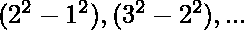

# 求无穷级数的和 1^2.x^0+2^2.x^1+3^2.x^2+4^2.x^3+……。

> 原文:[https://www . geesforgeks . org/find-无穷级数之和-12-x0-22-x1-32-x2-42-x3/](https://www.geeksforgeeks.org/find-the-sum-of-infinite-series-12-x0-22-x1-32-x2-42-x3/)

给定一个无穷级数和值 x，任务是求其和。下面是无穷级数

> 1^2*x^0+2^2*x^1+3^2*x^2+4^2*x^3+……。直到无穷大，其中 x 属于(-1，1)

**例:**

```
Input: x = 0.5
Output: 12

Input: x = 0.9
Output: 1900
```

**方法:**
虽然给定的数列不是算术-几何数列，但是，差异等等形成了一个 AP。所以，我们可以使用差异法。
![Let\: S = 1 + 4x + 9x^2 + 16x^3 + ...\infty \\\\ Multiply\: both\: sides\: with\: common\: ratio\: x\: of\: the\: GP(geometric progression).\\ S_x = x + 4x^2 + 9x^3 + ...\infty \\ \\ Now, \: subtract\: the\: two\: equations.\\ => (1-x)S = 1 + 3x + 5x^2 + 7x^3 + ...\infty \null\hfill (1)\\\\ Now, \: let\: R = 1 + 3x + 5x^2 + 7x^3 + ...\infty, \: which\: is\: an \:Arithmetico-Geometric\: series\: with \:a=1, \: d=2 \:and \:r=x.\\ For an A.G.P., $Sum \:R \:= \frac{a}{1-r} + \frac{rd}{(1-r)^2} \\ Substituting\: the \:values, \:we\: get\: R = \frac{1+x}{(1-x)^2} \\ Substitute\: R\: in\: (1), \:we\: get, (1-x)S=\frac{1+x}{(1-x)^2} \\ => S= \frac{1+x}{(1-x)^3}$  ](img/d212677f3c901d3ee791739939ce98a8.png "Rendered by QuickLaTeX.com")
遂，其和将为 **(1+x)/(1-x)^3.**
**以下是上述方法的实施:**

## C++

```
// C++ implementation of above approach
#include <iostream>
#include <math.h>

using namespace std;

// Function to calculate sum
double solve_sum(double x)
{
    // Return sum
    return (1 + x) / pow(1 - x, 3);
}

// Driver code
int main()
{
    // declaration of value of x
    double x = 0.5;

    // Function call to calculate
    // the sum when x=0.5
    cout << solve_sum(x);

    return 0;
}
```

## Java 语言(一种计算机语言，尤用于创建网站)

```
// Java Program to find
//sum of the given infinite series
import java.util.*;

class solution
{
static double calculateSum(double x)
{

// Returning the final sum
return (1 + x) / Math.pow(1 - x, 3);

}

//Driver code
public static void main(String ar[])
{

  double x=0.5;
  System.out.println((int)calculateSum(x));

}
}
//This code is contributed by Surendra_Gangwar
```

## 计算机编程语言

```
# Python implementation of above approach

# Function to calculate sum
def solve_sum(x):
    # Return sum
    return (1 + x)/pow(1-x, 3)

# driver code

# declaration of value of x
x = 0.5

# Function call to calculate the sum when x = 0.5
print(int(solve_sum(x)))
```

## C#

```
// C# Program to find sum of
// the given infinite series
using System;

class GFG
{
static double calculateSum(double x)
{

// Returning the final sum
return (1 + x) / Math.Pow(1 - x, 3);

}

// Driver code
public static void Main()
{
    double x = 0.5;
    Console.WriteLine((int)calculateSum(x));
}
}

// This code is contributed
// by inder_verma..
```

## 服务器端编程语言（Professional Hypertext Preprocessor 的缩写）

```
<?php
// PHP implementation of
// above approach

// Function to calculate sum
function solve_sum($x)
{
    // Return sum
    return (1 + $x) /
            pow(1 - $x, 3);
}

// Driver code

// declaration of value of x
$x = 0.5;

// Function call to calculate
// the sum when x=0.5
echo solve_sum($x);

// This code is contributed
// by inder_verma
?>
```

## java 描述语言

```
<script>
// javascript Program to find
//sum of the given infinite series

function calculateSum(x)
{

// Returning the final sum
return (1 + x) / Math.pow(1 - x, 3);

}

//Driver code

var x=0.5;
document.write(parseInt(calculateSum(x)));

// This code is contributed by 29AjayKumar

</script>
```

**Output:** 

```
12
```