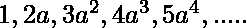
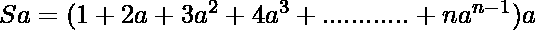
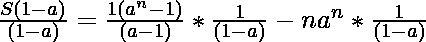
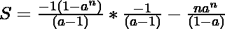
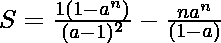
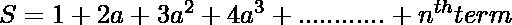
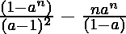
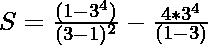
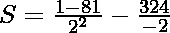

# 求数列 1、2a、3a2、4a3、5a4、…

的 n 项之和

> 原文:[https://www . geesforgeks . org/find-n 系列术语之和-1-2a-3a2-4a3-5a4/](https://www.geeksforgeeks.org/find-the-sum-of-n-terms-of-the-series-1-2a-3a2-4a3-5a4/)

给定一系列。 和**的值 a.** 求该系列第一个 **n** 项的**和**。

**示例:**

> **输入** : a = 3，n = 4
> 输出 : 142
> 
> **输入** : a = 5，n = 1
> **输出** : 1

**蛮力**T2【武力接近:

一个简单的方法是迭代级数的 N 个项，然后将它们相加来计算 a 的任何值的和。按照下面的步骤来理解这个方法:

对于每次迭代:

1.  计算**a<sup>n</sup>T3【n = 0】。**
2.  将**乘以<sup>n</sup>T3**(n+1)。****
3.  将**(n+1)* a<sup>n</sup>T3 相加，将 n 加 1。**
4.  重复上述过程 **n 次**。

插图:

> **a = 3 和 n = 4**
> 
> 循环将被执行 **n 次**次，在这种情况下为 4 次。
> 
> **循环 1:** 最初 a = 1，n = 0，sum = 0 的值
> 
> 1.  a<sup>n</sup>= 3<sup>0</sup>
>     T5= 1
> 2.  a<sup>n</sup>*(n+1)= 3<sup>0</sup>*(0+1)
>     = 1 *(1)
>     = 1
> 3.  sum = sum+a<sup>n</sup>*(n+1)
>     = 0+1
>     = 1
> 4.  将 n 增加 1。
> 
> **循环 2:**a = 3，n = 1，和= 1 的值
> 
> 1.  a<sup>n</sup>= 3<sup>1</sup>
>     T5= 3
> 2.  a<sup>n</sup>*(n+1)= 3<sup>1</sup>*(1+1)
>     = 3 *(2)
>     = 6
> 3.  sum = sum+a<sup>n</sup>*(n+1)
>     = 1+6
>     = 7
> 4.  n 的值增加 1。
> 
> **循环 3:**a = 3，n = 2，和= 7 的值
> 
> 1.  a<sup>n</sup>= 3<sup>2</sup>
>     T5= 9
> 2.  a<sup>n</sup>*(n+1)= 3<sup>2</sup>*(2+1)
>     = 9 *(3)
>     = 27
> 3.  sum = sum+a<sup>n</sup>*(n+1)
>     = 7+27
>     = 34
> 4.  将 n 增加 1。
> 
> **循环 4:**a = 3，n = 3，和= 34 的值
> 
> 1.  a<sup>n</sup>= 3<sup>3</sup>
>     T5= 27
> 2.  a<sup>n</sup>*(n+1)= 3<sup>3</sup>*(3+1)
>     = 27 *(4)
>     = 108
> 3.  sum = sum+a<sup>n</sup>*(n+1)
>     = 34+108
>     = 142
> 4.  将 n 的值增加 1。

下面是上述方法的实现:

## C++

```
// C++ implementation for the
// approach
#include <bits/stdc++.h>
using namespace std;

// Function to calculate
// the sum
void calcSum(int a, int n)
{
  // Edge Cases
  if (n < 0)
  {
    cout << "Invalid Input";
    return;
  }

  if (a == 0 || n == 1)
  {
    cout << 1;
    return;
  }

  // Initialize the variables
  int Sum = 0;

  // Calculate Sum upto N terms
  for(int i = 0; i < n; i++)
  {
    int r = pow(a, (i)) * (i + 1);
    Sum += r;
  }

  // Print Sum
  cout << Sum;
}

// Driver Code
int main()
{
  int a = 3;
  int n = 4;

  // Invoke calcSum function with
  // values of a and n
  calcSum(a, n);
  return 0;
}
```

## Java 语言(一种计算机语言，尤用于创建网站)

```
// Java implementation for the
// approach
import java.util.*;

class GFG{

// Function to calculate
// the sum
static void calcSum(int a, int n)
{

  // Edge Cases
  if (n < 0)
  {
    System.out.print("Invalid Input");
    return;
  }

  if (a == 0 || n == 1)
  {
    System.out.print(1);
    return;
  }

  // Initialize the variables
  int Sum = 0;

  // Calculate Sum upto N terms
  for(int i = 0; i < n; i++)
  {
    int r = (int) (Math.pow(a, (i)) * (i + 1));
    Sum += r;
  }

  // Print Sum
  System.out.print(Sum);
}

// Driver Code
public static void main(String[] args)
{
  int a = 3;
  int n = 4;

  // Invoke calcSum function with
  // values of a and n
  calcSum(a, n);
}
}

// This code is contributed by 29AjayKumar
```

## 蟒蛇 3

```
# Python 3 implementation for the
# approach

# Function to calculate
# the sum
def calcSum(a, n):

    # Edge Cases
    if (n < 0):
        print("Invalid Input")
        return

    if (a == 0 or n == 1):

        print(1)
        return

    # Initialize the variables
    Sum = 0

    # Calculate Sum upto N terms
    for i in range(n):
        r = pow(a, (i)) * (i + 1)
        Sum += r

    # Print Sum
    print(Sum)

# Driver Code
if __name__ == "__main__":

    a = 3
    n = 4

    # Invoke calcSum function with
    # values of a and n
    calcSum(a, n)

    # This code is contributed by ukasp.
```

## C#

```
// C# program to find GCD of two
// numbers
using System;
using System.Collections;

class GFG {

// Function to calculate
// the sum
static void calcSum(int a, int n)
{
  // Edge Cases
  if (n < 0)
  {
    Console.Write("Invalid Input");
    return;
  }

  if (a == 0 || n == 1)
  {
    Console.Write(1);
    return;
  }

  // Initialize the variables
  int Sum = 0;

  // Calculate Sum upto N terms
  for(int i = 0; i < n; i++)
  {
    int r = (int)Math.Pow(a, (i)) * (i + 1);
    Sum += r;
  }

  // Print Sum
  Console.Write(Sum);
}

// Driver method
public static void Main()
{
    int a = 3;
    int n = 4;

    // Invoke calcSum function with
    // values of a and n
    calcSum(a, n);
}
}

// This code is contributed by Samim Hossain Mondal.
```

## java 描述语言

```
<script>

// JavaScript implementation for the 
// approach

// Function to calculate
// the sum
function calcSum(a, n)
{

    // Edge Cases
    if (n < 0)
    {
        document.write("Invalid Input");
        return;
    }

    if (a == 0 || n == 1)
    {
        document.write(1);
        return;
    }

    // Initialize the variables
    let Sum = 0;

    // Calculate Sum upto N terms
    for(let i = 0; i < n; i++)
    {
        let r = Math.pow(a, (i)) * (i + 1);
        Sum += r;
    }

    // Print Sum
    document.write(Sum);
}

// Driver Code
let a = 3;
let n = 4;

// Invoke calcSum function with
// values of a and n
calcSum(a, n);

// This code is contributed by Potta Lokesh

</script>
```

**输出:**

> One hundred and forty-two

**时间复杂度:**O(n)
T3】辅助空间: O(1)

**<u>高效进场</u>**

在这种方法中，使用几何级数的概念提出了一种有效的解决方案。a **几何级数(g . p)**中**n**T2 项与**第一项 a** 和**公比 r** 的级数之和如下:

> 

让我们用这个概念来解决这个问题。

> 让
> 
> 显然**第 n 个术语**是
> 
> 。 **(1)**
> 
> **两边乘以‘a’，我们得到，**
> 
> 
> 
>  ** (2)**
> 
> **从(1)中减去等式(2)，我们得到**
> 
> 
> 
> 
> 
> 很明显，这是第一项为 1 的 n 项的**几何级数**
> 
> 具有第一项 a 和公共比率 r 的 n 项的 G.P 为:
> 
> 
> 
> **利用上面的公式，我们得到**
> 
> 
> 
> **将两边除以(1–a)，得到**
> 
> 
> 
> 
> 
> 
> 
> 因此，级数的和为
> 
> 

**为一！= 1 级数和的公式为:**

> 

**对于 a = 1，级数和的公式为:**
级数简化为前 n 个自然数的和，公式为-

> 

插图:

> **对于 a = 3，n = 4**
> 
> 自从 a！= 1，因此使用公式
> 
> 
> 
> **代入上式中 a 和 n 的值，得到**
> 
> 
> 
> 
> 
> s =-20 –(-162)
> 
> S = 142
> 
> 所以，a = 3，n = 4 的级数的和是 142。

下面是上述方法的实现:

## C++

```
// C++ program to implement
// the above approach
#include <bits/stdc++.h>
using namespace std;

// Function to calculate
// the sum
void calcSum(int a, int n)
{
  // Edge Cases
  if (n < 0)
  {
    cout << "Invalid Input";
    return;
  }

  if (a == 0 || n == 1)
  {
    cout << 1;
    return;
  }

  // Sum of First N Natural Numbers
  // In case a = 1
  if (a == 1)
  {
    // Avoiding Overflow
    if (n % 2 == 0)
      cout << (n / 2) * (n + 1);

    else
      cout << ((n + 1) / 2) * n;
  }

  // Calculate Sum with the help
  // of formula
  int r = pow(a, n);
  int d = pow(a - 1, 2);
  int Sum = (1 - r * (1 + n - n * a)) / d;

  // Print Sum
  cout << Sum;
}

// Driver Code
int main()
{
  int a = 3;
  int n = 4;

  // Invoke calcSum function
  // with values of a and n
  calcSum(a, n);
  return 0;
}
```

## Java 语言(一种计算机语言，尤用于创建网站)

```
// Java program to implement
// the above approach
class GFG {

    // Function to calculate
    // the sum
    public static void calcSum(int a, int n)
    {

        // Edge Cases
        if (n < 0) {
            System.out.println("Invalid Input");
            return;
        }

        if (a == 0 || n == 1) {
            System.out.println(1);
            return;
        }

        // Sum of First N Natural Numbers
        // In case a = 1
        if (a == 1) {
            // Avoiding Overflow
            if (n % 2 == 0)
                System.out.println((n / 2) * (n + 1));

            else
                System.out.println(((n + 1) / 2) * n);
        }

        // Calculate Sum with the help
        // of formula
        int r = (int) Math.pow(a, n);
        int d = (int) Math.pow(a - 1, 2);
        int Sum = (1 - r * (1 + n - n * a)) / d;

        // Print Sum
        System.out.println(Sum);
    }

    // Driver Code
    public static void main(String args[]) {
        int a = 3;
        int n = 4;

        // Invoke calcSum function
        // with values of a and n
        calcSum(a, n);
    }
}

// This code is contributed by saurabh_jaiswal.
```

## 蟒蛇 3

```
# Python program to implement
# the above approach

# Function to calculate
# the sum
def calcSum(a, n):

    # Edge Cases
    if (n < 0):
        print("Invalid Input");
        return;

    if (a == 0 or n == 1):
        print(1);
        return;

    # Sum of First N Natural Numbers
    # In case a = 1
    if (a == 1):

        # Avoiding Overflow
        if (n % 2 == 0):
            print((n // 2) * (n + 1));

        else:
            print(((n + 1) // 2) * n);

    # Calculate Sum with the help
    # of formula
    r =  pow(a, n);
    d = pow(a - 1, 2);
    Sum = (1 - r * (1 + n - n * a)) // d;

    # PrSum
    print(Sum);

# Driver Code
if __name__ == '__main__':
    a = 3;
    n = 4;

    # Invoke calcSum function
    # with values of a and n
    calcSum(a, n);

# This code is contributed by 29AjayKumar
```

## C#

```
// C# program to implement
// the above approach

using System;
class GFG {

    // Function to calculate
    // the sum
    public static void calcSum(int a, int n)
    {

        // Edge Cases
        if (n < 0) {
            Console.WriteLine("Invalid Input");
            return;
        }

        if (a == 0 || n == 1) {
            Console.WriteLine(1);
            return;
        }

        // Sum of First N Natural Numbers
        // In case a = 1
        if (a == 1) {
            // Avoiding Overflow
            if (n % 2 == 0)
                Console.WriteLine((n / 2) * (n + 1));

            else
                Console.WriteLine(((n + 1) / 2) * n);
        }

        // Calculate Sum with the help
        // of formula
        int r = (int) Math.Pow(a, n);
        int d = (int) Math.Pow(a - 1, 2);
        int Sum = (1 - r * (1 + n - n * a)) / d;

        // Print Sum
        Console.WriteLine(Sum);
    }

    // Driver Code
    public static void Main() {
        int a = 3;
        int n = 4;

        // Invoke calcSum function
        // with values of a and n
        calcSum(a, n);
    }
}

// This code is contributed by gfgking.
```

## java 描述语言

```
<script>
// Javascript program to implement
// the above approach

// Function to calculate
// the sum
function calcSum(a, n)
{
  // Edge Cases
  if (n < 0)
  {
    document.write("Invalid Input");
    return;
  }

  if (a == 0 || n == 1)
  {
    document.write(1);
    return;
  }

  // Sum of First N Natural Numbers
  // In case a = 1
  if (a == 1)
  {
    // Avoiding Overflow
    if (n % 2 == 0)
      document.write((n / 2) * (n + 1));

    else
      document.write(((n + 1) / 2) * n);
  }

  // Calculate Sum with the help
  // of formula
  let r = Math.pow(a, n);
  let d = Math.pow(a - 1, 2);
  let Sum = (1 - r * (1 + n - n * a)) / d;

  // Print Sum
  document.write(Sum);
}

// Driver Code
let a = 3;
let n = 4;

// Invoke calcSum function
// with values of a and n
calcSum(a, n);

// This code is contributed by Samim Hossain Mondal.
</script>
```

**输出:**

> One hundred and forty-two

**时间复杂度:** O(1)

**辅助空间:** O(1)