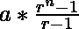
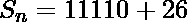

# 求数列 12、105、1008、10011、…

的 n 项之和

> 原文:[https://www . geesforgeks . org/find-the-sum-n-terms-of-series-12-105-1008-10011/](https://www.geeksforgeeks.org/find-the-sum-of-n-terms-of-the-series-12-105-1008-10011/)

给定正整数 **n** 。求级数第一个 **n 项**的和

> **12，105，1008，10011，…..**

**示例:**

> **输入:**n = 4
> T3】输出: 11136
> 
> **输入:**n = 7
> T3】输出:111111187

**进场:**

该序列通过使用以下模式形成。对于任何数值 N-

> ![S_{n} = \frac{10}{9}*(10^{n}-1) + \frac{n}{2}[3n+1]](img/edd1f629ead96c7c5f129b854e2ae0f7.png "Rendered by QuickLaTeX.com")

上述解决方案可以通过一系列步骤得出:

> **给定系列-**
> 
> 12 + 105 + 1008 + 10011 +…….
> 
> 10 + 2 + 100 + 5 + 1000 + 8 + 10000 + 11 +…… ..
> 
> (10 + 100 + 1000 + 10000+……) + (2 + 5 + 8 + 11+……)     -(1)
> 
> **上式中第一项为几何级数，第二项为算术级数。**
> 
> **G.P.** = 
> 其中 a 是第一项 a，r 是公比，n 是项数。
> 
> **A.P.** = ![\frac{n}{2}[2a +(n - 1)d]](img/0e06cbc3b7dea967e41f118e26ce546c.png "Rendered by QuickLaTeX.com")
> 其中 a 是第一个术语 a，a 是共同的区别，n 是术语的数量。
> 
> 所以在代入方程 G.P .和 A.P .中的值，并代入方程(1)中相应的方程后，我们得到，
> 
> ![10*\frac{10^{n}-1}{10-1} + \frac{n}{2}[2*2+(n-1)*3]](img/d4d16c62b0c011a45638f0829de91a4c.png "Rendered by QuickLaTeX.com")
> 
> ![\frac{10}{9}*10^{n}-1 + \frac{n}{2}[4+3n-3]](img/6321d0695999f3ce7f3166d14fc96fd1.png "Rendered by QuickLaTeX.com")
> 
> ![\frac{10}{9}*(10^{n}-1) + \frac{n}{2}[3n+1]](img/5d3b1dbd281ac7639130a505590b5803.png "Rendered by QuickLaTeX.com")
> 
> 所以，![S_{n} = \frac{10}{9}*(10^{n}-1) + \frac{n}{2}[3n+1]](img/edd1f629ead96c7c5f129b854e2ae0f7.png "Rendered by QuickLaTeX.com")

插图:

> **输入:** n = 4
> **输出:** 11136
> **解释:**
> ![S_{n} = \frac{10}{9}*(10^{4}-1) + \frac{4}{2}[3*4+1]](img/80eee5d3d49b97ee644c33dac6fa753d.png "Rendered by QuickLaTeX.com")
> ![S_{n} = \frac{10}{9}*(9999) + \frac{4}{2}[13]](img/0df8710504e13816dbc8abe49af5cbe8.png "Rendered by QuickLaTeX.com")
> 
> 
> 
> 这就给出了 ans 11136。

下面是上述方法的实现:

## C++

```
// C++ program to implement
// the above approach
#include <bits/stdc++.h>
#define ll long long
using namespace std;

// Function to return sum of
// N term of the series

ll findSum(ll n)
{
    ll x = 10 * (pow(10, n) - 1) / 9;
    ll y = n * (3 * n + 1) / 2;

    return x + y;
}

// Driver Code

int main()
{
    ll n = 4;
    cout << findSum(n);
    return 0;
}
```

**Output**

```
11136
```

**时间复杂度:** O(1)

**辅助空间:** O(1)