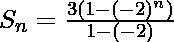

# 求数列 3，-6，12，-24 的和。。。最新条款

> 原文:[https://www . geesforgeks . org/find-the-sum-series-3-6-12-24-up-n-terms/](https://www.geeksforgeeks.org/find-the-sum-of-series-3-6-12-24-upto-n-terms/)

给定一个整数 **N** 。任务是找到给定系列的**总和**到 **N 项**:

> 3、-6、12、-24、…最多 N 个术语

**示例** :

```
Input : N = 5
Output : Sum = 33

Input : N = 20
Output : Sum = -1048575
```

观察给定的级数，可以看出每个项与其前一项的比值是相同的，即 **-2** 。因此给定的级数是几何级数。
您可以在这里了解更多 [GP 系列。
所以，当 r < 0 时。
在上述 GP 系列中，第一项 i:e **a = 3** 和公比 i:e **r = (-2)** 。
故。
因此，。
以下是上述方法的实施:](https://www.geeksforgeeks.org/progressions-ap-gp-hp-and-practice-problems/) 

## C++

```
//C++ program to find sum upto N term of the series:
// 3, -6, 12, -24, .....

#include<iostream>
#include<math.h>
using namespace std;
//calculate sum upto N term of series

class gfg
{
    public:
    int Sum_upto_nth_Term(int n)
    {
        return (1 - pow(-2, n));
    }
};
// Driver code
int main()
{
    gfg g;
    int N = 5;
    cout<<g.Sum_upto_nth_Term(N);
}
```

## Java 语言(一种计算机语言，尤用于创建网站)

```
//Java program to find sum upto N term of the series:
// 3, -6, 12, -24, .....

import java.util.*;
//calculate sum upto N term of series

class solution
{

static int Sum_upto_nth_Term(int n)
{
    return (1 -(int)Math.pow(-2, n));
}

// Driver code
public static void main (String arr[])
{
    int N = 5;
    System.out.println(Sum_upto_nth_Term(N));
}

}
```

## 计算机编程语言

```
# Python program to find sum upto N term of the series:
# 3, -6, 12, -24, .....

# calculate sum upto N term of series
def Sum_upto_nth_Term(n):
    return (1 - pow(-2, n))

# Driver code
N = 5
print(Sum_upto_nth_Term(N))
```

## C#

```
// C# program to find sum upto
// N term of the series:
// 3, -6, 12, -24, .....

// calculate sum upto N term of series
class GFG
{

static int Sum_upto_nth_Term(int n)
{
    return (1 -(int)System.Math.Pow(-2, n));
}

// Driver code
public static void Main()
{
    int N = 5;
    System.Console.WriteLine(Sum_upto_nth_Term(N));
}
}

// This Code is contributed by mits
```

## 服务器端编程语言（Professional Hypertext Preprocessor 的缩写）

```
<?php
// PHP program to find sum upto
// Nth term of the series:
// 3, -6, 12, -24, .....

// calculate sum upto N term of series
function Sum_upto_nth_Term($n)
{
    return (1 - pow(-2, $n));
}

// Driver code
$N = 5;
echo (Sum_upto_nth_Term($N));

// This code is contributed
// by Sach_Code
?>
```

## java 描述语言

```
<script>
// Java program to find sum upto N term of the series:
// 3, -6, 12, -24, .....

// calculate sum upto N term of series
function Sum_upto_nth_Term( n) {
    return (1 - parseInt( Math.pow(-2, n)));
}

// Driver code

    let N = 5;
    document.write(Sum_upto_nth_Term(N));

// This code is contributed by 29AjayKumar
</script>
```

**Output:** 

```
33
```