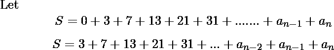
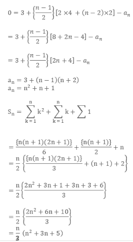

# 求数列 3、7、13、21、31 的和。

> 原文:[https://www . geesforgeks . org/find-the-sum-series-3-7-13-21-31/](https://www.geeksforgeeks.org/find-the-sum-of-series-3-7-13-21-31/)

给定一个数 n，任务是找出直到第<sup>个</sup>项的下列级数的和。

> **3、7、13、21、31、…。**

**示例** :

```
Input : N = 3
Output : 23

Input : N = 25
Output : 5875
```

**进场:**



减去上面两个方程，我们有:



以下是上述方法的实现:

## C++

```
// C++ Program to find the sum of given series

#include <iostream>
#include <math.h>

using namespace std;

// Function to calculate sum
int findSum(int n)
{
    // Return sum
    return (n * (pow(n, 2) + 3 * n + 5)) / 3;
}

// Driver code
int main()
{
    int n = 25;

    cout << findSum(n);

    return 0;
}
```

## Java 语言(一种计算机语言，尤用于创建网站)

```
// Java program to find sum of
// n terms of the given series
import java.util.*;

class GFG
{
static int calculateSum(int n)
{
    // returning the final sum
    return (n * ((int)Math.pow(n, 2) + 3 *
                               n + 5)) / 3;
}

// Driver Code
public static void main(String arr[])
{
    // number of terms to
    // find the sum
    int n = 25;
    System.out.println(calculateSum(n));
}
}

// This code is contributed
// by Surendra_Gangwar
```

## 蟒蛇 3

```
# Python program to find the
# sum of given series

# Function to calculate sum
def findSum(n):
    # Return sum
    return (n*(pow(n, 2)+3 * n + 5))/3

# driver code
n = 25

print(int(findSum(n)))
```

## C#

```
// C# program to find
// sum of n terms of
// the given series
using System;

class GFG
{
static int calculateSum(int n)
{
    // returning the final sum
    return (n * ((int)Math.Pow(n, 2) + 3 *
                               n + 5)) / 3;
}

// Driver Code
public static void Main()
{
    // number of terms to
    // find the sum
    int n = 25;
    Console.WriteLine(calculateSum(n));
}
}

// This code is contributed
// by inder_verma.
```

## 服务器端编程语言（Professional Hypertext Preprocessor 的缩写）

```
<?php
// PHP Program to find the
// sum of given series

// Function to calculate sum
function findSum($n)
{
    // Return sum
    return ($n * (pow($n, 2) +
             3 * $n + 5)) / 3;
}

// Driver code
$n = 25;

echo findSum($n);

// This code is contributed
// by inder_verma
?>
```

## java 描述语言

```
<script>

// javascript program to find sum of
// n terms of the given series

function calculateSum(n)
{
    // returning the final sum
    return (n * (parseInt(Math.pow(n, 2) + 3 *
                               n + 5)) / 3);
}

// Driver Code
// number of terms to
// find the sum
var n = 25;
document.write(calculateSum(n));

// This code contributed by shikhasingrajput

</script>
```

**Output:** 

```
5875
```

**时间复杂度:** O(1)