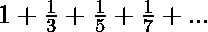

# 求数列 1 + 1/3 + 1/5 + 1/7 +的和…直到 N 项

> 原文:[https://www . geesforgeks . org/find-the-sum-the-series-1-3-1-5-1-7-till-n-terms/](https://www.geeksforgeeks.org/find-the-sum-of-the-series-1-1-3-1-5-1-7-till-n-terms/)

给定一个数字 **N** ，任务是找到下面系列的和，直到 N 项。

> 

**例:**

> **输入:** N = 10
> **输出:** 2.133256
> **说明:**
> 系列 1 + 1/3 + 1/5 + 1/7 + 1/9 + 1/11 之和为 2.133256。
> **输入:** N = 20
> **输出:** 2.479674
> **说明:**
> 数列 1+1/3+1/5+1/7+……+1/41 之和为 2.479674。

**方法:**从给定的序列中，找到第 n 项的公式:

```
1st term = 1
2nd term = 1/3
3rd term = 1/5
4th term = 1/7
.
.
Nthe term = 1 / (2 * N - 1))
```

因此:

> **该系列的第 n 项**
> 
> ```
> *** QuickLaTeX cannot compile formula:
>  
> 
> *** Error message:
> Error: Nothing to show, formula is empty
> 
> ```

然后在**【1，N】**范围内的数字上迭代，使用上面的公式找到所有的项，并计算它们的和。
以下是上述办法的实施情况:

## C++

```
// C++ program to find the sum of the
// series 1 + 1/3 + 1/5 + ...

#include <iostream>
using namespace std;

// Function to find the sum of the
// given series
void printSumSeries(int N)
{
    // Initialise the sum to 0
    float sum = 0;

    for (int i = 1; i <= N; i++) {

        // Generate the ith term and
        // add it to the sum
        sum += 1.0 / (2 * i - 1);
    }

    // Print the final sum
    cout << sum << endl;
}

// Driver Code
int main()
{
    int N = 6;

    printSumSeries(N);
    return 0;
}
```

## Java 语言(一种计算机语言，尤用于创建网站)

```
// Java program to find the sum of the
// series 1 + 1/3 + 1/5 + ...
class GFG {

    // Function to find the sum of the
    // given series
    static void printSumSeries(int N)
    {
        // Initialise the sum to 0
        float sum = 0;

        for (int i = 1; i <= N; i++) {

            // Generate the ith term and
            // add it to the sum
            sum += 1.0 / (2 * i - 1);
        }

        // Print the final sum
        System.out.println(sum);
    }

    // Driver Code
    public static void main (String[] args)
    {
        int N = 6;

        printSumSeries(N);

    }

}

// This code is contributed by AnkitRai01
```

## 蟒蛇 3

```
# Python3 program to find the sum of the
# series 1 + 1/3 + 1/5 + ...

# Function to find the sum of the
# given series
def printSumSeries(N) :

    # Initialise the sum to 0
    sum = 0;

    for i in range(1, N + 1) :

        # Generate the ith term and
        # add it to the sum
        sum += 1.0 / (2 * i - 1);

    # Print the final sum
    print(sum);

# Driver Code
if __name__ == "__main__" :

    N = 6;

    printSumSeries(N);

# This code is contributed by AnkitRai01
```

## C#

```
// C# program to find the sum of the
// series 1 + 1/3 + 1/5 + ...
using System;

class GFG {

    // Function to find the sum of the
    // given series
    static void printSumSeries(int N)
    {
        // Initialise the sum to 0
        float sum = 0;

        for (int i = 1; i <= N; i++) {

            // Generate the ith term and
            // add it to the sum
            sum += (float)1.0 / (2 * i - 1);
        }

        // Print the final sum
        Console.WriteLine(sum);
    }

    // Driver Code
    public static void Main (string[] args)
    {
        int N = 6;

        printSumSeries(N);
    }   
}

// This code is contributed by AnkitRai01
```

## java 描述语言

```
<script>

// javascript program to find the sum of the
// series 1 + 1/3 + 1/5 + ...

// Function to find the sum of the
// given series
function printSumSeries( N)
{
    // Initialise the sum to 0
    let sum = 0;

    for (let i = 1; i <= N; i++) {

        // Generate the ith term and
        // add it to the sum
        sum += 1.0 / (2 * i - 1);
    }

    // Print the final sum
   document.write(sum.toFixed(5));
}

// Driver Code

    let N = 6;

    printSumSeries(N);

// This code is contributed by todaysgaurav

</script>
```

**Output:** 

```
1.87821
```

时间复杂度:0(N)

辅助空间:0(1)