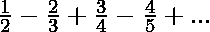

# 求数列 1/2–2/3+3/4–4/5+的和…直到 N 项

> 原文:[https://www . geesforgeks . org/find-the-sum-the-series-1-2-2-3-3-4-4-5-till-n-terms/](https://www.geeksforgeeks.org/find-the-sum-of-the-series-1-2-2-3-3-4-4-5-till-n-terms/)

给定一个数字 **N** ，任务是找到下面系列的和，直到 N 项。

> 

**例:**

> **输入:** N = 6
> **输出:** -0.240476
> **输入:** N = 10
> **输出:** -0.263456

**方法:**从给定的序列中，找到第 n 项的公式:

```
1st term = 1/2
2nd term = - 2/3
3rd term = 3/4
4th term = - 4/5
.
.
Nthe term = ((-1)N) * (N / (N + 1))
```

因此:

> **该系列的第 n 项**
> 
> ```
> *** QuickLaTeX cannot compile formula:
>  
> 
> *** Error message:
> Error: Nothing to show, formula is empty
> 
> ```

然后在**【1，N】**范围内的数字上迭代，使用上面的公式找到所有的项，并计算它们的和。
以下是上述办法的实施情况:

## C++

```
// C++ program for the above approach

#include <bits/stdc++.h>
using namespace std;

// Function to find the sum of series
void printSeriesSum(int N)
{
    double sum = 0;

    for (int i = 1; i <= N; i++) {

        // Generate the ith term and
        // add it to the sum if i is
        // even and subtract if i is
        // odd
        if (i & 1) {
            sum += (double)i / (i + 1);
        }
        else {
            sum -= (double)i / (i + 1);
        }
    }

    // Print the sum
    cout << sum << endl;
}

// Driver Code
int main()
{
    int N = 10;

    printSeriesSum(N);
    return 0;
}
```

## Java 语言(一种计算机语言，尤用于创建网站)

```
// Java program for the above approach
class GFG{

// Function to find the sum of series
static void printSeriesSum(int N)
{
    double sum = 0;

    for (int i = 1; i <= N; i++) {

        // Generate the ith term and
        // add it to the sum if i is
        // even and subtract if i is
        // odd
        if (i % 2 == 1) {
            sum += (double)i / (i + 1);
        }
        else {
            sum -= (double)i / (i + 1);
        }
    }

    // Print the sum
    System.out.print(sum +"\n");
}

// Driver Code
public static void main(String[] args)
{
    int N = 10;

    printSeriesSum(N);
}
}

// This code is contributed by 29AjayKumar
```

## 蟒蛇 3

```
# Python3 program for the above approach

# Function to find the sum of series
def printSeriesSum(N) :

    sum = 0;

    for i in range(1, N + 1) :

        # Generate the ith term and
        # add it to the sum if i is
        # even and subtract if i is
        # odd
        if (i & 1) :
            sum += i / (i + 1);

        else :
            sum -= i / (i + 1);

    # Print the sum
    print(sum);

# Driver Code
if __name__ == "__main__" :

    N = 10;

    printSeriesSum(N);

    # This code is contributed by Yash_R
```

## C#

```
// C# program for the above approach
using System;

class GFG {

// Function to find the sum of series
static void printSeriesSum(int N)
{
    double sum = 0;

    for (int i = 1; i <= N; i++) {

        // Generate the ith term and
        // add it to the sum if i is
        // even and subtract if i is
        // odd
        if ((i & 1)==0) {
            sum += (double)i / (i + 1);
        }
        else {
            sum -= (double)i / (i + 1);
        }
    }

    // Print the sum
    Console.WriteLine(sum);
}

// Driver Code
    public static void Main (string[] args)
    {

    int N = 10;

    printSeriesSum(N);
}
}

// This code is contributed by shivanisinghss2110
```

## java 描述语言

```
<script>

// javascript program for the above approach

// Function to find the sum of series
function printSeriesSum( N)
{
    let sum = 0;

    for (let i = 1; i <= N; i++) {

        // Generate the ith term and
        // add it to the sum if i is
        // even and subtract if i is
        // odd
        if (i & 1) {
            sum += i / (i + 1);
        }
        else {
            sum -= i / (i + 1);
        }
    }

    // Print the sum
     document.write( sum.toFixed(6) );
}

// Driver Code

    let N = 10;

    printSeriesSum(N);

// This code is contributed by todaysgaurav

</script>
```

**Output:** 

```
-0.263456
```

时间复杂度:0(N)

辅助空间:0(1)