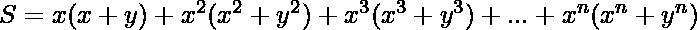
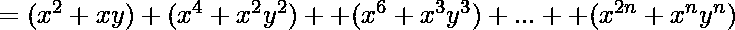
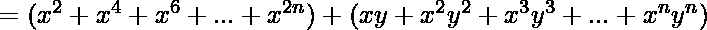
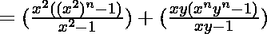

# 求数列 x(x+y)+x^2(x^2+y^2)+x^3(x^3+y^3)+…+x^n(x^n+y^n)的和

> 原文:[https://www . geesforgeks . org/find-the-sum-the-series-xxy-x2 y2-x3x 3y 3-xnxnyn/](https://www.geeksforgeeks.org/find-the-sum-of-the-series-xxy-x2x2y2-x3x3y3-xnxnyn/)

给定一系列，其中 x、y 和 n 取整数值。任务是找到给定系列的第 n 个项的和。
**示例:**

```
Input: x = 2, y = 2, n = 2
Output: 40

Input: x = 2, y = 4, n = 2
Output: 92
```

**进场:**给定系列为:
。



这样我们的问题就简化为求两个 [GP](https://www.geeksforgeeks.org/progressions-ap-gp-hp-and-practice-problems/) 系列的和。
**以下是上述方法的实施:**

## C++

```
// CPP program to find the sum of series
#include <bits/stdc++.h>
using namespace std;

// Function to return required sum
int sum(int x, int y, int n)
{

    // sum of first series
    int sum1 = (pow(x, 2) * (pow(x, 2 * n) - 1))
               / (pow(x, 2) - 1);

    // sum of second series
    int sum2 = (x * y * (pow(x, n) * pow(y, n) - 1))
               / (x * y - 1);

    return sum1 + sum2;
}

// Driver Code
int main()
{
    int x = 2, y = 2, n = 2;

    // function call to print sum
    cout << sum(x, y, n);
    return 0;
}
```

## Java 语言(一种计算机语言，尤用于创建网站)

```
// Java program to find the sum of series

public class GFG {

    // Function to return required sum
    static int sum(int x, int y, int n)
    {

        // sum of first series
        int sum1 = (int) (( Math.pow(x, 2) * (Math.pow(x, 2 * n) - 1))
                   / (Math.pow(x, 2) - 1));

        // sum of second series
        int sum2 = (int) ((x * y * (Math.pow(x, n) * Math.pow(y, n) - 1))
                    / (x * y - 1));

        return sum1 + sum2;
    }

    // Driver code
    public static void main (String args[]){
        int x = 2, y = 2, n = 2;

        // function call to print sum
        System.out.println(sum(x, y, n));
    }

// This code is contributed by ANKITRAI1
}
```

## 蟒蛇 3

```
# Python3 program to find the sum of series
# Function to return required sum

def sum(x,y,n):

    # sum of first series
    sum1 = ((x**2)*(x**(2*n)-1))//(x**2 - 1)

    # sum of second series
    sum2 = (x*y*(x**n*y**n-1))//(x*y-1)
    return (sum1+sum2)

# Driver Code
if __name__=='__main__':
    x = 2
    y = 2
    n = 2
# function call to print sum
    print(sum(x, y, n))

# this code is contributed by sahilshelangia
```

## C#

```
// C# program to find the sum of series
using System;

class GFG
{

// Function to return required sum
static int sum(int x, int y, int n)
{

    // sum of first series
    int sum1 = (int) ((Math.Pow(x, 2) *
                      (Math.Pow(x, 2 * n) - 1)) /
                      (Math.Pow(x, 2) - 1));

    // sum of second series
    int sum2 = (int) ((x * y * (Math.Pow(x, n) *
                Math.Pow(y, n) - 1)) / (x * y - 1));

    return sum1 + sum2;
}

// Driver code
public static void Main ()
{
    int x = 2, y = 2, n = 2;

    // function call to print sum
    Console.Write(sum(x, y, n));
}
}

// This code is contributed by ChitraNayal
```

## 服务器端编程语言（Professional Hypertext Preprocessor 的缩写）

```
<?php
// PHP program to find the
// sum of series

// Function to return required sum
function sum($x, $y, $n)
{
    //sum of first series
    $sum1 = (pow($x, 2) *
            (pow($x, 2 * $n) - 1)) /
            (pow($x, 2) - 1);

    // sum of second series
    $sum2 = ($x * $y * (pow($x, $n) *
                        pow($y, $n) - 1)) /
                           ($x * $y - 1);

    return $sum1 + $sum2;
}

// Driver code
$x = 2;
$y = 2;
$n = 2;

// function call to print sum
echo sum($x, $y, $n);

// This code is contributed
// by Shashank_Sharma
?>
```

## java 描述语言

```
<script>
// java script program to find the
// sum of series

// Function to return required sum
function sum(x, y, n)
{
    //sum of first series
    sum1 = (Math.pow(x, 2) *
            (Math.pow(x, 2 * n) - 1)) /
            (Math.pow(x, 2) - 1);

    // sum of second series
    sum2 = (x * y * (Math.pow(x, n) *
                        Math.pow(y, n) - 1)) /
                           (x * y - 1);

    return sum1 + sum2;
}

// Driver code
let x = 2;
let y = 2;
let n = 2;

// function call to print sum
document.write(sum(x, y, n));

// This code is contributed
// by bobby
</script>
```

**Output:** 

```
40
```

**时间复杂度:** *O(log(n))*