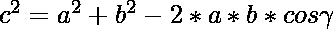
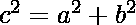
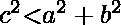

# 从给定的边找到三角形的类型

> 原文:[https://www . geeksforgeeks . org/从给定边找到三角形的类型/](https://www.geeksforgeeks.org/find-the-type-of-triangle-from-the-given-sides/)

给定表示三角形边的三个整数 **A** 、 **B** 和 **C** ，任务是检查三角形是直角三角形、锐角三角形还是钝角三角形。
**举例:**

> **输入:** A = 1，B = 4，C = 3
> **输出:**钝角三角形
> **解释:**
> 边 1，2，3 的三角形是钝角三角形
> **输入:** A = 2，B = 2，C = 2
> **输出:**锐角三角形
> **解释:**
> 边 2，2，3 的三角形

**方法:**思路是利用[余弦定律](https://en.wikipedia.org/wiki/Law_of_cosines)中的事实，用这些公式来检查三角形的类型–

它概括了[勾股定理](https://en.wikipedia.org/wiki/Pythagorean_theorem)，该定理指出，对于直角三角形，斜边的平方等于三角形的底边和高度的平方之和，这就是
同样，可以观察到
对于锐角三角形

对于钝角

## C++

```
// C++ implementation to find
// the type of triangle with
// the help of the sides

#include <bits/stdc++.h>
using namespace std;

// Function to find the type of
// triangle with the help of sides
void checkTypeOfTriangle(int a,
                int b, int c){
    int sqa = pow(a, 2);
    int sqb = pow(b, 2);
    int sqc = pow(c, 2);

    if (sqa == sqb + sqc ||
        sqb == sqc + sqa ||
        sqc == sqa + sqb){
        cout << "Right-angled Triangle";
    }
    else if(sqa > sqc + sqb ||
            sqb > sqa + sqc ||
            sqc > sqa + sqb){
        cout << "Obtuse-angled Triangle";
    }
    else{
        cout << "Acute-angled Triangle";
    }
}

// Driver Code
int main()
{
    int a, b, c;
    a = 2;
    b = 2;
    c = 2;

    // Function Call
    checkTypeOfTriangle(a, b, c);
    return 0;
}
```

## Java 语言(一种计算机语言，尤用于创建网站)

```
// Java implementation to find
// the type of triangle with
// the help of the sides
import java.util.*;

class GFG
{

// Function to find the type of
// triangle with the help of sides
static void checkTypeOfTriangle(int a,
                int b, int c){
    int sqa = (int)Math.pow(a, 2);
    int sqb = (int)Math.pow(b, 2);
    int sqc = (int)Math.pow(c, 2);

    if (sqa == sqa + sqb ||
        sqb == sqa + sqc ||
        sqc == sqa + sqb){
        System.out.print("Right-angled Triangle");
    }
    else if(sqa > sqc + sqb ||
            sqb > sqa + sqc ||
            sqc > sqa + sqb){
        System.out.print("Obtuse-angled Triangle");
    }
    else{
        System.out.print( "Acute-angled Triangle");
    }
}

// Driver Code
public static void main (String []args)
{
    int a, b, c;
    a = 2;
    b = 2;
    c = 2;

    // Function Call
    checkTypeOfTriangle(a, b, c);
}
}

// This code is contribute by chitranayal
```

## 蟒蛇 3

```
# Python3 implementation to find
# the type of triangle with
# the help of the sides

# Function to find the type of
# triangle with the help of sides
def checkTypeOfTriangle(a,b,c):
    sqa = pow(a, 2)
    sqb = pow(b, 2)
    sqc = pow(c, 2)

    if (sqa == sqa + sqb or
        sqb == sqa + sqc or
        sqc == sqa + sqb):
        print("Right-angled Triangle")

    elif(sqa > sqc + sqb or
            sqb > sqa + sqc or
            sqc > sqa + sqb):
        print("Obtuse-angled Triangle")

    else:
        print("Acute-angled Triangle")

# Driver Code
if __name__ == '__main__':
    a = 2
    b = 2
    c = 2

    # Function Call
    checkTypeOfTriangle(a, b, c)

# This code is contributed by mohit kumar 29
```

## C#

```
// C# implementation to find
// the type of triangle with
// the help of the sides
using System;

class GFG
{

// Function to find the type of
// triangle with the help of sides
static void checkTypeOfTriangle(int a,
                int b, int c){
    int sqa = (int)Math.Pow(a, 2);
    int sqb = (int)Math.Pow(b, 2);
    int sqc = (int)Math.Pow(c, 2);

    if (sqa == sqa + sqb ||
        sqb == sqa + sqc ||
        sqc == sqa + sqb){
        Console.Write("Right-angled Triangle");
    }
    else if(sqa > sqc + sqb ||
            sqb > sqa + sqc ||
            sqc > sqa + sqb){
        Console.Write("Obtuse-angled Triangle");
    }
    else{
        Console.Write( "Acute-angled Triangle");
    }
}

// Driver Code
public static void Main(String []args)
{
    int a, b, c;
    a = 2;
    b = 2;
    c = 2;

    // Function Call
    checkTypeOfTriangle(a, b, c);
}
}

// This code is contributed by 29AjayKumar
```

## java 描述语言

```
<script>

// JavaScript implementation to find
// the type of triangle with
// the help of the sides

// Function to find the type of
// triangle with the help of sides
function checkTypeOfTriangle(a,b,c)
{
    let sqa = Math.floor(Math.pow(a, 2));
       let sqb = Math.floor(Math.pow(b, 2));
    let sqc = Math.floor(Math.pow(c, 2));

    if (sqa == sqa + sqb ||
        sqb == sqa + sqc ||
        sqc == sqa + sqb){
        document.write("Right-angled Triangle");
    }
    else if(sqa > sqc + sqb ||
            sqb > sqa + sqc ||
            sqc > sqa + sqb){
        document.write("Obtuse-angled Triangle");
    }
    else{
        document.write( "Acute-angled Triangle");
    }
}

// Driver Code
let a, b, c;
a = 2;
b = 2;
c = 2;

// Function Call
checkTypeOfTriangle(a, b, c);

// This code is contributed by rag2127

</script>
```

**Output:** 

```
Acute-angled Triangle
```