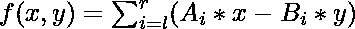

# 求给定 f(x)

的最大值(F(x))–最小值(F(x))

> 原文:[https://www . geesforgeks . org/find-the-value-of-maxfx-min FX-for-a-给定-fx/](https://www.geeksforgeeks.org/find-the-value-of-maxfx-minfx-for-a-given-fx/)

给定由正整数和负整数组成的两个 N 整数序列，包括 0(序列 A 和序列 B)。然后会有 Q 查询。在每一种情况下，你会得到两个整数 l 和 r (r>=l)。让我们定义一个函数:

任务是为每个查询打印 **Max(f(x，y))**–**Min(f(x，y))** 的值。

**示例:**

```
Input: 
N = 5, Q = 2
A[] = 0 7 3 4 5
B[] = 0 3 1 2 3
l = 1, r = 1
l = 1, r = 3
Output: 
0
917448

Input: 
N = 5, Q = 2
A[] = 0 -8 3 4 -9
B[] = 0 -3 -5 2 3
l = 1, r = 1
l = 1, r = 3
Output:
0
851916 
```

**逼近:**如果我们看得清楚，函数只取决于 x 和 y 的值，这可以通过看到各个数组求和的性质很容易地计算出来。首先，我们预先计算两个数组的前缀和，然后我们只看到和的性质。当我们取它们的模时，x 和 y 的值总是 32766 或-32766。

下面是上述方法的实现:

## C++

```
// C++ implementation of above approach
#include <bits/stdc++.h>
using namespace std;
#define ll long long
#define MAX 200006
#define CONS 32766

// Function to calculate the value
void calc(ll a[], ll b[], ll lr[], ll q, ll n)
{
    ll M, m, i, j, k, l, r, suma, sumb, cc;
    cc = 0;

    // forming the prefix sum arrays
    for (i = 0; i < n - 1; ++i) {
        a[i + 1] += a[i];
        b[i + 1] += b[i];
    }

    while (q--) {
        // Taking the query
        l = lr[cc++];
        r = lr[cc++];
        l -= 2;
        r -= 1;

        // finding the sum in the range l to r in array a
        suma = a[r];

        // finding the sum in the range l to r in array b
        sumb = b[r];
        if (l >= 0) {
            suma -= a[l];
            sumb -= b[l];
        }

        // Finding the max value of the function
        M = max(CONS * suma + CONS * sumb,
                -CONS * suma - CONS * sumb);
        M = max(M, max(CONS * suma - CONS * sumb,
                       -CONS * suma + CONS * sumb));

        // Finding the min value of the function
        m = min(CONS * suma + CONS * sumb,
                -CONS * suma - CONS * sumb);
        m = min(m, min(CONS * suma - CONS * sumb,
                       -CONS * suma + CONS * sumb));

        cout << (M - m) << "\n";
    }
}

// Driver code
int main()
{
    ll n = 5, q = 2;
    ll a[5] = { 0, 7, 3, 4, 5 };
    ll b[5] = { 0, 3, 1, 2, 3 };

    ll lr[q * 2];
    lr[0] = 1;
    lr[1] = 1;
    lr[2] = 1;
    lr[3] = 3;

    calc(a, b, lr, q, n);

    return 0;
}
```

## Java 语言(一种计算机语言，尤用于创建网站)

```
// Java implementation of above approach

import java.util.*;

class GFG
{

        static final int MAX=200006;
        static final int CONS=32766;

        // Function to calculate the value
        static void calc(int a[], int b[], int lr[], int q, int n)
        {
            int M, m, i, j, k, l, r, suma, sumb, cc;
            cc = 0;

            // forming the prefix sum arrays
            for (i = 0; i < n - 1; ++i)
            {
                a[i + 1] += a[i];
                b[i + 1] += b[i];
            }

            while (q!=0)
            {
                // Taking the query
                l = lr[cc++];
                r = lr[cc++];
                l -= 2;
                r -= 1;

                // finding the sum in the range l to r in array a
                suma = a[r];

                // finding the sum in the range l to r in array b
                sumb = b[r];
                if (l >= 0) {
                    suma -= a[l];
                    sumb -= b[l];
                }

                // Finding the max value of the function
                M = Math.max(CONS * suma + CONS * sumb,
                        -CONS * suma - CONS * sumb);
                M = Math.max(M, Math.max(CONS * suma - CONS * sumb,
                            -CONS * suma + CONS * sumb));

                // Finding the min value of the function
                m = Math.min(CONS * suma + CONS * sumb,
                        -CONS * suma - CONS * sumb);
                m = Math.min(m, Math.min(CONS * suma - CONS * sumb,
                            -CONS * suma + CONS * sumb));

                System.out.println((M - m) );
                q--;
            }
        }

        // Driver code
        public static void  main(String [] args)
        {
            int n = 5, q = 2;
            int []a = { 0, 7, 3, 4, 5 };
            int []b = { 0, 3, 1, 2, 3 };

            int []lr=new int[q * 2];
            lr[0] = 1;
            lr[1] = 1;
            lr[2] = 1;
            lr[3] = 3;

            calc(a, b, lr, q, n);

        }
// This code is contributed by ihritik

}
```

## 蟒蛇 3

```
# Python 3 implementation of
# above approach

MAX = 200006
CONS = 32766

# Function to calculate the value
def calc(a, b, lr, q, n):

    cc = 0

    # forming the prefix sum arrays
    for i in range(n - 1) :
        a[i + 1] += a[i]
        b[i + 1] += b[i]

    while (q > 0) :
        # Taking the query
        l = lr[cc]
        cc +=1
        r = lr[cc]
        cc += 1
        l -= 2
        r -= 1

        # finding the sum in the range l
        # to r in array a
        suma = a[r]

        # finding the sum in the range
        # l to r in array b
        sumb = b[r]
        if (l >= 0) :
            suma -= a[l]
            sumb -= b[l]

        # Finding the max value of the function
        M = max(CONS * suma + CONS * sumb,
                -CONS * suma - CONS * sumb)
        M = max(M, max(CONS * suma - CONS * sumb,
                    -CONS * suma + CONS * sumb))

        # Finding the min value of the function
        m = min(CONS * suma + CONS * sumb,
                -CONS * suma - CONS * sumb)
        m = min(m, min(CONS * suma - CONS * sumb,
                    -CONS * suma + CONS * sumb))

        print(M - m)

        q -= 1

# Driver code
if __name__ == "__main__":

    n = 5
    q = 2
    a = [ 0, 7, 3, 4, 5 ]
    b = [ 0, 3, 1, 2, 3 ]

    lr = [0]*(q * 2)
    lr[0] = 1
    lr[1] = 1
    lr[2] = 1
    lr[3] = 3

    calc(a, b, lr, q, n)

# This code is contributed by
# ChitraNayal
```

## C#

```
// C# implementation of above approach
using System;

class GFG
{

// static int MAX=200006;
static int CONS = 32766;

// Function to calculate the value
static void calc(int []a, int []b,
                 int []lr, int q, int n)
{
    int M, m, i, l, r, suma, sumb, cc;
    cc = 0;

    // forming the prefix sum arrays
    for (i = 0; i < n - 1; ++i)
    {
        a[i + 1] += a[i];
        b[i + 1] += b[i];
    }

    while (q != 0)
    {
        // Taking the query
        l = lr[cc++];
        r = lr[cc++];
        l -= 2;
        r -= 1;

        // finding the sum in the
        // range l to r in array a
        suma = a[r];

        // finding the sum in the
        // range l to r in array b
        sumb = b[r];
        if (l >= 0)
        {
            suma -= a[l];
            sumb -= b[l];
        }

        // Finding the max value of the function
        M = Math.Max(CONS * suma + CONS * sumb,
                    -CONS * suma - CONS * sumb);
        M = Math.Max(M, Math.Max(CONS * suma - CONS * sumb,
                                -CONS * suma + CONS * sumb));

        // Finding the min value of the function
        m = Math.Min(CONS * suma + CONS * sumb,
                    -CONS * suma - CONS * sumb);
        m = Math.Min(m, Math.Min(CONS * suma - CONS * sumb,
                                -CONS * suma + CONS * sumb));

        Console.WriteLine((M - m));
        q--;
    }
}

// Driver code
public static void Main()
{
    int n = 5, q = 2;
    int []a = { 0, 7, 3, 4, 5 };
    int []b = { 0, 3, 1, 2, 3 };

    int []lr = new int[q * 2];
    lr[0] = 1;
    lr[1] = 1;
    lr[2] = 1;
    lr[3] = 3;

    calc(a, b, lr, q, n);
}
}

// This code is contributed by anuj_67
```

## 服务器端编程语言（Professional Hypertext Preprocessor 的缩写）

```
<?php
// PHP implementation of above approach
$MAX = 200006;
$CONS = 32766;

// Function to calculate the value
function calc($a, $b, $lr, $q, $n)
{
    global $MAX ;
    global $CONS;
    $M; $m; $i; $j; $k;
    $l; $r; $suma; $sumb; $cc;
    $cc = 0;

    // forming the prefix sum arrays
    for ($i = 0; $i < $n - 1; ++$i)
    {
        $a[$i + 1] += $a[$i];
        $b[$i + 1] += $b[$i];
    }

    while ($q--)
    {
        // Taking the query
        $l = $lr[$cc++];
        $r = $lr[$cc++];
        $l -= 2;
        $r -= 1;

        // finding the sum in the range
        // l to r in array a
        $suma = $a[$r];

        // finding the sum in the range
        // l to r in array b
        $sumb = $b[$r];
        if ($l >= 0)
        {
            $suma -= $a[$l];
            $sumb -= $b[$l];
        }

        // Finding the max value of the function
        $M = max($CONS * $suma + $CONS * $sumb,
                -$CONS * $suma - $CONS * $sumb);
        $M = max($M, max($CONS * $suma - $CONS * $sumb,
                        -$CONS * $suma + $CONS * $sumb));

        // Finding the min value of the function
        $m = min($CONS * $suma + $CONS * $sumb,
                -$CONS * $suma - $CONS * $sumb);
        $m = min($m, min($CONS * $suma - $CONS * $sumb,
                        -$CONS * $suma + $CONS * $sumb));

        echo ($M - $m) , "\n";
    }
}

// Driver code
$n = 5; $q = 2;
$a = array(0, 7, 3, 4, 5 );
$b = array( 0, 3, 1, 2, 3 );
$lr[0] = 1;
$lr[1] = 1;
$lr[2] = 1;
$lr[3] = 3;

calc($a, $b, $lr, $q, $n);

// This code is contributed by anuj_67
?>
```

## java 描述语言

```
<script>
// Javascript implementation of above approach

    let MAX=200006;
    let CONS=32766;
    // Function to calculate the value
    function calc(a,b,lr,q,n)
    {
            let M, m, i, j, k, l, r, suma, sumb, cc;
            cc = 0;

            // forming the prefix sum arrays
            for (i = 0; i < n - 1; ++i)
            {
                a[i + 1] += a[i];
                b[i + 1] += b[i];
            }

            while (q!=0)
            {
                // Taking the query
                l = lr[cc++];
                r = lr[cc++];
                l -= 2;
                r -= 1;

                // finding the sum in the range l to r in array a
                suma = a[r];

                // finding the sum in the range l to r in array b
                sumb = b[r];
                if (l >= 0) {
                    suma -= a[l];
                    sumb -= b[l];
                }

                // Finding the max value of the function
                M = Math.max(CONS * suma + CONS * sumb,
                        -CONS * suma - CONS * sumb);
                M = Math.max(M, Math.max(CONS * suma - CONS * sumb,
                            -CONS * suma + CONS * sumb));

                // Finding the min value of the function
                m = Math.min(CONS * suma + CONS * sumb,
                        -CONS * suma - CONS * sumb);
                m = Math.min(m, Math.min(CONS * suma - CONS * sumb,
                            -CONS * suma + CONS * sumb));

                document.write((M - m) +"<br>");
                q--;
            }
    }

    // Driver code
    let n = 5, q = 2;
    let a=[ 0, 7, 3, 4, 5 ];
    let b=[0, 3, 1, 2, 3];
    let lr=new Array(q * 2);
    lr[0] = 1;
    lr[1] = 1;
    lr[2] = 1;
    lr[3] = 3;

    calc(a, b, lr, q, n);

// This code is contributed by avanitrachhadiya2155
</script>
```

**Output:** 

```
0
917448
```