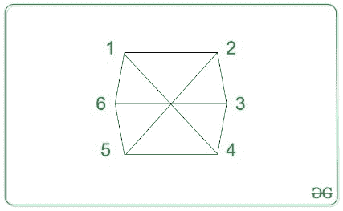
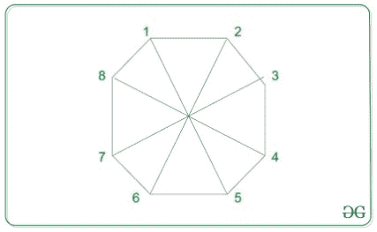

# 从 N 边多边形中找到与顶点 M 对角相对的顶点

> 原文:[https://www . geesforgeks . org/find-the-vertex-对角对顶-m-from-n 边多边形/](https://www.geeksforgeeks.org/find-the-vertex-diagonally-opposite-to-the-vertex-m-from-an-n-sided-polygon/)

给定两个整数 **N** 和 **M** ，任务是找到一个 **N 边**多边形的与**M<sup>th</sup>T7】顶点对角相对的顶点。**

**示例:**

> **输入:** N = 6，M = 2
> T3】输出:5
> T6】说明:
> 
> 
> 
> 从上图可以观察到，与顶点 5 相对的顶点是 2。
> 
> **输入:** N = 8，M = 5
> T3】输出:1
> T6】说明:
> 
> 
> 
> 从上图可以观察到，与顶点 8 相对的顶点是 1。

**方法:**解决给定问题需要考虑以下两种情况:

1.  **如果 M > N / 2:** 顶点永远是 **M — (N / 2)** 。
2.  **如果 M ≤ N / 2:** 顶点始终为 **M + (N / 2)** 。

下面是上述方法的实现:

## C++

```
// C++ program for the above approach

#include <bits/stdc++.h>
using namespace std;

// Function to return the
// required vertex
int getPosition(int N, int M)
{

    // Case 1:
    if (M > (N / 2)) {
        return (M - (N / 2));
    }

    // Case 2:
    return (M + (N / 2));
}

// Driver Code
int main()
{
    int N = 8, M = 5;
    cout << getPosition(N, M);

    return 0;
}
```

## Java 语言(一种计算机语言，尤用于创建网站)

```
// Java program for
// the above approach
class GFG{

// Function to return the
// required vertex
static int getPosition(int N,
                       int M)
{
  // Case 1:
  if (M > (N / 2))
  {
    return (M - (N / 2));
  }

  // Case 2:
  return (M + (N / 2));
}

// Driver Code
public static void main(String[] args)
{
  int N = 8, M = 5;
  System.out.print(getPosition(N, M));

}
}

// This code is contributed by Rajput-Ji
```

## 蟒蛇 3

```
# Python3 program for the
# above approach

# Function to return the
# required vertex
def getPosition(N, M):

  # Case 1:
  if (M > (N // 2)):
    return (M - (N // 2))

  # Case 2:
  return (M + (N // 2))

# Driver Code
N = 8
M = 5

print(getPosition(N, M))

# This code is contributed by code_hunt
```

## C#

```
// C# program for the above approach
using System;

class GFG{

// Function to return the
// required vertex
static int getPosition(int N, int M)
{

    // Case 1:
    if (M > (N / 2))
    {
        return (M - (N / 2));
    }

    // Case 2:
    return (M + (N / 2));
}

// Driver Code
public static void Main(String[] args)
{
    int N = 8, M = 5;

    Console.Write(getPosition(N, M));
}
}

// This code is contributed by Amit Katiyar
```

## java 描述语言

```
<script>

// Javascript program for the above approach

// Function to return the
// required vertex
function getPosition(N, M)
{

    // Case 1:
    if (M > parseInt(N / 2)) {
        return (M - parseInt(N / 2));
    }

    // Case 2:
    return (M + parseInt(N / 2));
}

// Driver Code
var N = 8, M = 5;
document.write(getPosition(N, M));

</script>
```

**Output:** 

```
1
```

***时间复杂度:**O(1)*
T5**辅助空间:** O(1)